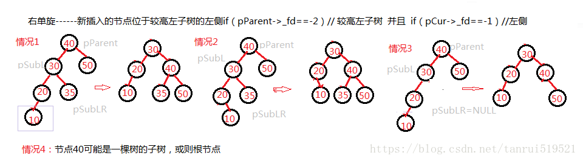
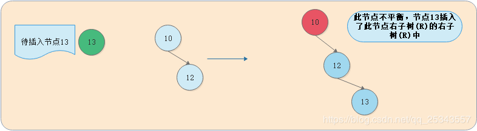
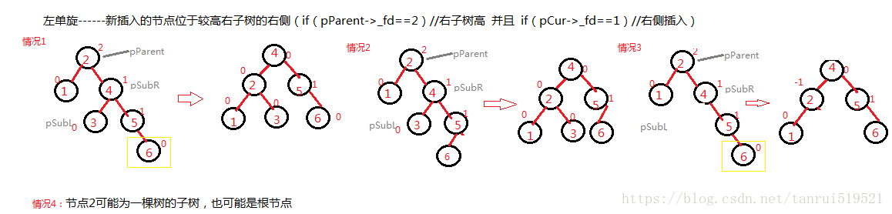
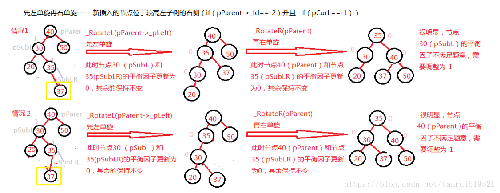
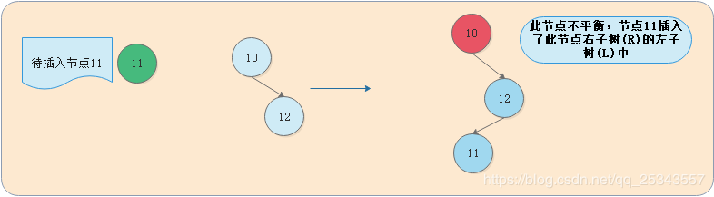
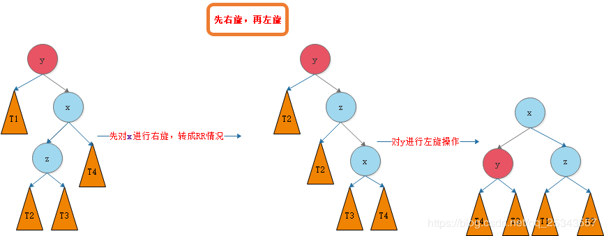

[原文1](https://blog.csdn.net/qq_25343557/article/details/89110319) [原文2]([https://blog.csdn.net/tanrui519521/article/details/80935348?ops_request_misc=%257B%2522request%255Fid%2522%253A%2522159125473719724839243176%2522%252C%2522scm%2522%253A%252220140713.130102334.pc%255Fblog.%2522%257D&request_id=159125473719724839243176&biz_id=0&utm_medium=distribute.pc_search_result.none-task-blog-2~blog~first_rank_v2~rank_blog_v1-1-80935348.pc_v2_rank_blog_v1&utm_term=avl](https://blog.csdn.net/tanrui519521/article/details/80935348?ops_request_misc=%7B%22request%5Fid%22%3A%22159125473719724839243176%22%2C%22scm%22%3A%2220140713.130102334.pc%5Fblog.%22%7D&request_id=159125473719724839243176&biz_id=0&utm_medium=distribute.pc_search_result.none-task-blog-2~blog~first_rank_v2~rank_blog_v1-1-80935348.pc_v2_rank_blog_v1&utm_term=avl))

## 平衡二叉树

   平衡二叉搜索树（Self-balancing binary search tree）又被称为AVL树（有别于AVL算法），且具有以下性质：它是一 棵空树或它的左右两个子树的高度差的绝对值不超过1，并且左右两个子树都是一棵平衡二叉树。

我们之所以需要平衡二叉搜索树的结构是因为如果我们按照逐次增大，如1、2、3、4、5、6的顺序构造一棵二叉搜索树，那么这棵搜索二叉树就会退化成链表。

## 平衡因子

**某结点的左子树与右子树的高度(深度)差**即为该结点的平衡因子（BF,Balance Factor）。平衡二叉树上所有结点的平衡因子只可能是 -1，0 或 1。如果某一结点的平衡因子绝对值大于1则说明此树不是平衡二叉树。为了方便计算每一结点的平衡因子我们可以为每个节点赋予height这一属性，表示此节点的高度。

## 添加节点

AVL树首先是二叉搜索树，我们需要根据二叉搜索树的插入方式进行插入，再通过平衡因子进行调整

1、若该树为NULL，则直接插入

2、若不为NULL则找到插入位置并插入

3、检查当前插入节点的父节点的平衡因子，若为0，则说明插入该节点前已有一个孩子节点，此时树肯定不需要调整

4、若父节点平衡因子为1或-1，则说明插入该节点前为叶子节点，此时树可能需要调整，需要从父节点向上进行判断

## 调整操作

### LL（右旋）

LL的意思是向左子树（L）的左孩子（L）中插入新节点后导致不平衡，这种情况下需要右旋操作，而不是说LL的意思是右旋。

**如果左子树较高且当前插入的点位于左子树的左侧，则需要进行右旋。**

我们首先找到不满足平衡因子条件的节点，称这个节点为右旋操作的根节点。右旋操作之后，该根节点的左孩子节点将会成为新的根节点（也可以理解为右旋操作以该根节点的左孩子节点为中心进行右旋）。

我们将这种情况抽象出来，得到下图：

我们需要对节点y进行平衡的维护。步骤如下图所示：

例子：

### RR（左旋）

**如果右子树较高且当前插入的点位于右子树的右侧，则需要进行左旋旋。**

我们首先找到不满足平衡因子条件的节点，称这个节点为左旋旋操作的根节点。左旋操作之后，该根节点的右孩子节点将会成为新的根节点（也可以理解为左旋旋操作以该根节点的右孩子节点为中心进行左旋）。

我们将这种情况抽象出来，得到下图：

我们需要对节点y进行平衡的维护。步骤如下图所示 ：

例子

### 左右双旋

**如果左子树较高且当前插入的点位于左子树的右侧，则需要先进行左单旋再进行右单旋**

我们将这种情况抽象出来，得到下图：

我们需要对节点y进行平衡的维护。步骤如下图所示：**第三个图中x和z反了**

例子：

### 右左双旋

**如果右子树较高且当前插入的点位于右子树的左侧**

我们将这种情况抽象出来，得到下图：

我们需要对节点y进行平衡的维护。步骤如下图所示：**第二个图中y的左孩子为T1，第三个图中x和z反了，孩子也错了，应该是从左至右T1，T2，T3，T4，**

例子

