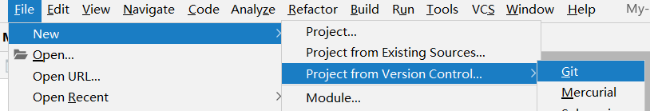

## Git回退本地代码

第一步：点击项目名称->右键->选择Local History ->show History 

第二步：查看所有历史节点，选择某个想回去的版本，然后右键，点击revert即可回退到这一版本


## Git回退本地代码后再push到远程

本地git reset --hard commit id回退到某个版本

回退版本后，未push到远程就修改了本地代码

修改完后再push到远程，提示先pull

问题是pull远程代码就覆盖掉本地修改的了

   操作分析：

   一开始是这样：

     A - B - C - D    远程
     A - B - C - D    本地


     第一步，git reset --hard B
    
     A - B - C - D    远程
     A - B               本地


     第二步，修改本地代码，记为 E
    
     A - B - C - D    远程
     A - B - E        本地

  如果我们现在pull 远程代码，情况如下：


    A - B - C - D    远程
    A - B - E - D'    本地
其中，D' 包含了 C 和 D 的改动，因为 git pull 相当于 git fetch 加上 git merge。这个时候 merge 的是 "Fetched HEAD"，也就是远程的 D。同时，D' 的 message 应该会出现一句 "merge … from ...."

如果你希望远程是 A - B - E，那就不要 pull，git push --force强制推送。


## Git clone别人项目并上传到自己的github

### 首先将项目clone到idea上




### 查看 设置全部变量

```bash
//查看全局变量
git config --global user.name
git config --global user.email

//查看当前项目变量
git config user.name
git config user.email
```

```bash
//设置全局变量
git config  --global user.name 你的目标用户名；       
git config  --global user.email 你的目标邮箱名;
```


### 去自己的github新建一个项目 完成后会出现


直接添加远端会报错 [remote origin already exists参考](https://www.jianshu.com/p/3380ec281729)

```bash
git remote add origin https://github.com/Cola2333/blog.git
// 报错fatal: remote origin already exists.（报错远程起源已经存在。）
```

先删除再添加

```bash
git remote rm origin
git remote add origin https://github.com/Cola2333/blog.git
```

```bash
git push -u origin master
```

完成