## 什么是JUC

java.util.concurrent包下的


## 实现Thread

以前的实现

​	继承 Thread类

​	继承 Runnable接口

​	继承 Callable接口


## 线程和进程

Java默认有两个线程：main、GC

Java无法开启线程，因为调用的本地方法（native）Java无法操作底层的C

```java
public synchronized void start() {
        /**
         * This method is not invoked for the main method thread or "system"
         * group threads created/set up by the VM. Any new functionality added
         * to this method in the future may have to also be added to the VM.
         *
         * A zero status value corresponds to state "NEW".
         */
        if (threadStatus != 0)
            throw new IllegalThreadStateException();

        /* Notify the group that this thread is about to be started
         * so that it can be added to the group's list of threads
         * and the group's unstarted count can be decremented. */
        group.add(this);

        boolean started = false;
        try {
            start0();
            started = true;
        } finally {
            try {
                if (!started) {
                    group.threadStartFailed(this);
                }
            } catch (Throwable ignore) {
                /* do nothing. If start0 threw a Throwable then
                  it will be passed up the call stack */
            }
        }
    }

    private native void start0();
```


### 线程的状态

```java
public enum State {
        /**
         * Thread state for a thread which has not yet started.
         */
        NEW,

        /**
         * Thread state for a runnable thread.  A thread in the runnable
         * state is executing in the Java virtual machine but it may
         * be waiting for other resources from the operating system
         * such as processor.
         */
        RUNNABLE,

        /**
         * Thread state for a thread blocked waiting for a monitor lock.
         * A thread in the blocked state is waiting for a monitor lock
         * to enter a synchronized block/method or
         * reenter a synchronized block/method after calling
         * {@link Object#wait() Object.wait}.
         */
        BLOCKED,

        /**
         * Thread state for a waiting thread.
         * A thread is in the waiting state due to calling one of the
         * following methods:
         * <ul>
         *   <li>{@link Object#wait() Object.wait} with no timeout</li>
         *   <li>{@link #join() Thread.join} with no timeout</li>
         *   <li>{@link LockSupport#park() LockSupport.park}</li>
         * </ul>
         *
         * <p>A thread in the waiting state is waiting for another thread to
         * perform a particular action.
         *
         * For example, a thread that has called <tt>Object.wait()</tt>
         * on an object is waiting for another thread to call
         * <tt>Object.notify()</tt> or <tt>Object.notifyAll()</tt> on
         * that object. A thread that has called <tt>Thread.join()</tt>
         * is waiting for a specified thread to terminate.
         */
        WAITING,

        /**
         * Thread state for a waiting thread with a specified waiting time.
         * A thread is in the timed waiting state due to calling one of
         * the following methods with a specified positive waiting time:
         * <ul>
         *   <li>{@link #sleep Thread.sleep}</li>
         *   <li>{@link Object#wait(long) Object.wait} with timeout</li>
         *   <li>{@link #join(long) Thread.join} with timeout</li>
         *   <li>{@link LockSupport#parkNanos LockSupport.parkNanos}</li>
         *   <li>{@link LockSupport#parkUntil LockSupport.parkUntil}</li>
         * </ul>
         */
        TIMED_WAITING,

        /**
         * Thread state for a terminated thread.
         * The thread has completed execution.
         */
        TERMINATED;
    }
```


### 并发并行

并发编程：并发、并行

+ 并发（多线程操作同一个资源）

  CPU 一核 ，模拟出来多条线程，天下武功，唯快不破，快速交替

  本质是充分利用CPU资源

+ 并行（多个人一起行走）

  CPU 多核 ，多个线程可以同时执行； 线程池

```java
public class Test1 {
    public static void main(String[] args) {
        // 获取cpu的核数
        // CPU 密集型，IO密集型
        System.out.println(Runtime.getRuntime().availableProcessors());
    }
}
```


### sleep和wait的区别

1. 来自不同的类

   wait => Object

   sleep => Thread

2. 关于锁的释放

   wait 会释放锁

   sleep 抱着锁睡觉，不会释放！

3. 使用的范围是不同的

   wait必须在同步代码块中

   sleep可以在任何地方

4. 关于异常捕获

   wait无需捕获异常

   sleep必须捕获异常


## Lock

### 传统Sychronized

```java
package com.usc.juc;

/**
* 真正的多线程开发，公司中的开发，降低耦合性
* 线程就是一个单独的资源类，没有任何附属的操作！
* 1、 属性、方法
*/
public class SaleTicketDemo1 {
    public static void main(String[] args) {
        Ticket ticket = new Ticket();
        // 并发：多线程操作同一个资源类, 把资源类丢入线程
        new Thread(() -> {
            for (int i = 1; i < 40; i++) {
                ticket.sale();

            }
        }).start();
        new Thread(() -> {
            for (int i = 1; i < 40; i++) {
                ticket.sale();

            }
        }).start();
        new Thread(() -> {
            for (int i = 1; i < 40; i++) {
                ticket.sale();

            }
        }).start();

    }

}

// 资源类 OOP
class Ticket {
    private int num = 30;

    public synchronized void sale() {
        if (num > 0)
            System.out.println(Thread.currentThread().getName() + "卖出了第" + (num --) + "张票，剩余" + num + "张票");
    }
}

```


### Lock

ReentrantLock

ReentrantReadWriteLock.ReadLock

ReentrantReadWriteLock.WriteLock

公平锁

非公平锁（默认）

```java
/**
     * Creates an instance of {@code ReentrantLock}.
     * This is equivalent to using {@code ReentrantLock(false)}.
     */
    public ReentrantLock() {
        sync = new NonfairSync();
    }

    /**
     * Creates an instance of {@code ReentrantLock} with the
     * given fairness policy.
     *
     * @param fair {@code true} if this lock should use a fair ordering policy
     */
    public ReentrantLock(boolean fair) {
        sync = fair ? new FairSync() : new NonfairSync();
    }
```


```java
package com.usc.juc;

import java.util.concurrent.locks.Lock;
import java.util.concurrent.locks.ReentrantLock;

public class SaleTicketDemo2 {
    public static void main(String[] args) {
        Ticket ticket2 = new Ticket();
        new Thread(() -> {
            for (int i = 1; i < 40; i++) {
                ticket2.sale();

            }
        }).start();
        new Thread(() -> {
            for (int i = 1; i < 40; i++) {
                ticket2.sale();

            }
        }).start();
        new Thread(() -> {
            for (int i = 1; i < 40; i++) {
                ticket2.sale();

            }
        }).start();

    }

}

// Lock三部曲
// 1、 new ReentrantLock();
// 2、 lock.lock(); // 加锁
// 3、 finally=> lock.unlock(); // 解锁
class Ticket2 {
    private int num = 30;
    Lock lock = new ReentrantLock();
    public void sale() {
        lock.lock();
        try {
            if (num > 0)
                System.out.println(Thread.currentThread().getName() + "卖出了第" + (num--) + "张票，剩余" + num + "张票");
        }
        catch (Exception e) {
            e.printStackTrace();
        }
        finally {
            lock.unlock();
        }
    }
}

```


### Sychronized和Lock的区别

1、Synchronized 内置的Java关键字， Lock 是一个Java类

2、Synchronized 无法判断获取锁的状态，Lock 可以判断是否获取到了锁

3、Synchronized 会自动释放锁，lock 必须要手动释放锁！如果不释放锁，死锁

4、Synchronized 线程 1（获得锁，阻塞）、线程2（等待，傻傻的等）；Lock锁就不一定会等待下去；

5、Synchronized 可重入锁，不可以中断的，非公平；Lock ，可重入锁，可以 判断锁，非公平（可以自己设置置）；

6、Synchronized 适合锁少量的代码同步问题，Lock 适合锁大量的同步代码！


### 生产者消费者问题

#### Sychronized写法

```java
package com.usc.juc;

/**
* 线程之间的通信问题：生产者和消费者问题！ 等待唤醒，通知唤醒
* 线程交替执行 A B 操作同一个变量 num = 0
* A num+1
* B num-1
*/
public class ProducerCustomerDemo1 {
    public static void main(String[] args) {
        P p = new P();
        new Thread(() -> {
            for (int i = 0; i < 10; i ++) {
                try {
                    p.increment();
                } catch (InterruptedException e) {
                    e.printStackTrace();
                }
            }
        }).start();

        new Thread(() -> {
            for (int i = 0; i < 10; i ++) {
                try {
                    p.decrement();
                } catch (InterruptedException e) {
                    e.printStackTrace();
                }
            }
        }).start();

        new Thread(() -> {
            for (int i = 0; i < 10; i ++) {
                try {
                    p.increment();
                } catch (InterruptedException e) {
                    e.printStackTrace();
                }
            }
        }).start();

        new Thread(() -> {
            for (int i = 0; i < 10; i ++) {
                try {
                    p.decrement();
                } catch (InterruptedException e) {
                    e.printStackTrace();
                }
            }
        }).start();

    }
}

// 判断等待，业务，通知
class P {
    private int num = 0;
    public synchronized void increment() throws InterruptedException {
        while (num != 0 ) {
            this.wait();
        }
        num ++;
        System.out.println(Thread.currentThread().getName() + "=>" + num);
        this.notifyAll();
    }

    public synchronized void decrement() throws InterruptedException {
        while (num == 0 ) {
            this.wait();
        }
        num --;
        System.out.println(Thread.currentThread().getName() + "=>" + num);
        this.notifyAll();
    }


}

```


#### 虚假唤醒

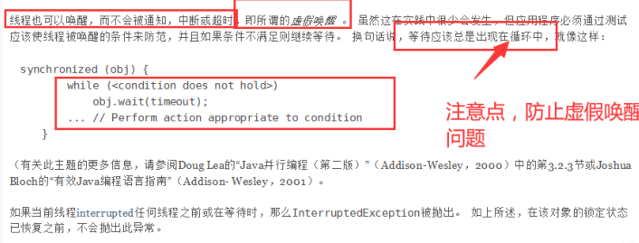

用if判断的话，唤醒后线程会从wait之后的代码开始运行，但是不会重新判断if条件，直接继续运行if代码块之后的代码，而如果使用while的话，也会从wait之后的代码运行，但是唤醒后会重新判断循环条件，如果不成立再执行while代码块之后的代码块，成立的话继续wait。


#### JUC写法

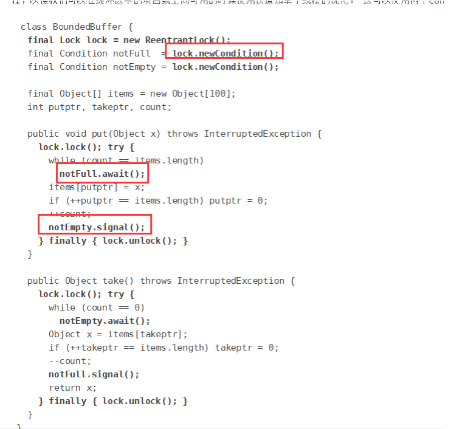

```java
package com.usc.juc;

import java.util.concurrent.locks.Condition;
import java.util.concurrent.locks.Lock;
import java.util.concurrent.locks.ReentrantLock;

public class ProducerCustomerDemo2 {
    public static void main(String[] args) {
        P2 p2 = new P2();
        new Thread(() -> {
            for (int i = 0; i < 10; i ++)
                p2.increment();
        }, "A").start();

        new Thread(() -> {
            for (int i = 0; i < 10; i ++)
                p2.decrement();
        }, "B").start();

        new Thread(() -> {
            for (int i = 0; i < 10; i ++)
                p2.increment();
        }, "C").start();

        new Thread(() -> {
            for (int i = 0; i < 10; i ++)
                p2.decrement();
        }, "D").start();
    }

}

class P2 {
    private int num = 0;
    Lock lock = new ReentrantLock();
    Condition condition = lock.newCondition();

    public void increment() {
        lock.lock();
        try {
            while (num != 0) {
                condition.await();
            }
            num ++;
            System.out.println(Thread.currentThread().getName() + "=>" + num);
            condition.signalAll();
        } catch (Exception e) {
            e.printStackTrace();
        } finally {
            lock.unlock();
        }
    }

    public void decrement() {
        lock.lock();
        try {
            while (num == 0) {
                condition.await();
            }
            num --;
            System.out.println(Thread.currentThread().getName() + "=>" + num);
            condition.signalAll();
        } catch (Exception e) {
            e.printStackTrace();
        } finally {
            lock.unlock();
        }
    }
}

```

**注意JUC不再是notifyAll而是signalAll 写错的话被报错**


#### 精准唤醒

```java
package com.usc.juc;

import java.util.Collection;
import java.util.concurrent.locks.Condition;
import java.util.concurrent.locks.Lock;
import java.util.concurrent.locks.ReentrantLock;

public class ProducerCustomerDemo3 {
    public static void main(String[] args) {
        P3 p3 = new P3();
        new Thread(() -> {
            for (int i = 0; i < 10; i ++) {
                p3.saleA();
            }
        }, "A").start();

        new Thread(() -> {
            for (int i = 0; i < 10; i ++) {
                p3.saleB();
            }
        }, "B").start();

        new Thread(() -> {
            for (int i = 0; i < 10; i ++) {
                p3.saleC();
            }
        }, "C").start();
    }
}

class P3 {
    private int num = 1;
    Lock lock = new ReentrantLock();
    Condition condition1 = lock.newCondition();
    Condition condition2 = lock.newCondition();
    Condition condition3 = lock.newCondition();

    /**
     * 加锁 -> 判读等待 -> 业务 -> 唤醒 -> 解锁
     * */
    public void saleA() {
        lock.lock();
        try {
            while(num != 1) {
                condition1.await();
            }
            System.out.println(Thread.currentThread().getName() + "=> AAA");
            num = 2;
            condition2.signal();
        } catch (Exception e) {
            e.printStackTrace();
        } finally {
            lock.unlock();
        }
    }

    public void saleB() {
        lock.lock();
        try {
            while(num != 2) {
                condition2.await();
            }
            System.out.println(Thread.currentThread().getName() + "=> BBB");
            num = 3;
            condition3.signal();
        } catch (Exception e) {
            e.printStackTrace();
        } finally {
            lock.unlock();
        }
    }

    public void saleC() {
        lock.lock();
        try {
            while(num != 3) {
                condition3.await();
            }
            System.out.println(Thread.currentThread().getName() + "=> CCC");
            num = 1;
            condition1.signal();
        } catch (Exception e) {
            e.printStackTrace();
        } finally {
            lock.unlock();
        }
    }
}
```

  

### 八锁现象

```java
//1、标准情况下，两个线程先打印 发短信还是 打电话？ 1/发短信 2/打电话
package com.usc.juc.lock8;

public class Test1 {
    public static void main(String[] args) {
        Phone phone = new Phone();
        new Thread(() -> {
            phone.sendSms();
        }).start();

        new Thread(() -> {
            phone.makeCall();
        }).start();
    }
}

class Phone {
    public synchronized void sendSms() {
        System.out.println("发短信");
    }

    public synchronized void makeCall() {
        System.out.println("打电话");
    }
}
```

按顺序执行，所以先执行发短信


```java
//2、sendSms延迟4秒，两个线程先打印 发短信还是 打电话？ 1/发短信 2/打电话
package com.usc.juc.lock8;

import java.util.concurrent.TimeUnit;

public class Test1 {
    public static void main(String[] args) {
        Phone phone = new Phone();
        new Thread(() -> {
            phone.sendSms();
        }).start();

        new Thread(() -> {
            phone.makeCall();
        }).start();
    }
}

class Phone {
    public synchronized void sendSms() {
        try {
            TimeUnit.SECONDS.sleep(4);
        } catch (InterruptedException e) {
            e.printStackTrace();
        }
        System.out.println("发短信");
    }

    public synchronized void makeCall() {
        System.out.println("打电话");
    }
}
```

因为synchronized 锁的是方法的调用者（也就是对象），所以两个方法用的是同一个锁，谁先拿到谁执行，即使sleep也不会释放资源。


```java
// 3、增加了一个普通方法后！先执行发短信还是Hello？ 普通方法
package com.usc.juc.lock8;

import java.util.concurrent.TimeUnit;

public class Test1 {
    public static void main(String[] args) {
        Phone phone = new Phone();
        new Thread(() -> {
            phone.sendSms();
        }).start();

        new Thread(() -> {
            phone.makeCall();
        }).start();

        new Thread(() -> {
            phone.hello();
        }).start();


    }
}

class Phone {
    public synchronized void sendSms() {
        try {
            TimeUnit.SECONDS.sleep(4);
        } catch (InterruptedException e) {
            e.printStackTrace();
        }
        System.out.println("发短信");
    }

    public synchronized void makeCall() {
        System.out.println("打电话");
    }

    public void hello() {
        System.out.println("hello");
    }


}
```

hello方法并没有加sychronized关键字，所以在sendSms sleep的时候， hello会执行


```java
//4、两个对象，两个同步方法， 发短信还是 打电话？ // 打电话
package com.usc.juc.lock8;

import java.util.concurrent.TimeUnit;

public class Test1 {
    public static void main(String[] args) {
        Phone phone = new Phone();
        Phone phone2 = new Phone();
        new Thread(() -> {
            phone.sendSms();
        }).start();

        new Thread(() -> {
            phone2.makeCall();
        }).start();

        new Thread(() -> {
            phone.hello();
        }).start();


    }
}

class Phone {
    public synchronized void sendSms() {
        try {
            TimeUnit.SECONDS.sleep(4);
        } catch (InterruptedException e) {
            e.printStackTrace();
        }
        System.out.println("发短信");
    }

    public synchronized void makeCall() {
        System.out.println("打电话");
    }

    public void hello() {
        System.out.println("hello");
    }


}
```

因为是不同的对象 所以用的不是同一把锁 sendSms sleep不会影响 makeCall。

但是有一点疑问 hello和 makeCall是一定makeCall先执行吗？还是不一定？


```java
package com.usc.juc.lock8;

import java.util.concurrent.TimeUnit;

public class Test1 {
    public static void main(String[] args) {
        Phone phone = new Phone();
        new Thread(() -> {
            phone.sendSms();
        }).start();

        new Thread(() -> {
            phone.makeCall();
        }).start();

//        new Thread(() -> {
//            phone.hello();
//        }).start();
    }
}

class Phone {
    public static synchronized void sendSms() {
        try {
            TimeUnit.SECONDS.sleep(4);
        } catch (InterruptedException e) {
            e.printStackTrace();
        }
        System.out.println("发短信");
    }

    public static synchronized void makeCall() {
        System.out.println("打电话");
    }

//    public void hello() {
//        System.out.println("hello");
//    }
}
```

static静态方法在类加载的时候就有了，所以synchronized锁的是Class，所以肯定是sendSms执行，它执行完了makeCall才能执行


```java
//5、变为两个静态的同步方法，只有一个对象，先打印 发短信？打电话？// 发短信
package com.usc.juc.lock8;

import java.util.concurrent.TimeUnit;

public class Test1 {
    public static void main(String[] args) {
        Phone phone = new Phone();
        Phone phone2 = new Phone();
        new Thread(() -> {
            phone.sendSms();
        }).start();

        new Thread(() -> {
            phone2.makeCall();
        }).start();

//        new Thread(() -> {
//            phone.hello();
//        }).start();
    }
}

class Phone {
    public static synchronized void sendSms() {
        try {
            TimeUnit.SECONDS.sleep(4);
        } catch (InterruptedException e) {
            e.printStackTrace();
        }
        System.out.println("发短信");
    }

    public static synchronized void makeCall() {
        System.out.println("打电话");
    }

//    public void hello() {
//        System.out.println("hello");
//    }

}
```

在之前说过，synchronized锁的是Class，所以即使是不同的对象，也是出自同一个Class，所以用的也是通一把锁


```java
// 6、1个静态的同步方法，1个普通的同步方法 ，一个对象，先打印 发短信？hello？ // hello
package com.usc.juc.lock8;

import java.util.concurrent.TimeUnit;

public class Test1 {
    public static void main(String[] args) {
        Phone phone = new Phone();
//        Phone phone2 = new Phone();
        new Thread(() -> {
            phone.sendSms();
        }).start();

//        new Thread(() -> {
//            phone.makeCall();
//        }).start();

        new Thread(() -> {
            phone.hello();
        }).start();
    }
}

class Phone {
    public static synchronized void sendSms() {
        try {
            TimeUnit.SECONDS.sleep(4);
        } catch (InterruptedException e) {
            e.printStackTrace();
        }
        System.out.println("发短信");
    }

//    public static synchronized void makeCall() {
//        System.out.println("打电话");
//    }

    public synchronized  void hello() {
        System.out.println("hello");
    }


}
```

静态同步方法锁的是Class，普通同步方法锁的是对象，两个方法用的不是一把锁，所以互不影响。（我一开始以为Class被锁住之后 对象也是无法使用的 但是最终看来是互不影响的）


```java
// 2、1个静态的同步方法，1个普通的同步方法 ，两个对象，先打印 发短信？hello？ //hello
package com.usc.juc.lock8;

import java.util.concurrent.TimeUnit;

public class Test1 {
    public static void main(String[] args) {
        Phone phone = new Phone();
        Phone phone2 = new Phone();
        new Thread(() -> {
            phone.sendSms();
        }).start();

//        new Thread(() -> {
//            phone.makeCall();
//        }).start();

        new Thread(() -> {
            phone2.hello();
        }).start();
    }
}

class Phone {
    public static synchronized void sendSms() {
        try {
            TimeUnit.SECONDS.sleep(4);
        } catch (InterruptedException e) {
            e.printStackTrace();
        }
        System.out.println("发短信");
    }

//    public static synchronized void makeCall() {
//        System.out.println("打电话");
//    }

    public synchronized  void hello() {
        System.out.println("hello");
    }


}
```

与上一种情况一样


## 集合类不安全

### List

```java
//以下写法是线程不安全的，会报错
package com.usc.juc.unsafe;

import java.util.ArrayList;
import java.util.List;
import java.util.UUID;

public class ListTest {
    public static void main(String[] args) {
        List<String> list = new ArrayList<>();
        for (int i = 0; i < 10 ; i++) {
            new Thread(() -> {
                list.add(UUID.randomUUID().toString().substring(0, 5));
                System.out.println(list);
            }, String.valueOf(i)).start();
        }
    }
}
```

```java
// 解决方法
package com.usc.juc.unsafe;

        import java.util.*;
        import java.util.concurrent.CopyOnWriteArrayList;

public class ListTest {
    public static void main(String[] args) {
        /**
         * 线程不安全
         * List<String> list = new ArrayList<>();
         * */

        /**
         * 解决方案
         * 1.List<String> list = new Vector<>();
         * 2.List<String> list = Collections.synchronizedList(new ArrayList<>());
         * 3.List<String> list = new CopyOnWriteArrayList<>();
         * */

        List<String> list = new CopyOnWriteArrayList<>();
        for (int i = 0; i < 10 ; i++) {
            new Thread(() -> {
                list.add(UUID.randomUUID().toString().substring(0, 5));
                System.out.println(list);
            }, String.valueOf(i)).start();
        }
    }
}
```

### ArrayList

底层就是数组 通过扩容来实现add

### Vector

底层也是数组 其实就是对所有的方法加了synchronized关键字，也就是使用了同步方法来保证了线程安全

```java
public synchronized void addElement(E obj) {
    modCount++;
    ensureCapacityHelper(elementCount + 1);
    elementData[elementCount++] = obj;
}
```

### Collection.sychronizedList

其实就是对ArrayList进行再包裹 通过同步代码块来实现线程安全

```java
public void add(int index, E element) {
    synchronized (mutex) {list.add(index, element);}
}
```

### Vector vs Collection.sychronizedList

1. Vector使用同步方法来实现线程安全 sychronizedList使用的是同步方法块
2. SynchronizedList可以指定锁定的对象。
3. SynchronizedList有一些方法时没有加同步方法块的，比如listIterator和listIterator(int index)，所以对SynchronizedList进行变量的时候要手动加锁
4. Vector的扩容机制为变成之前的2倍 sychronizedList为变成之前的1.5倍

### CopyOnWriteArrayList

[参考](https://www.jianshu.com/p/9b6a4d0b94ac)

为了将读取的性能发挥到极致，`CopyOnWriteArrayList` 读取是不用加锁的，写入不会阻塞读取操作，只有写入和写入之间需要进行同步等待，读操作的性能得到大幅度提升。

`CopyOnWriteArrayList` 类的所有**可变操作**（add，set等等）都是通过创建底层数组的新副本来实现的。当 List 需要被修改的时候，并不直接修改原有数组对象，而是对原有数据进行一次拷贝，将修改的内容写入副本中。写完之后，再将修改完的副本替换成原来的数据，这样就可以保证写操作不会影响读操作了。

```java
//不加锁
public E get(int index) {
    return get(getArray(), index);
}


//加lock
public E set(int index, E element) {
        final ReentrantLock lock = this.lock;
        lock.lock();
        try {
            Object[] elements = getArray();
            E oldValue = get(elements, index);

            if (oldValue != element) {
                int len = elements.length;
                Object[] newElements = Arrays.copyOf(elements, len);
                newElements[index] = element;
                setArray(newElements);
            } else {
                // Not quite a no-op; ensures volatile write semantics
                setArray(elements);
            }
            return oldValue;
        } finally {
            lock.unlock();
        }
    }
```


### Set

```java
//Set是线程不安全的
package com.usc.juc.unsafe;

import java.util.HashSet;
import java.util.Set;
import java.util.UUID;

public class SetTest {
    public static void main(String[] args) {
        Set<String> set = new HashSet<>();
        for (int i = 0; i < 30 ; i++) {
            new Thread(() -> {
                set.add(UUID.randomUUID().toString().substring(0, 5));
                System.out.println(set);
            }).start();
        }
    }
}
```

```java
//解决方案
package com.usc.juc.unsafe;

import java.util.Collections;
import java.util.HashSet;
import java.util.Set;
import java.util.UUID;
import java.util.concurrent.CopyOnWriteArraySet;

public class SetTest {
    public static void main(String[] args) {
        /**
         * 线程不安全
         * 1.Set<String> set = new HashSet<>();
         * */

        /**
         * 解决方案
         * 1.Set<String> set = Collections.synchronizedSet(new HashSet<>());
         * 2.Set<String> set = new CopyOnWriteArraySet<>();
         * */

        Set<String> set = new CopyOnWriteArraySet<>();

        for (int i = 0; i < 30 ; i++) {
            new Thread(() -> {
                set.add(UUID.randomUUID().toString().substring(0, 5));
                System.out.println(set);
            }).start();
        }
    }
}
```

### HashSet

底层是HashMap，通过HashMap的健不能重复来实现Set中值不重复

在add的时候保持value值为空

```java
public HashSet() {
    map = new HashMap<>();
}

public boolean add(E e) {
    return map.put(e, PRESENT)==null;
}
```


### Map

```java
//Map是线程不安全的
package com.usc.juc.unsafe;

import java.util.HashMap;
import java.util.Map;
import java.util.UUID;

public class MapTest {
    public static void main(String[] args) {
//        Map<String, String> map = new HashMap<>(16, 0.75);
        Map<String, String> map = new HashMap();

        for (int i = 0; i < 30; i++) {
            new Thread(() -> {
                map.put(Thread.currentThread().getName(), UUID.randomUUID().toString().substring(0, 5));
                System.out.println(map);
            }, String.valueOf(i)).start();
        }
    }
}
```

```java
//解决方法
package com.usc.juc.unsafe;

import java.util.Collections;
import java.util.HashMap;
import java.util.Map;
import java.util.UUID;
import java.util.concurrent.ConcurrentHashMap;

public class MapTest {
    public static void main(String[] args) {
        /**
         * 线程不安全
         * Map<String, String> map = new HashMap();
         * */

        /**
         * 解决方法
         * 1.Map<String, String> map = Collections.synchronizedMap(new HashMap<>());
         * 2.Map<String, String> map = new ConcurrentHashMap<>();
         * */

        Map<String, String> map = new ConcurrentHashMap<>();

        for (int i = 0; i < 30; i++) {
            new Thread(() -> {
                map.put(Thread.currentThread().getName(), UUID.randomUUID().toString().substring(0, 5));
                System.out.println(map);
            }, String.valueOf(i)).start();
        }
    }
}
```


### HashMap

工作中班不会用```Map<String, String> map = new HashMap();```这种写法

会指定初始大小以及负载因子 初始大小默认为16 负责因子默认为0.75


### ConcurrentHashMap

[参考](https://www.jianshu.com/p/d0b37b927c48)

[参考](https://www.jianshu.com/p/1e1a96075256)


## Runable

```java
package com.usc.juc.runable;

public class RuableTest {
    public static void main(String[] args) {
        new Thread(new MyThread()).start();
    }
}

class MyThread implements Runnable{
    @Override
    public void run() {
        System.out.println("run()");
    }
}
```


## Callable

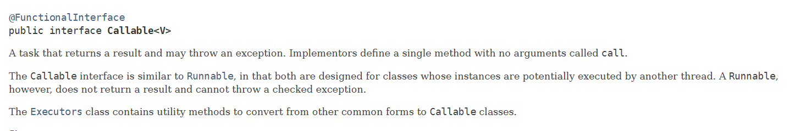

### Callable与Runable的区别

1. 有返回值
2. 可以抛出异常
3. 支持泛型
4. 方法不同 Callable为call()，Runable为run()

```java
package com.usc.juc.runable;

import java.util.concurrent.Callable;
import java.util.concurrent.ExecutionException;
import java.util.concurrent.FutureTask;

public class CallableTest {
    public static void main(String[] args) throws ExecutionException, InterruptedException {
        MyThread2 myThread2 = new MyThread2();
        FutureTask futureTask = new FutureTask(myThread2); //适配器
        new Thread(futureTask, "A").start();
        String o = (String) futureTask.get(); //可能阻塞
        System.out.println(o);
    }
}

class MyThread2 implements Callable<String> {
    @Override
    public String call() throws Exception {
        System.out.println("call()");
        return "success";
    }
}
```

### 适配器

FutureTask是Runable的一个实现类

Future中的构造方法中有Callable这个参数

```java
new Thread(new Runnable()).start();
new Thread(new FutureTask<V>()).start(); //本质也是runable
new Thread(new FutureTask<V>( Callable )).start();
```

### 细节

1. 有缓存
2. get()方法可能会阻塞

### 本质

就是一个有返回值的线程

### 使用

之前的使用，都是可以把资源类单独拿出来，然后```new Thread()```去多线程执行资源类的方法

但是现在应该怎么写呢？

只能用资源类去继承callable接口，然后直接在call()里写？

不能用类似之前的方法实现吗？


## 辅助类

### CountDownLatch

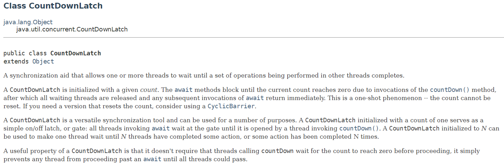

```java
package com.usc.juc.helper;

import java.util.concurrent.CountDownLatch;

public class CountDownLatchTest {
    public static void main(String[] args) throws InterruptedException {
        CountDownLatch countDownLatch = new CountDownLatch(10);
        for (int i = 0; i < 10; i++) {
            new Thread(() -> {
                System.out.println(Thread.currentThread().getName() + "=> go out");
                countDownLatch.countDown();

            }, String.valueOf(i)).start();
        }
        countDownLatch.await();
        System.out.println("close");
    }
}
```

简单来说就是让其他线程等待某一组线程完成后再进行

```java
CountDownLatch countDownLatch = new CountDownLatch(10); //赋初始值

countDownLatch.countDown(); //初始值-1

countDownLatch.await(); // 使其他线程等待 初始值变为0后被唤醒
```


### CyclicBarrier

```java
package com.usc.juc.helper;

import java.util.concurrent.BrokenBarrierException;
import java.util.concurrent.CyclicBarrier;

public class CyclicBarrierTest {
    public static void main(String[] args) {
        CyclicBarrier cyclicBarrier = new CyclicBarrier(7, () -> {
            System.out.println("已经集齐七颗龙珠，可以召唤神龙");
        });

        for (int i = 1; i <= 7; i++) {
            final int temp = i; //如果想在lambda函数里拿到i 只能这么做
            new Thread(() -> {
                System.out.println(Thread.currentThread().getName() + "拿到了第" + temp + "颗龙珠");
                try {
                    cyclicBarrier.await();
                } catch (InterruptedException e) {
                    e.printStackTrace();
                } catch (BrokenBarrierException e) {
                    e.printStackTrace();
                }
            }).start();
        }

    }
}
```

CyclicBarrier cyclicBarrier = new CyclicBarrier()中第一个参数为大小 第二个参数是runnable 满足大小后执行

可以查看出 和CountDown的不同在于它的**await是在线程内的**。


### Semaphore

```java
package com.usc.juc.helper;

import java.util.concurrent.Semaphore;
import java.util.concurrent.TimeUnit;

public class SemaphoreTest {
    public static void main(String[] args) {
        // 线程数量：停车位! 限流！
        Semaphore semaphore = new Semaphore(3);

        for (int i = 0; i < 6; i++) {
            new Thread(() -> {
                try {
                    semaphore.acquire();
                    System.out.println(Thread.currentThread().getName() + "抢到了车位");
                    TimeUnit.SECONDS.sleep(3);
                    System.out.println(Thread.currentThread().getName() + "离开了车位");
                } catch (InterruptedException e) {
                    e.printStackTrace();
                } finally {
                    semaphore.release();
                }
            }, String.valueOf(i)).start();

        }
    }
}
```

```Semaphore semaphore = new Semaphore(3);``` 最大允许进入的线程量

```semaphore.acquire()``` 获取，如果已经满了，则会等待

```semaphore.release();``` 释放，唤醒等待的线程


#### Semaphore和Lock的区别

应该可以说Semaphore 如果说是一种特殊的lock：（因为大家首先学习的lock才这么说，应该是lock是一种特殊的Semaphore）

1. lock 是独占，一人享用，而Semaphore是一个多人使用，lock是电影院的VIP单人间，而Semaphore是大厅。 
2. lock和Semaphore都需要排队，都有两种排队方式：公平和非公平。
3. lock和Semaphore都是改变state变量，只是lock争夺0变成1，而Semaphore是争一个非零的值，因此几率大很多。
4. 如果初始是将permits也是就是state 置为1，那么Semaphore就和lock没区别了。


## ReadWriteLock

```java
//不加锁的状态下
package com.usc.juc.helper.ReadWriteLock;

import java.util.HashMap;
import java.util.Map;

public class ReadWriteLockTest {
    public static void main(String[] args) {
        MyCache myCache = new MyCache();
        for (int i = 0; i < 5; i++) {
            final int temp = i;
            new Thread(() -> {
                myCache.put(temp + "", temp + "");
            }, String.valueOf(i)).start();
        }

        for (int i = 0; i < 5; i++) {
            final int temp = i;
            new Thread(() -> {
                myCache.get(temp + "");
            }, String.valueOf(i)).start();
        }
    }
}

class MyCache {
    private volatile  Map<String, Object> map = new HashMap<>();

    public void put(String key, Object value) {
        System.out.println("正在写入--->" + key);
        map.put(key, value);
        System.out.println("写入成功--->" + key);
    }

    public void get(String key) {
        System.out.println("正在读取--->" + key);
        map.get(key);
        System.out.println("读取成功--->" + key);
    }
}
```

```java
//加入读写锁
package com.usc.juc.helper.ReadWriteLock;

import java.util.HashMap;
import java.util.Map;
import java.util.concurrent.TimeUnit;
import java.util.concurrent.locks.ReadWriteLock;
import java.util.concurrent.locks.ReentrantReadWriteLock;

public class ReadWriteLockTest {
    public static void main(String[] args) throws InterruptedException {
        MyLockCache myCache = new MyLockCache();
        for (int i = 0; i < 30; i++) {
            final int temp = i;
            new Thread(() -> {
                myCache.put(temp + "", temp + "");
            }, String.valueOf(i)).start();
        }

        for (int i = 0; i < 30; i++) {
            final int temp = i;
            new Thread(() -> {
                myCache.get(temp + "");
            }, String.valueOf(i)).start();
        }
    }
}

class MyLockCache {
    private volatile  Map<String, Object> map = new HashMap<>();
    ReadWriteLock lock = new ReentrantReadWriteLock();

    public void put(String key, Object value) {
        lock.writeLock().lock();
        try {
            System.out.println("正在写入--->" + key);
            map.put(key, value);
            System.out.println("写入成功--->" + key);
        } catch (Exception e) {
            e.printStackTrace();
        } finally {
            lock.writeLock().unlock();
        }
    }

    public void get(String key) {
        lock.readLock().lock();
        try {
            System.out.println("正在读取--->" + key);
            map.get(key);
            System.out.println("读取成功--->" + key);
        } catch (Exception e) {
            e.printStackTrace();
        } finally {
            lock.readLock().unlock();
        }

    }
}

class MyCache {
    private volatile Map<String, Object> map = new HashMap<>();

    public void put(String key, Object value) {
        System.out.println("正在写入--->" + key);
        map.put(key, value);
        System.out.println("写入成功--->" + key);
    }

    public void get(String key) {
        System.out.println("正在读取--->" + key);
        map.get(key);
        System.out.println("读取成功--->" + key);
    }
}
```

上写锁的时候，仅允许当前线程进行写操作，其他线程不能读也不能写

上读锁的适合，其他线程可以读但是不能写


**问题**：为什么执行的时候每次都是全部写完了才开始读 讲道理的话不应该是一个线程结束后 cpu再调度另一个线程吗 

为什么不可以一个写线程之后是一个读线程？

**回答**：如果当前的写释放了锁 因为作家偏好 下一个锁也会给写 因为写会相对比较快

​			但是如果当前的读释放了锁，那么下一个锁会给读


## BlockingQueue

初始化队列的适合必须对队列大小进行赋值

如果队列满了，就必须阻塞等待

如果队列空了，也必须阻塞等待

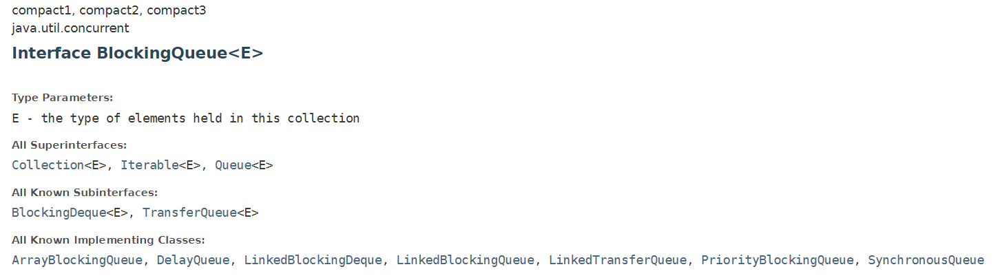

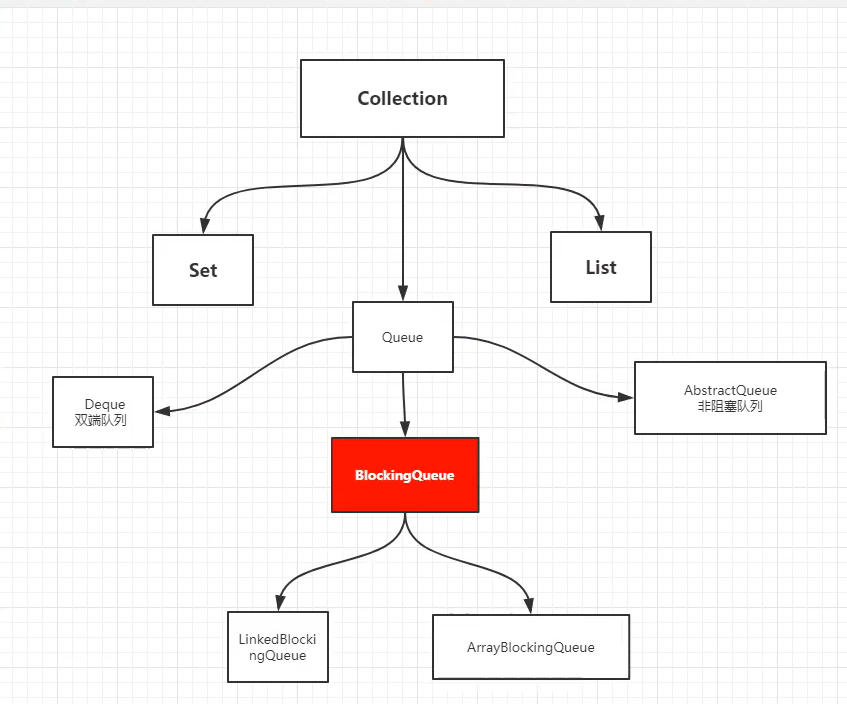

### 四种API

| 方式     | 抛出异常 | 有返回值，不抛出异常 | 阻塞 等待 | 超时 等待 |
| -------- | -------- | -------------------- | --------- | --------- |
| 添加     | add      | offer                | put       | offer     |
| 删除     | remove   | poll                 | take      | poll      |
| 检测队首 | element  | peek                 |           |           |

```java
package com.usc.juc.blocking;

import java.util.concurrent.ArrayBlockingQueue;
import java.util.concurrent.BlockingQueue;
import java.util.concurrent.TimeUnit;

public class BlockingQueueTest {

    public static void test1() {
        ArrayBlockingQueue arrayBlockingQueue = new ArrayBlockingQueue(3);
        System.out.println(arrayBlockingQueue.add("1"));
        System.out.println(arrayBlockingQueue.add("2"));
        System.out.println(arrayBlockingQueue.add("3"));
//        System.out.println(arrayBlockingQueue.add("4"));

        System.out.println(arrayBlockingQueue.remove());
        System.out.println(arrayBlockingQueue.remove());
        System.out.println(arrayBlockingQueue.remove());
//        System.out.println(arrayBlockingQueue.remove());

    }

    public static void test2() {
        ArrayBlockingQueue arrayBlockingQueue = new ArrayBlockingQueue(3);
        System.out.println(arrayBlockingQueue.offer("1"));
        System.out.println(arrayBlockingQueue.offer("2"));
        System.out.println(arrayBlockingQueue.offer("3"));
        System.out.println(arrayBlockingQueue.offer("4"));

        System.out.println(arrayBlockingQueue.poll());
        System.out.println(arrayBlockingQueue.poll());
        System.out.println(arrayBlockingQueue.poll());
        System.out.println(arrayBlockingQueue.poll());

    }

    public static void test3() throws InterruptedException {
        ArrayBlockingQueue arrayBlockingQueue = new ArrayBlockingQueue(3);
        arrayBlockingQueue.put("1"); //put的返回值为空
        arrayBlockingQueue.put("2");
        arrayBlockingQueue.put("3");
//        arrayBlockingQueue.put("4");

        System.out.println(arrayBlockingQueue.take());
        System.out.println(arrayBlockingQueue.take());
        System.out.println(arrayBlockingQueue.take());
//        System.out.println(arrayBlockingQueue.take());

    }

    public static void test4() throws InterruptedException {
        ArrayBlockingQueue arrayBlockingQueue = new ArrayBlockingQueue(3);
        System.out.println(arrayBlockingQueue.offer("1", 2, TimeUnit.SECONDS));
        System.out.println(arrayBlockingQueue.offer("2", 2, TimeUnit.SECONDS));
        System.out.println(arrayBlockingQueue.offer("3", 2, TimeUnit.SECONDS));
        System.out.println(arrayBlockingQueue.offer("4", 2, TimeUnit.SECONDS));


        System.out.println(arrayBlockingQueue.poll(2, TimeUnit.SECONDS));
        System.out.println(arrayBlockingQueue.poll(2, TimeUnit.SECONDS));
        System.out.println(arrayBlockingQueue.poll(2, TimeUnit.SECONDS));
        System.out.println(arrayBlockingQueue.poll(2, TimeUnit.SECONDS));

    }

    public static void main(String[] args) throws InterruptedException {
        test4();
    }
}
```


## SynchronousQueue

有继承自BlockingQueue

[参考](https://zhuanlan.zhihu.com/p/29227508)

1. 可以指定锁的公平性
2. 它内部没有容器，只能存一个值。一个生产线程，当它生产产品（即put的时候），如果当前没有人想要消费产品(即当前没有线程执行take)，此生产线程必须阻塞，等待一个消费线程调用take操作，take操作将会唤醒该生产线程，同时消费线程会获取生产线程的产品（即数据传递），这样的一个过程称为一次配对过程。(当然也可以先take后put,原理是一样的，如果take完之后没有put，那么线程一样会堵塞)。


```java
//如果3put 3take 是可以的
//如果3put 2take或者 2put 3take都是会堵塞的
package com.usc.juc.blocking;

import java.util.concurrent.BlockingQueue;
import java.util.concurrent.SynchronousQueue;

public class SynchronousQueueTest {

    public static void test1() {
        SynchronousQueue<String> blockingQueue = new SynchronousQueue<>();
        new Thread(() -> {
            try {
                System.out.println(Thread.currentThread().getName() + "put 1");
                blockingQueue.put("1");
                System.out.println(Thread.currentThread().getName() + "put 2");
                blockingQueue.put("2");
//                System.out.println(Thread.currentThread().getName() + "put 3");
//                blockingQueue.put("3");
            } catch (InterruptedException e) {
                e.printStackTrace();
            }
        }).start();

        new Thread(() -> {
            try {
                System.out.println(Thread.currentThread().getName() + "get 1");
                blockingQueue.take();
                System.out.println(Thread.currentThread().getName() + "get 2");
                blockingQueue.take();
                System.out.println(Thread.currentThread().getName() + "get 3");
                blockingQueue.take();
            } catch (InterruptedException e) {
                e.printStackTrace();
            }
        }).start();
    }

    public static void main(String[] args) {
        test1();
    }
}
```


## 线程池

### 池化技术

线程池、连接池、内存池、对象池

程序的运行本质：占用系统的资源！ 优化资源的使用！=> 池化技术

池化技术：创建、销毁。十分浪费资源，所以事先准备好一些资源，有人要用，就来我这里拿，用完之后还给我。


### 线程池的好处

1. 线程复用，降低资源消耗，提高响应速度
2. 可控制最大并发数，方便管理


### 线程池三大方法

```java
package com.usc.juc.pool;

import java.util.concurrent.ExecutorService;
import java.util.concurrent.Executors;

public class Test1 {
    public static void main(String[] args) {
//        ExecutorService threadPool = Executors.newSingleThreadExecutor(); //单个线程
//        ExecutorService threadPool = Executors.newFixedThreadPool(5); //大小固定的线程池
        ExecutorService threadPool = Executors.newCachedThreadPool(); // 可伸缩的，遇强则强，遇弱则弱
        try {
            for (int i = 0; i < 10; i++) {
                //线程池创建线程
                threadPool.execute(() -> {
                    System.out.println(Thread.currentThread().getName() + " ===> ok");
                });
            }
        } catch (Exception e) {
            e.printStackTrace();
        } finally {
            //关闭线程池
            threadPool.shutdown();
        }
    }
}

```


### 线程池七大参数

```java
// ExecutorService实现方式
public static ExecutorService newSingleThreadExecutor() {
    return new FinalizableDelegatedExecutorService
        (new ThreadPoolExecutor(1, 1,
                                0L, TimeUnit.MILLISECONDS,
                                new LinkedBlockingQueue<Runnable>()));
}

public static ExecutorService newFixedThreadPool(int nThreads) {
    return new ThreadPoolExecutor(nThreads, nThreads,
                                  0L, TimeUnit.MILLISECONDS,
                                  new LinkedBlockingQueue<Runnable>());
}

public static ExecutorService newCachedThreadPool() {
    return new ThreadPoolExecutor(0, Integer.MAX_VALUE,
                                  60L, TimeUnit.SECONDS,
                                  new SynchronousQueue<Runnable>());
}
```

```java
// ThreadPoolExecutor源码
public ThreadPoolExecutor(int corePoolSize, // 核心线程池大小
                          int maximumPoolSize, // 最大核心线程池大小
                          long keepAliveTime, // 超时无人调用会释放
                          TimeUnit unit, // 超时单位
                          BlockingQueue<Runnable> workQueue, // 阻塞队列
                          ThreadFactory threadFactory, // 线程工厂 用于创建线程 一般不用修改
                          RejectedExecutionHandler handler) { // 拒绝策略
    if (corePoolSize < 0 ||
        maximumPoolSize <= 0 ||
        maximumPoolSize < corePoolSize ||
        keepAliveTime < 0)
        throw new IllegalArgumentException();
    if (workQueue == null || threadFactory == null || handler == null)
        throw new NullPointerException();
    this.acc = System.getSecurityManager() == null ?
            null :
            AccessController.getContext();
    this.corePoolSize = corePoolSize;
    this.maximumPoolSize = maximumPoolSize;
    this.workQueue = workQueue;
    this.keepAliveTime = unit.toNanos(keepAliveTime);
    this.threadFactory = threadFactory;
    this.handler = handler;
}
```


### 四种拒绝策略

```
/**
* new ThreadPoolExecutor.AbortPolicy() // 银行满了，还有人进来，不处理这个人的，抛出异
常
* new ThreadPoolExecutor.CallerRunsPolicy() // 哪来的去哪里！
* new ThreadPoolExecutor.DiscardPolicy() //队列满了，丢掉任务，不会抛出异常！
* new ThreadPoolExecutor.DiscardOldestPolicy() //队列满了，尝试去和最早的竞争，也不会
抛出异常！
*/
```


### alibaba推荐使用的创建线程池的方法

```java
package com.usc.juc.pool;

import java.util.concurrent.ArrayBlockingQueue;
import java.util.concurrent.Executors;
import java.util.concurrent.ThreadPoolExecutor;
import java.util.concurrent.TimeUnit;

public class Test2 {
    public static void main(String[] args) {
        ThreadPoolExecutor threadPool = new ThreadPoolExecutor(3,
                7,
                3,
                TimeUnit.SECONDS,
                new ArrayBlockingQueue(11),
                Executors.defaultThreadFactory(),
                new ThreadPoolExecutor.AbortPolicy()) { //默认的拒绝策略

        };

        try {
            for (int i = 0; i < 19; i++) {
                threadPool.execute(() -> {
                    System.out.println(Thread.currentThread().getName() + " ===> ok");
                });
            }
        } catch (Exception e) {
            e.printStackTrace();
        } finally {
            threadPool.shutdown();
        }
    }
}
```

**注意**：以下两个参数的创建方式

```ThreadFactory threadFactory``` ===》 Executors.defaultThreadFactory()

```RejectedExecutionHandler handler``` ===》new ThreadPoolExecutor.AbortPolicy()


**类比去银行办理业务**：

```java
int corePoolSize,  // 目前开放用于办理业务的窗口
int maximumPoolSize, // 若办理业务的窗口和等待区都满了 开新的窗口 这是最大窗口口数
long keepAliveTime, // 如果大部分人都办理完业务了 窗口超过一段时间没人办理业务 会关闭
TimeUnit unit, // 超时单位
BlockingQueue<Runnable> workQueue, // 等待办理业务的区域
ThreadFactory threadFactory, // 线程工厂 用于创建线程 一般不用修改
RejectedExecutionHandler handler) { // 人已经满了（达到最大窗口数的情况下 等待区也满了）拒绝办理
    
```


### CPU密集型 IO密集型

用来决定线程池的最大大小 其实是用来调优的

CPU密集型：几个处理器就是几

IO密集型：大型IO操作数量的三倍

```java
package com.usc.juc.pool;

import java.util.concurrent.ArrayBlockingQueue;
import java.util.concurrent.Executors;
import java.util.concurrent.ThreadPoolExecutor;
import java.util.concurrent.TimeUnit;

public class Test2 {
    public static void main(String[] args) {
        System.out.println(Runtime.getRuntime().availableProcessors());
        ThreadPoolExecutor threadPool = new ThreadPoolExecutor(3,
                Runtime.getRuntime().availableProcessors(), // 应该这样写 而不是直接写死
                3,
                TimeUnit.SECONDS,
                new ArrayBlockingQueue(11),
                Executors.defaultThreadFactory(),
                new ThreadPoolExecutor.AbortPolicy()) {

        };

        try {
            for (int i = 0; i < 30; i++) {
                threadPool.execute(() -> {
                    System.out.println(Thread.currentThread().getName() + " ===> ok");
                });
            }
        } catch (Exception e) {
            e.printStackTrace();
        } finally {
            threadPool.shutdown();
        }
    }
}
```


## 函数式接口

### function函数型接口

```java
package com.usc.juc.function;

import java.util.function.Function;

public class Demo01 {
    public static void main(String[] args) {
//        Function<String, String> function = new Function<String, String>() {
//            @Override
//            public String apply(String s) {
//                return s;
//            }
//        };
        Function<String, String> function = (str) -> {return str;};
        System.out.println(function.apply("abc"));
    }
}

```


### 断定型接口

```java
package com.usc.juc.function;

import java.util.function.Predicate;

public class Demo2 {
    public static void main(String[] args) {
//        Predicate<String> predicate = new Predicate<String>() {
//            @Override
//            public boolean test(String s) {
//                return s.equals("abc");
//            }
//        };
        Predicate<String> predicate = (str) -> {return str.equals("abc");};
        System.out.println(predicate.test("abc"));
        System.out.println(predicate.test("abb"));

    }
}
```


### consumer消费型接口

```java
package com.usc.juc.function;

import java.beans.Customizer;
import java.util.function.Consumer;

public class Demo03 {
    public static void main(String[] args) {
//        Consumer<String> consumer = new Consumer<String>() {
//            @Override
//            public void accept(String s) {
//                System.out.println(s);
//            }
//        };
        Consumer consumer = (str) -> {
            System.out.println(str);
        };
        consumer.accept("abc");
    }
}
```


### Supplier供给型接口

```java
public class Demo04 {
    public static void main(String[] args) {
        Supplier<String> supplier = () -> {return "abc";};
        System.out.println(supplier.get());
    }
}
```


## Stream流

```java
package com.usc.juc.stream;

import com.sun.xml.internal.ws.api.model.wsdl.WSDLOutput;

import java.lang.reflect.Array;
import java.util.Arrays;
import java.util.List;
import java.util.stream.Stream;

public class StreamTest {
    public static void main(String[] args) {
        User user1 = new User(1, "wjj", 24);
        User user2 = new User(2, "fxt", 23);
        User user3 = new User(3, "cny", 18);
        User user4 = new User(4, "syc", 23);

        List<User> list = Arrays.asList(user1, user2, user3, user4);
        list.stream()
                .filter(user -> {return user.getId() % 2 == 0;}) // filter是断定型接口
                .filter(user -> {return user.getAge()>22;})
                .map(user -> {return user.getName().toUpperCase();}) //map是函数形接口
                .sorted((o1, o2) -> {return o2.compareTo(o1);})
                .forEach(System.out :: println); // forEach是消费型接口

    }
}
```


## ForkJoin

### 什么是ForkJoin

ForkJoin 在 JDK 1.7 ， 并行执行任务！提高效率。大数据量！

类似于大数据中的MapReduce（把大任务拆分为	小任务）

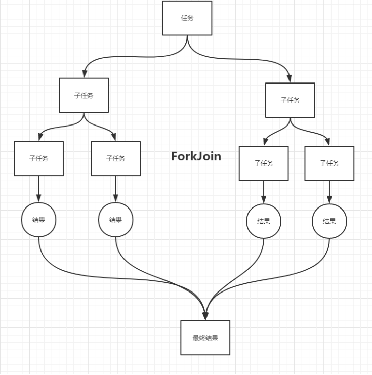

### ForkJoin特点（工作窃取）

维护的是双端队列

如果一个线程已经执行完自己的任务了，他可能会拿别的线程的任务进行执行


### ForkJoin使用

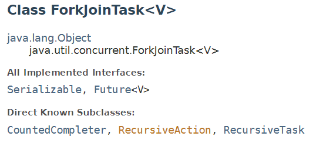

```RecursiveAction```：无返回值

```RecursiveTask```: 有返回值


```java
package com.usc.juc.forkjoin;

import java.util.concurrent.RecursiveTask;

/**
 * 创建求和计算任务
 * 继承RecursiveTask抽象类，必须重新compute抽象方法
 * */
public class ForkJoinDemo extends RecursiveTask<Long> {
    private long start;
    private long end;
    private long temp = 10000L;

    public ForkJoinDemo(long start, long end) {
        this.start = start;
        this.end = end;
    }


    @Override
    protected Long compute  () {
        if (end - start < temp) {
            Long sum =0L;
            for (Long i = start; i <= end ; i++) {
                sum += i;
            }
            return sum;
        }
        else {
            Long middle = (end - start) / 2;
            ForkJoinDemo task1 = new ForkJoinDemo(start, middle);
            task1.fork();
            ForkJoinDemo task2 = new ForkJoinDemo(middle, end);
            task2.fork();
            return task1.join() + task2.join();
        }
    }
}

```

```java
package com.usc.juc.forkjoin;

import java.util.concurrent.ExecutionException;
import java.util.concurrent.ForkJoinPool;
import java.util.concurrent.ForkJoinTask;
import java.util.stream.LongStream;

public class Test {

    // 普通计算方法
    public static void test1() {
        Long sum = 0L;
        Long start = System.currentTimeMillis();
        for (Long i = 0L; i < 10_0000_0000L; i++) {
            sum += i;
        }
        Long end = System.currentTimeMillis();
        System.out.println("和为：" + sum + " 用时：" + (end - start));
    }

    //ForkJoin
    public static void test2() throws ExecutionException, InterruptedException {
        Long start = System.currentTimeMillis();
        ForkJoinPool forkJoinPool = new ForkJoinPool(); // 类似于线程池 需要先创建
        ForkJoinDemo task = new ForkJoinDemo(0L, 10_0000_0000L); // 创建ForkJoin任务
        ForkJoinTask<Long> submit = forkJoinPool.submit(task);// submit有返回值 excute没有
        Long sum = submit.get();
        Long end = System.currentTimeMillis();
        System.out.println("和为：" + sum + " 用时：" + (end - start));
    }

    //Stream
    public static void test3() {
        Long start = System.currentTimeMillis();
        long sum = LongStream.rangeClosed(0L, 10_0000_0000L).parallel().reduce(0, Long::sum);
        Long end = System.currentTimeMillis();
        System.out.println("和为：" + sum + " 用时：" + (end - start));

    }

    public static void main(String[] args) throws ExecutionException, InterruptedException {
//        test1();// 7374
        test2(); //3959
//        test3(); //244
    }
}
```

## 异步回调

### 不带返回值的异步回调

```java
package com.usc.juc.furture;

import java.util.concurrent.CompletableFuture;
import java.util.concurrent.ExecutionException;
/**
 * 不带返回值的异步回调
 * */
public class Demo01 {
    public static void main(String[] args) throws ExecutionException, InterruptedException {
        CompletableFuture<Void> completableFuture =CompletableFuture.runAsync(() -> {
            System.out.println(Thread.currentThread().getName() + "===> void");
        });
        System.out.println("123");
        completableFuture.get();
    }
}

```

作用：

同一个线程内，进行异步操作，先让下面的任务执行，然后在合适的时机通过```completableFuture.get();```调用结果


### 带返回值的异步回调 可以处理异常

```java
package com.usc.juc.furture;

import java.util.concurrent.CompletableFuture;
import java.util.concurrent.ExecutionException;

public class Demo02 {
    public static void main(String[] args) throws ExecutionException, InterruptedException {
        CompletableFuture<Integer> completableFuture = CompletableFuture.supplyAsync(() -> {
            System.out.println(Thread.currentThread().getName() + "===> Integer");
            return 200;
        });

        completableFuture.whenComplete((t, u) -> {// 重写BiCosumer函数
            System.out.println("t===>" + t);// 打印返回值
            System.out.println("u===>" + u);// 打印异常信息
        }).get();
    }
}
```

```java
package com.usc.juc.furture;

import java.util.concurrent.CompletableFuture;
import java.util.concurrent.ExecutionException;

public class Demo02 {
    public static void main(String[] args) throws ExecutionException, InterruptedException {
        CompletableFuture<Integer> completableFuture = CompletableFuture.supplyAsync(() -> {
            System.out.println(Thread.currentThread().getName() + "===> Integer");
            int i = 10/0; // 制造异常
            return 200;
        });

        completableFuture.whenComplete((t, u) -> {
            System.out.println("t===>" + t);
            System.out.println("u===>" + u);
        }).exceptionally((e) -> { // 捕获异常信息
            System.out.println(e.getMessage());
            return 400;
        }).get();
    }
}
```

```java
package com.usc.juc.furture;

import java.util.concurrent.CompletableFuture;
import java.util.concurrent.ExecutionException;

public class Demo02 {
    public static void main(String[] args) throws ExecutionException, InterruptedException {
        CompletableFuture<Integer> completableFuture = CompletableFuture.supplyAsync(() -> {
//            System.out.println(Thread.currentThread().getName() + "===> Integer");
            int i = 10/0;
            return 200;
        });

        //感觉这样玩比较合理
        completableFuture.whenComplete((t, u) -> {
            System.out.println(u == null ? t : u);
        }).get();
    }
}
```


## JMM

### 什么是JMM

JMM ： Java内存模型，不存在的东西，概念！约定！

关于JMM的一些同步的约定：

1. 线程加锁前，必须读取主存中的最新值到工作内存中！(线程在执行前会从主存中read一份然后load到工作区，然后通过执行引擎对工作区的进行修改，不会直接修改主存的内容)

2. 线程解锁前，必须把共享变量立刻刷回主存。
3. 加锁和解锁是同一把锁


### 八大操作 

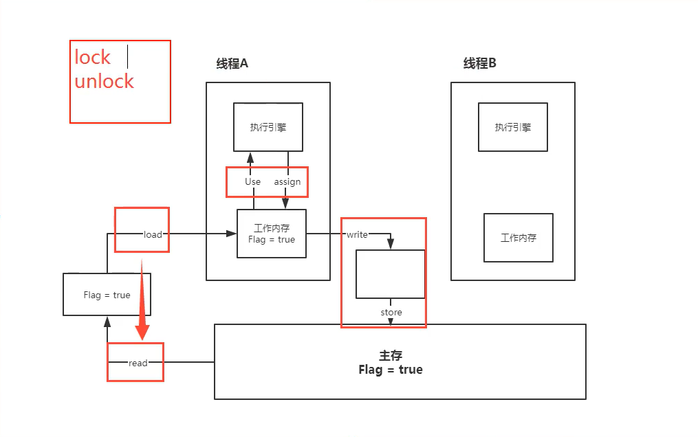

lock （锁定）：作用于主内存的变量，把一个变量标识为线程独占状态

unlock （解锁）：作用于主内存的变量，它把一个处于锁定状态的变量释放出来，释放后的变量
才可以被其他线程锁定

read （读取）：作用于主内存变量，它把一个变量的值从主内存传输到线程的工作内存中，以便
随后的load动作使用

load （载入）：作用于工作内存的变量，它把read操作从主存中变量放入工作内存中

use （使用）：作用于工作内存中的变量，它把工作内存中的变量传输给执行引擎，每当虚拟机
遇到一个需要使用到变量的值，就会使用到这个指令

assign （赋值）：作用于工作内存中的变量，它把一个从执行引擎中接受到的值放入工作内存的变
量副本中

store （存储）：作用于主内存中的变量，它把一个从工作内存中一个变量的值传送到主内存中，
以便后续的write使用

write （写入）：作用于主内存中的变量，它把store操作从工作内存中得到的变量的值放入主内
存的变量中


### 无法保证内存可见性

```java
package com.usc.juc.volatiletest;

import java.util.concurrent.TimeUnit;

public class Demo01 {
    static boolean flag = true; //只有写成静态变量 匿名类里才可以读得到
    public static void main(String[] args) throws InterruptedException {
        new Thread(() -> {
            while (flag) {

            }
        }, "A").start();

        TimeUnit.SECONDS.sleep(2); //保证上面的线程先运行

        flag = false; //主线程虽然修改了，但是线程A并不知道
        System.out.println("false");
    }
}
```


## Volatile

保证内存可见性，禁止指令重排，不保证原子性

### 保证内存可见性

```java
package com.usc.juc.volatiletest;

import java.util.concurrent.TimeUnit;

public class Demo01 {
    static volatile boolean flag = true; //只有写成静态变量 匿名类里才可以读得到
    public static void main(String[] args) throws InterruptedException {
        new Thread(() -> {
            while (flag) {

            }
        }, "A").start();

        TimeUnit.SECONDS.sleep(2); //保证上面的线程先运行

        flag = false; // 线程A会从主存中拿值 所以会停止
        System.out.println("false");
    }
}
```


### 不保证原子性

```java
package com.usc.juc.volatiletest;

public class Demo02 {
    public volatile static int num = 0;

    public static void add() {
        num += 1; //不是原子操作
    }

    public static void main(String[] args) {
        for (int i = 0; i < 20 ; i++) {
            new Thread(() -> {
                for (int j = 0; j < 1000; j++) {
                    add();
                }
            }).start();
        }
        while(Thread.activeCount() > 2) { //java默认有两个线程 主线程和GC
            Thread.yield(); //如果线程数大于2 主线程就会把自己的时间让掉 也就是说主线程最后进行
        }

        System.out.println(num); //输出结果不一定时20000
    }

}

```

num ++ 并不是原子操作 他的执行过程分为好几步，所以可能两个线程同时读取到了同一个数，如此一来两个线程的+1操作最终只会使num + 1； 


**如果想保证原子性 可以给num加synchronized或lock**

```java
package com.usc.juc.volatiletest;

public class Demo02 {
    public static int num = 0;

    public synchronized static void add() {
        num += 1;
    }

    public static void main(String[] args) {
        for (int i = 0; i < 20 ; i++) {
            new Thread(() -> {
                for (int j = 0; j < 1000; j++) {
                    add();
                }
            }).start();
        }
        while(Thread.activeCount() > 2) { //java默认有两个线程 主线程和GC
            Thread.yield(); //如果线程数大于2 主线程就会把自己的时间让掉 也就是说主线程最后进行
        }

        System.out.println(num);
    }

}
```


**也可以使用原子类来保证原子性 相对于锁来说 更高效**

```java
package com.usc.juc.volatiletest;

import java.util.concurrent.atomic.AtomicInteger;

public class Demo02 {
    public static AtomicInteger num = new AtomicInteger();

    public static void add() {
        num.getAndIncrement(); //原子类的+1操作
    }

    public static void main(String[] args) {
        for (int i = 0; i < 20 ; i++) {
            new Thread(() -> {
                for (int j = 0; j < 1000; j++) {
                    add();
                }
            }).start();
        }
        while(Thread.activeCount() > 2) { //java默认有两个线程 主线程和GC
            Thread.yield(); //如果线程数大于2 主线程就会把自己的时间让掉 也就是说主线程最后进行
        }
        System.out.println(num);
    }

}
```

这些类的底层都直接和操作系统挂钩！在内存中修改值！Unsafe类是一个很特殊的存在！


### 指令重排

#### 什么是指令重排

你写的程序，计算机并不是按照你写的那样去执行的。

源代码-->编译器优化的重排--> 指令并行也可能会重排--> 内存系统也会重排---> 执行

**但是处理器在进行指令重排的时候会考虑数据之间的依赖性！**

```java
int x = 1; // 1
int y = 2; // 2
x = x + 5; // 3
y = x * x; // 4
我们所期望的：1234 但是可能执行的时候回变成 2134 1324
不可能是 4123 因为4依赖于1
```


**例子**：

x y a b初始值都为零 两个线程并发执行

| Thread A | Thread B |
| :------: | :------: |
|  x = a   |  y = b   |
|  b = 1   |  a = 2   |

结果 x = 0 y = 0


但是 如果发生指令重排（因为子单个线程内部 两个操作是没有依赖的）

| Thread A | Thread B |
| :------: | :------: |
|  b = 1   |  a = 2   |
|  x = a   |  y = b   |

x = 2 y = 1


#### 如何保证禁止指令重排

volatile可以避免指令重排：

内存屏障。CPU指令。作用：

1、保证特定的操作的执行顺序！

2、可以保证某些变量的内存可见性 （利用这些特性volatile实现了可见性）

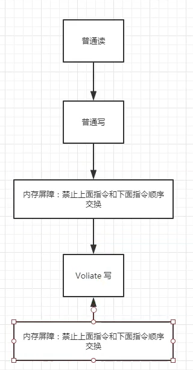

内存屏障可以保证内存凭证中间的指令的顺序 但是内存屏障之外的无法保证


## CAS

**compare and swap**

[参考](https://www.jianshu.com/p/ae25eb3cfb5d)

```java
package com.usc.juc.cas;

import java.util.concurrent.atomic.AtomicInteger;

public class Demo01 {
    public static void main(String[] args) {
        AtomicInteger atomicInteger = new AtomicInteger(2020);
        // 如果我期望的值达到了，那么就更新，否则，就不更新, CAS 是CPU的并发原语！
        System.out.println(atomicInteger.compareAndSet(2020, 2021));
        System.out.println(atomicInteger);

        atomicInteger.getAndIncrement();
        System.out.println(atomicInteger.compareAndSet(2020, 2021));
        System.out.println(atomicInteger);
    }
}
```

```java
// AtomicInteger中 getAndIncrement的实现
public final int getAndIncrement() {
    return unsafe.getAndAddInt(this, valueOffset, 1);
}
```

可见```getAndIncrement```是由```unsafe```类的```getAndAddInt```实现的

```java
// unsafe类源码
public class AtomicInteger extends Number implements java.io.Serializable {
    private static final long serialVersionUID = 6214790243416807050L;

    // setup to use Unsafe.compareAndSwapInt for updates
    private static final Unsafe unsafe = Unsafe.getUnsafe(); // 调用unsafe类
    private static final long valueOffset;

    static {
        try {
            valueOffset = unsafe.objectFieldOffset // 获取内存地址偏移量
                (AtomicInteger.class.getDeclaredField("value"));
        } catch (Exception ex) { throw new Error(ex); }
    }

    private volatile int value;
```

```java
// unsafe类中 getAndAddInt
public final int getAndAddInt(Object var1, long var2, int var4) {
    int var5;
    do {
        var5 = this.getIntVolatile(var1, var2);
    } while(!this.compareAndSwapInt(var1, var2, var5, var5 + var4));

    return var5;
}
```

对比```getAndIncrement```和```getAndAddInt```，可以看出

```var1 = this``` 当前对象

```var2 = valueoffset``` 内存地址偏移量

```var4 = 1``` 要增加的数值

```var5```使用当前对象以及其内存地址偏移量拿到数值 如果这个数值相等（也就是说var没有被其他线程改变）那么久将var5加上var4并返回

如果不相等，那么更新失败，会重新取值（我理解为重新执行getAndIncrement方法），然后再次尝试

我个人感觉 ，只所以有var5是为了保证 在执行+1操作的适合 待+1的值是没有被改变过的 以此保证原子性


## ABA问题

​	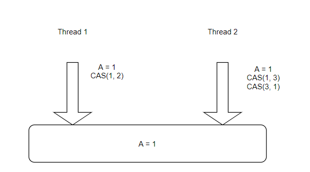

两个线程同时去内存中取值，Thread2速度较快对A进行了两次修改，最终的修改结果和A的初始值相同。

但是Thread1并不知情，他以为当前A的1还是之前的1

```java
package com.usc.juc.cas;

import java.util.concurrent.TimeUnit;
import java.util.concurrent.atomic.AtomicInteger;

public class Demo02 {
    public static void main(String[] args) {
        AtomicInteger atomicInteger = new AtomicInteger(2);

        new Thread(() -> {
            System.out.println(atomicInteger.compareAndSet(2, 3));
            System.out.println(atomicInteger.get());

            System.out.println(atomicInteger.compareAndSet(3, 2));
            System.out.println(atomicInteger.get());
        }, "1").start();


        new Thread(() -> {
            try {
                TimeUnit.SECONDS.sleep(3);
            } catch (InterruptedException e) {
                e.printStackTrace();
            }
            System.out.println(atomicInteger.compareAndSet(2, 3));
            System.out.println(atomicInteger.get());
        }, "2").start();


    }
}
```


## 原子引用

```java
package com.usc.juc.cas;

import java.util.concurrent.TimeUnit;
import java.util.concurrent.atomic.AtomicStampedReference;

/**
 * 模拟会出问题的写法
 * */
public class Demo03 {
    public static void main(String[] args) {
        AtomicStampedReference<Integer> atomicStampedReference = new AtomicStampedReference<>(2, 1);

        new Thread(() -> {
            System.out.println("A===>" + atomicStampedReference.compareAndSet(2, 3, atomicStampedReference.getStamp(), atomicStampedReference.getStamp() + 1));
            try {
                TimeUnit.SECONDS.sleep(2); // 让B先拿到值为1的时间戳
            } catch (InterruptedException e) {
                e.printStackTrace();
            }

            System.out.println("A===>" + atomicStampedReference.compareAndSet(3, 2, atomicStampedReference.getStamp(), atomicStampedReference.getStamp() + 1));
        }, "A").start();

        new Thread(() -> {
            int stamp = atomicStampedReference.getStamp();

            try {
                TimeUnit.SECONDS.sleep(3); // 让A先执行
            } catch (InterruptedException e) {
                e.printStackTrace();
            }

            System.out.println("B==>" + atomicStampedReference.compareAndSet(2, 3, stamp, stamp + 1)); // 此时虽然值还是2 但是时间戳已经不是1而是3了
        }, "B").start();
        
    }
}
```

```java
package com.usc.juc.cas;

import java.util.concurrent.TimeUnit;
import java.util.concurrent.atomic.AtomicStampedReference;
/**
 * 此种写法就不会出问题了
 * */
public class Demo03 {
    public static void main(String[] args) {
        AtomicStampedReference<Integer> atomicStampedReference = new AtomicStampedReference<>(2, 1);

        new Thread(() -> {
            try {
                TimeUnit.SECONDS.sleep(2); // 让B先拿到值为1的时间戳
            } catch (InterruptedException e) {
                e.printStackTrace();
            }

            System.out.println("A===>" + atomicStampedReference.compareAndSet(2, 3, atomicStampedReference.getStamp(), atomicStampedReference.getStamp() + 1));

            System.out.println("A===>" + atomicStampedReference.compareAndSet(3, 2, atomicStampedReference.getStamp(), atomicStampedReference.getStamp() + 1));
        }, "A").start();

        new Thread(() -> {
//            int stamp = atomicStampedReference.getStamp();

            try {
                TimeUnit.SECONDS.sleep(3); // 让A先执行
            } catch (InterruptedException e) {
                e.printStackTrace();
            }

            System.out.println("B==>" + atomicStampedReference.compareAndSet(2, 3, atomicStampedReference.getStamp(), atomicStampedReference.getStamp() + 1)); // 此时虽然值还是2 但是时间戳已经不是1而是3了
        }, "B").start();

    }
}
```

**注意**

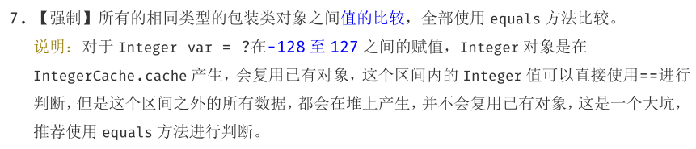

也就是说 如果将泛型设置为```Integer```

```java
AtomicStampedReference<Integer> atomicStampedReference = new AtomicStampedReference<>(2, 1)
```

如果数值超过了127 会导致更新失败


## 公平锁

公平锁： 非常公平， 不能够插队，必须先来后到！

非公平锁：非常不公平，可以插队 （默认都是非公平）

只所以默认都是非公平是因为如果有task1 3h task2 3，如果使用公平锁，3s的任务需要等3h才能执行，十分不合理

```java
public ReentrantLock() {
    sync = new NonfairSync();
}
```

重载方法 设置为公平锁

```java
public ReentrantLock(boolean fair) {
    sync = fair ? new FairSync() : new NonfairSync();
}
```

## 可重入锁

#### synchronized

```java
package com.usc.juc.reentrentlock;

public class SynchronizedTest {
    public static void main(String[] args) {
        Phone phone = new Phone();

        new Thread(() -> {
            phone.all();
        }).start();

        new Thread(() -> {
            phone.all();
        }).start();
    }
}

class Phone {
    public synchronized void all() {
        sms();
        call();
    }

    public synchronized void sms() {
        System.out.println("sms");
    }

    public synchronized void call() {
        System.out.println("call");
    }
}
```

可以理解为all() 上了一把锁 这把锁同时会锁住all()中调用sms()和call()

也就是说 调用all()的时候 对对象上锁了 这个锁只有在all()中的sms()和call()全部执行完后才会释放


### Lock

```java
package com.usc.juc.reentrentlock;

import java.util.concurrent.locks.Lock;
import java.util.concurrent.locks.ReentrantLock;

public class LockTest {
    public static void main(String[] args) {
        Phone2 phone2 = new Phone2();
        new Thread(() -> {
            phone2.all();
        }).start();

        new Thread(() -> {
            phone2.all();
        }).start();
    }
}

class Phone2 {

    Lock lock = new ReentrantLock();

    public void sms() {
        lock.lock();
//        lock.lock(); // 锁要配对使用 如果加了两把锁 就需要解锁两次
        try {
            System.out.println("sms");
        } catch (Exception e) {
            e.printStackTrace();
        } finally {
//            lock.unlock();
            lock.unlock();
        }
    }

    public void call() {
        lock.lock();
        try {
            System.out.println("call");
        } catch (Exception e) {
            e.printStackTrace();
        } finally {
            lock.unlock();
        }
    }

    public void all() {
        lock.lock();
        try {
            sms(); // 这里还有锁
            call(); // 这里还有锁
        } catch (Exception e) {
            e.printStackTrace();
        } finally {
            lock.unlock();
        }
    }
}
```

可以理解为上了多把锁 all()上了一把锁 而且他调用的sms()和call()都有自己的锁

也就是说 all()上了锁，然后调用sms()，sms()自己也会上一把锁，结束后sms()释放自己锁，call()同理，等都执行完了，all()才会释放锁

**注意** lock锁必须配对使用 即使是对同一对象上锁 也许要对应的解锁次数 


## 自旋锁

**原理**

当第一个线程A获取锁的时候，能够成功获取到，不会进入while循环，如果此时线程A没有释放锁，另一个线程B又来获取锁，此时由于

不满足CAS，所以就会进入while循环，不断判断是否满足CAS，直到A线程调用unlock方法释放了该锁

```java
package com.usc.juc.spinlock;

import java.util.concurrent.atomic.AtomicReference;

public class MySpinLock {
    AtomicReference<Thread> atomicReference = new AtomicReference<>(); // 默认为空

    public void lock() {
        Thread thread = Thread.currentThread();
        System.out.println(thread.getName() + " try to get lock ...");

        while(!atomicReference.compareAndSet(null, thread)) {

        }
        System.out.println(thread.getName() + " get lock");
    }

    public void unlock() {
        Thread thread = Thread.currentThread();
        System.out.println(thread.getName() + " release lock");
        atomicReference.compareAndSet(thread, null);
    }
}
```

```java
package com.usc.juc.spinlock;

import java.util.concurrent.TimeUnit;

public class MySpinLockTest {
    public static void main(String[] args) throws InterruptedException {
        MySpinLock mySpinLock = new MySpinLock();

        new Thread(() -> {
            mySpinLock.lock(); // A线程会直接拿到锁
            try {
                TimeUnit.SECONDS.sleep(5); // 占用该锁5s
            } catch (InterruptedException e) {
                e.printStackTrace();
            } finally {
                mySpinLock.unlock();
            }
        }, "A").start();

        TimeUnit.SECONDS.sleep(1); // 保证让A线程先运行

        new Thread(() -> {
            mySpinLock.lock(); // B线程尝试获取锁 但是会进入while循环 需要等待A线程释放锁
            try {
                TimeUnit.SECONDS.sleep(2);
            } catch (InterruptedException e) {
                e.printStackTrace();
            } finally {
               mySpinLock.unlock();
            }
        }, "B").start();
    }
}
```

执行顺序：

A线程尝试获取锁并获取到（因为下面的sleep(1)保证了A线程会先去获取锁） A线程休眠

A线程休眠时 B线程尝试获取锁 但是因为不满足CAS 会进入while循环

A线程休眠结束 释放锁

B线程满足CAS 获取到了锁 ...


## 死锁

```java
package com.usc.juc.deadlock;

import java.util.concurrent.TimeUnit;


public class MyDeadLock {
    public static void main(String[] args) {
        String lockA = "lockA";
        String lockB = "lockB";


        new Thread(new Data(lockA, lockB), "T1").start();
        new Thread(new Data(lockB, lockA), "T2").start();


    }
}

class Data implements Runnable {
    String lockA;
    String lockB;

    public Data(String lockA, String lockB) {
        this.lockA = lockA;
        this.lockB = lockB;
    }

    @Override
    public void run() {
        synchronized (lockA) { // A的锁在最后才释放（得了B之后才释放）
            System.out.println(Thread.currentThread().getName() + "have" + lockA + " try to get" + lockB);

            try {
                TimeUnit.SECONDS.sleep(2);
            } catch (InterruptedException e) {
                e.printStackTrace();
            }

            synchronized (lockB) {
                System.out.println(Thread.currentThread().getName() + "have" + lockB);
            }
        }
    }
}
```

```java
/**
 * 个人感觉这样写更好一些
 * */
package com.usc.juc.deadlock;

import java.util.concurrent.TimeUnit;

public class MyDeadLock {
    public static void main(String[] args) {
        String lockA = "lockA";
        String lockB = "lockB";
        Data data = new Data(lockA, lockB);
        Data data1 = new Data(lockB, lockA);
        new Thread(() -> {
            try {
                data.getLock();
            } catch (InterruptedException e) {
                e.printStackTrace();
            }
        }).start();

        new Thread(() -> {
            try {
                data1.getLock();
            } catch (InterruptedException e) {
                e.printStackTrace();
            }
        }).start();
    }
}

class Data {
    String lockA;
    String lockB;

    public Data(String lockA, String lockB) {
        this.lockA = lockA;
        this.lockB = lockB;
    }

    public void getLock() throws InterruptedException {
        synchronized (lockA) {
            System.out.println(Thread.currentThread().getName() + "have" + lockA + " try to get" + lockB);

            TimeUnit.SECONDS.sleep(2);

            synchronized (lockB) {
                System.out.println(Thread.currentThread().getName() + "have" + lockB);
            }
        }
    }
}
```

**注意**```synchronized```关键字只能锁方法或者代码块 不可以锁变量

此例中，```synchronized```锁住了两个```String```对象，也就是说，在线程T1中的lockA是"lockA" 而在线程T2中的lockA其实是"lockB"。

这样一来线程T1先获取到 了"lockA"，然后又想再去获得"lockB"

这样一来线程T2先获取到 了"lockB"，然后又想再去获得"lockA"

sleep保证了两个线程都会先获得一个锁