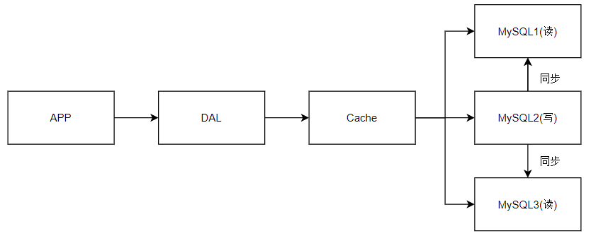

# 数据库架构演变

## 单MySQL年代

九十年代，网站访问量不大，单个数据库完全够用

网站大多数为静态网页，服务器没有太大压力

该模式的瓶颈：

1、数据量太大的话，一个机器是放不下的

2、数据的索引（B+ tree），一个机器放不下

3、访问量（读写混合），一个服务器承受不住

## Memcached(缓存) + MySQL + 垂直拆分 （读写分离）

该模式的瓶颈：

网站80%都是读操作，每次都要去查询数据库的话就十分的麻烦！所以说我们希望减轻数据的压力，我们可以使用缓存来保证效率！

发展过程：

优化数据结构(数据库索引) -> 文件缓存(IO） -> Memcache

## 分库分表 + 水平拆分 + MySQL集群

## 如今年代

因为数据量大而且数据集变化快，MySQL 等关系型数据库就不够用了。

MySQL数据库表很大的话效率很低

大数据的IO压力下，表几乎没法更改（加一个列相当于加一亿个列）

# NoSQL概述

## 什么是NoSQL
NoSQL = Not Only SQL （不仅仅是SQL）
关系型数据库：表格 ，行 ，列
泛指非关系型数据库的，随着web2.0互联网的诞生！传统的关系型数据库很难对付web2.0时代！尤其
是超大规模的高并发的社区！ 暴露出来很多难以克服的问题，NoSQL在当今大数据环境下发展的十分迅
速，Redis是发展最快的，而且是我们当下必须要掌握的一个技术！
很多的数据类型用户的个人信息，社交网络，地理位置。这些数据类型的存储不需要一个固定的格式！
不需要多月的操作就可以横向扩展的 ！ Map<String,Object> 使用键值对来控制！
NoSQL 特点
解耦！
1、方便扩展（数据之间没有关系，很好扩展！）
2、大数据量高性能（Redis 一秒写8万次，读取11万，NoSQL的缓存记录级，是一种细粒度的缓存，性
能会比较高！）
3、数据类型是多样型的！（不需要事先设计数据库！随取随用！如果是数据量十分大的表，很多人就无
法设计了！）
4、传统 RDBMS 和 NoSQL
bilibili：狂神说Java
了解：3V+3高
大数据时代的3V：主要是描述问题的
1. 海量Volume
2. 多样Variety
3. 实时Velocity
大数据时代的3高：主要是对程序的要求
1. 高并发
2. 高可扩
3. 高性能
真正在公司中的实践：NoSQL + RDBMS 一起使用才是最强的，阿里巴巴的架构演进！
技术没有高低之分，就看你如何去使用！（提升内功，思维的提高！）
阿里巴巴演进分析
思考问题：这么多东西难道都是在一个数据库中的吗?
传统的 RDBMS
- 结构化组织
- SQL
- 数据和关系都存在单独的表中 row col
- 操作操作，数据定义语言
- 严格的一致性
- 基础的事务
- .....
Nosql
- 不仅仅是数据
- 没有固定的查询语言
- 键值对存储，列存储，文档存储，图形数据库（社交关系）
- 最终一致性，
- CAP定理和BASE （异地多活） 初级架构师！（狂神理念：只要学不死，就往死里学！）
- 高性能，高可用，高可扩
- ....
bilibili：狂神说Java
技术急不得，越是慢慢学，才能越扎实！
开源才是技术的王道！
任何一家互联网的公司，都不可能只是简简单单让用户能用就好了！
大量公司做的都是相同的业务；（竞品协议）
随着这样的竞争，业务是越来越完善，然后对于开发者的要求也是越来越高！
如果你未来相当一个架构师： 没有什么是加一层解决不了的！
# 1、商品的基本信息
bilibili：狂神说Java
要知道，一个简单地网页背后的技术一定不是大家所想的那么简单！
大型互联网应用问题：
数据类型太多了！
数据源繁多，经常重构！
数据要改造，大面积改造？
解决问题：
 名称、价格、商家信息；
 关系型数据库就可以解决了！ MySQL / Oracle （淘宝早年就去IOE了！- 王坚：推荐文章：阿里云
的这群疯子：40分钟重要！）
 淘宝内部的 MySQL 不是大家用的 MySQL
# 2、商品的描述、评论（文字比较多）
文档型数据库中，MongoDB
# 3、图片
分布式文件系统 FastDFS
- 淘宝自己的 TFS
- Gooale的  GFS
- Hadoop   HDFS
- 阿里云的  oss
# 4、商品的关键字 （搜索）
- 搜索引擎 solr elasticsearch
- ISerach：多隆（多去了解一下这些技术大佬！）
所有牛逼的人都有一段苦逼的岁月！但是你只要像SB一样的去坚持，终将牛逼！
# 5、商品热门的波段信息
- 内存数据库
- Redis Tair、Memache...
# 6、商品的交易，外部的支付接口
 - 三方应用
bilibili：狂神说Java
这里以上都是NoSQL入门概述，不仅能够提高大家的知识，还可以帮助大家了解大厂的工作内容！
NoSQL的四大分类
KV键值对：
新浪：Redis
美团：Redis + Tair
bilibili：狂神说Java
阿里、百度：Redis + memecache
文档型数据库（bson格式 和json一样）：
MongoDB （一般必须要掌握）
MongoDB 是一个基于分布式文件存储的数据库，C++ 编写，主要用来处理大量的文档！
MongoDB 是一个介于关系型数据库和非关系型数据中中间的产品！MongoDB 是非关系型数
据库中功能最丰富，最像关系型数据库的！
ConthDB
列存储数据库
HBase
分布式文件系统
图关系数据库
他不是存图形，放的是关系，比如：朋友圈社交网络，广告推荐！
Neo4j，InfoGrid；
四者对比！
bilibili：狂神说Java
敬畏之心可以使人进步！宇宙！科幻！
活着的意义？ 追求幸福（帮助他人，感恩之心），探索未知（努力的学习，不要这个社会抛弃）
Redis入门
概述
Redis 是什么？
Redis（Remote Dictionary Server )，即远程字典服务 !
是一个开源的使用ANSI C语言编写、支持网络、可基于内存亦可持久化的日志型、Key-Value数据库，
并提供多种语言的API。
redis会周期性的把更新的数据写入磁盘或者把修改操作写入追加的记录文件，并且在此基础上实现了
master-slave(主从)同步。
免费和开源！是当下最热门的 NoSQL 技术之一！也被人们称之为结构化数据库！
bilibili：狂神说Java
Redis 能干嘛？
1、内存存储、持久化，内存中是断电即失、所以说持久化很重要（rdb、aof）
2、效率高，可以用于高速缓存
3、发布订阅系统
4、地图信息分析
5、计时器、计数器（浏览量！）
6、........
特性
1、多样的数据类型
2、持久化
3、集群
4、事务

​                                     