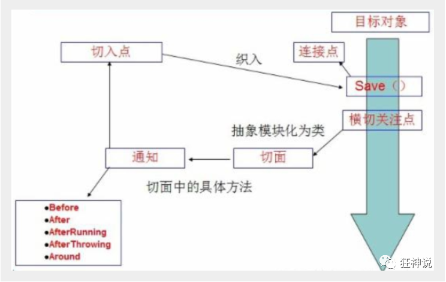

## 简介

[官方文档](https://docs.spring.io/spring/docs/5.2.7.RELEASE/spring-framework-reference/core.html#spring-core)

2002年，Rod Jahnson首次推出了Spring框架雏形interface21框架。

2004年3月24日，Spring框架以interface21框架为基础，经过重新设计，发布了1.0正式版。

Spring理念 : 使现有技术更加实用。本身就是一个大杂烩 , 整合现有的框架技术。

### 优点

1、Spring是一个开源免费的框架 , 容器  

2、Spring是一个轻量级的框架 , 非侵入式的 （引入Spring不会影响原有的Project）

**3、控制反转 IoC(Iversion of Controller)  , 面向切面 Aop()**

4、对事物的支持 , 对框架的支持

**Spring是一个轻量级的控制反转(IoC)和面向切面(AOP)的容器（框架）。**


## 组成


组成 Spring 框架的每个模块（或组件）都可以单独存在，或者与其他一个或多个模块联合实现。每个模块的功能如下：

- **核心容器**：核心容器提供 Spring 框架的基本功能。核心容器的主要组件是 BeanFactory，它是工厂模式的实现。BeanFactory 使用控制反转（IOC）模式将应用程序的配置和依赖性规范与实际的应用程序代码分开。
- **Spring 上下文**：Spring 上下文是一个配置文件，向 Spring 框架提供上下文信息。Spring 上下文包括企业服务，例如 JNDI、EJB、电子邮件、国际化、校验和调度功能。
- **Spring AOP**：通过配置管理特性，Spring AOP 模块直接将面向切面的编程功能 , 集成到了 Spring 框架中。所以，可以很容易地使 Spring 框架管理任何支持 AOP的对象。Spring AOP 模块为基于 Spring 的应用程序中的对象提供了事务管理服务。通过使用 Spring AOP，不用依赖组件，就可以将声明性事务管理集成到应用程序中。
- **Spring DAO**：JDBC DAO 抽象层提供了有意义的异常层次结构，可用该结构来管理异常处理和不同数据库供应商抛出的错误消息。异常层次结构简化了错误处理，并且极大地降低了需要编写的异常代码数量（例如打开和关闭连接）。Spring DAO 的面向 JDBC 的异常遵从通用的 DAO 异常层次结构。
- **Spring ORM**：Spring 框架插入了若干个 ORM 框架，从而提供了 ORM 的对象关系工具，其中包括 JDO、Hibernate 和 iBatis SQL Map。所有这些都遵从 Spring 的通用事务和 DAO 异常层次结构。
- **Spring Web 模块**：Web 上下文模块建立在应用程序上下文模块之上，为基于 Web 的应用程序提供了上下文。所以，Spring 框架支持与 Jakarta Struts 的集成。Web 模块还简化了处理多部分请求以及将请求参数绑定到域对象的工作。
- **Spring MVC 框架**：MVC 框架是一个全功能的构建 Web 应用程序的 MVC 实现。通过策略接口，MVC 框架变成为高度可配置的，MVC 容纳了大量视图技术，其中包括 JSP、Velocity、Tiles、iText 和 POI。


## Maven依赖

```xml
<dependency>
    <groupId>org.springframework</groupId>
    <artifactId>spring-webmvc</artifactId>
    <version>5.2.0.RELEASE</version>
</dependency>
```

## XML配置

### 普通

```xml
<?xml version="1.0" encoding="UTF-8"?>
<beans xmlns="http://www.springframework.org/schema/beans"
    xmlns:xsi="http://www.w3.org/2001/XMLSchema-instance"
    xsi:schemaLocation="http://www.springframework.org/schema/beans
        https://www.springframework.org/schema/beans/spring-beans.xsd">

</beans>
```

### 自动装配

```xml
<?xml version="1.0" encoding="UTF-8"?>
<beans xmlns="http://www.springframework.org/schema/beans"
    xmlns:xsi="http://www.w3.org/2001/XMLSchema-instance"
    xmlns:context="http://www.springframework.org/schema/context"
    xsi:schemaLocation="http://www.springframework.org/schema/beans
        https://www.springframework.org/schema/beans/spring-beans.xsd
        http://www.springframework.org/schema/context
        https://www.springframework.org/schema/context/spring-context.xsd">

    <context:annotation-config/>

</beans>
```


## IoC基础

新建一个空白的maven项目

### 分析实现

我们先用我们原来的方式写一段代码 .

1、先写一个UserDao接口

```java
public interface UserDao {
   public void getUser();
}
```

2、再去写Dao的实现类

```java
public class UserDaoImpl implements UserDao {
   @Override
   public void getUser() {
       System.out.println("获取用户数据");
  }
}
```

3、然后去写UserService的接口

```java
public interface UserService {
   public void getUser();
}
```

4、最后写Service的实现类

```java
public class UserServiceImpl implements UserService {
   private UserDao userDao = new UserDaoImpl();

   @Override
   public void getUser() {
       userDao.getUser();
  }
}
```

5、测试一下

```java
@Test
public void test(){
   UserService service = new UserServiceImpl();
   service.getUser();
}
```

这是我们原来的方式，但是如果把Userdao的实现类增加一个 .

```java
public class UserDaoMySqlImpl implements UserDao {
   @Override
   public void getUser() {
       System.out.println("MySql获取用户数据");
  }
}
```

紧接着我们要去使用MySql的话 , 我们就需要去service实现类里面修改对应的实现

```java
public class UserServiceImpl implements UserService {
   private UserDao userDao = new UserDaoMySqlImpl();

   @Override
   public void getUser() {
       userDao.getUser();
  }
}
```

在假设, 我们再增加一个Userdao的实现类 .

```java
public class UserDaoOracleImpl implements UserDao {
   @Override
   public void getUser() {
       System.out.println("Oracle获取用户数据");
  }
}
```

那么我们要使用Oracle，又需要去service实现类里面修改对应的实现。假设我们的这种需求非常大，这种方式就根本不适用了，每次变动，都需要修改大量代码。这种设计的耦合性太高。

### 解决问题

我们可以在需要用到他的地方 , 不去实现它 , 而是留出一个接口 , 利用set , 我们去代码里修改下 .

```java
public class UserServiceImpl implements UserService {
   private UserDao userDao;
// 利用set实现
   public void setUserDao(UserDao userDao) {
       this.userDao = userDao;
  }

   @Override
   public void getUser() {
       userDao.getUser();
  }
}
```

现在去我们的测试类里 , 进行测试 ;

```java
@Test
public void test(){
   //注意是UserServiceImpl 不是UserService 因为UserService没有set方法
   UserServiceImpl service = new UserServiceImpl();
   service.setUserDao( new UserDaoMySqlImpl() );
   service.getUser();
   //那我们现在又想用Oracle去实现呢
   service.setUserDao( new UserDaoOracleImpl() );
   service.getUser();
}
```

以前所有东西都是由程序去进行控制创建，而现在是由调用者自行控制创建对象，把主动权交给了调用者，程序不用去管怎么创建，怎么实现了，它只负责提供一个接口。

这种思想，从本质上解决了问题，我们程序员不再去管理对象的创建了，更多的去关注业务的实现，耦合性大大降低。这也就是IOC的原型 !


## IoC本质

**控制反转IoC(Inversion of Control)，是一种设计思想，DI(依赖注入)是实现IoC的一种方法**，也有人认为DI只是IoC的另一种说法。没有IoC的程序中 , 我们使用面向对象编程 , 对象的创建与对象间的依赖关系完全硬编码在程序中，对象的创建由程序自己控制，控制反转后将对象的创建转移给第三方，个人认为所谓控制反转就是 	。

**IoC是Spring框架的核心内容**，使用多种方式完美的实现了IoC，可以使用XML配置，也可以使用注解，新版本的Spring也可以零配置实现IoC。

Spring容器在初始化时先读取配置文件，根据配置文件或元数据创建与组织对象存入容器中，程序使用时再从Ioc容器中取出需要的对象。


采用XML方式配置Bean的时候，Bean的定义信息是和实现分离的，而采用注解的方式可以把两者合为一体，Bean的定义信息直接以注解的形式定义在实现类中，从而达到了零配置的目的。

**控制反转是一种通过描述（XML或注解）并通过第三方去生产或获取特定对象的方式。在Spring中实现控制反转的是IoC容器，其实现方法是依赖注入（Dependency Injection,DI）。**


## 第一个Spirng程序

### 编写代码

创建hello实体类 要有无参构造函数

```java
package edu.usc.pojo;

public class Hello {
    private String str;

    public String getStr() {
        return str;
    }

    public void setStr(String str) {
        this.str = str;
    }

    @Override
    public String toString() {
        return "Hello{" +
                "str='" + str + '\'' +
                '}';
    }
}
```

resource包下新建beans.xml配置文件

```xml
<?xml version="1.0" encoding="UTF-8"?>
<beans xmlns="http://www.springframework.org/schema/beans"
       xmlns:xsi="http://www.w3.org/2001/XMLSchema-instance"
       xsi:schemaLocation="http://www.springframework.org/schema/beans
       http://www.springframework.org/schema/beans/spring-beans.xsd">

    <!--bean就是java对象 , 由Spring创建和管理-->
    <!--id代表 Hello hello-->
    <!--class代表 new Hello()-->
    <bean id="hello" class="edu.usc.pojo.Hello">
        <!--设置bean的属性-->
        <property name="str" value="Spring"/>
    </bean>

</beans>
```

测试

```java
@Test
public void test02() {
    ApplicationContext context = new ClassPathXmlApplicationContext("beans.xml");
    Hello hello = (Hello) context.getBean("hello");
    System.out.println(hello);

}
```

### 思考

- Hello 对象是谁创建的？hello 对象是由Spring创建的
- Hello 对象的属性是怎么设置的？hello 对象的属性是由Spring容器设置的，这个过程就叫控制反转
  + 控制 :  传统应用程序的对象是由程序本身控制创建的 , 使用Spring后 , 对象是由Spring来创建的
  + 反转 : 程序本身不创建对象 , 而变成被动的接收对象 

+ 依赖注入 : 就是利用实体类的set方法来进行注入的

 IOC是一种编程思想，由主动的编程变成被动的接收


### 修改第一个Spring程序

在配置文件beans.xml中新增bean

```xml
<?xml version="1.0" encoding="UTF-8"?>
<beans xmlns="http://www.springframework.org/schema/beans"
       xmlns:xsi="http://www.w3.org/2001/XMLSchema-instance"
       xsi:schemaLocation="http://www.springframework.org/schema/beans
       http://www.springframework.org/schema/beans/spring-beans.xsd">

    <bean id="hello" class="edu.usc.pojo.Hello">
        <property name="str" value="Spring"/>
    </bean>

    <bean id="userDaoImpl" class="edu.usc.dao.UserDaoImpl"></bean>
    <bean id="userDaoMysqlImpl" class="edu.usc.dao.UserDaoMysqlImpl"></bean>
    <bean id="userServiceImpl" class="edu.usc.service.UserServiceImpl">
      	<!--注意: 这里的name并不是属性 , 而是set方法后面的那部分，首字母小写-->
       	<!--引用另外一个bean , 不是用value 而是用 ref-->
        <property name="userDao" ref="userDaoMysqlImpl"/>
    </bean>

</beans>
```

测试

```java
@Test
public void test03() {
    ApplicationContext context = new ClassPathXmlApplicationContext("beans.xml");
    UserServiceImpl userServiceImpl = (UserServiceImpl) context.getBean("userServiceImpl");
    userServiceImpl.getUser();
}
```

到此，我们可以彻底不用再程序中去改动了，要实现不同的操作，只需要在xml配置文件中进行修改，所谓的IoC

就是对象由Spring 来创建，管理，装配 ! 


## IoC创建对象

## 通过无参构造方法来创建

1、User.java

```java
public class User {

   private String name;

   public User() {
       System.out.println("user无参构造方法");
  }

   public void setName(String name) {
       this.name = name;
  }

   public void show(){
       System.out.println("name="+ name );
  }

}
```

2、beans.xml

```xml
<?xml version="1.0" encoding="UTF-8"?>
<beans xmlns="http://www.springframework.org/schema/beans"
      xmlns:xsi="http://www.w3.org/2001/XMLSchema-instance"
      xsi:schemaLocation="http://www.springframework.org/schema/beans
       http://www.springframework.org/schema/beans/spring-beans.xsd">

   <bean id="user" class="com.kuang.pojo.User">
       <property name="name" value="kuangshen"/>
   </bean>

</beans>
```

3、测试类

```java
@Test
public void test(){
   ApplicationContext context = new ClassPathXmlApplicationContext("beans.xml");
   //在执行getBean的时候，user已经创建好了，通过无参构造
   User user = (User) context.getBean("user");
   //调用对象的方法 .
   user.show();
}
```

结果可以发现，在调用show方法之前，User对象已经通过无参构造初始化了！

## 通过有参构造方法来创建

1、UserT . java

```java
public class UserT {

   private String name;

   public UserT(String name) {
       this.name = name;
  }

   public void setName(String name) {
       this.name = name;
  }

   public void show(){
       System.out.println("name="+ name );
  }

}
```

2、beans.xml 有三种方式编写

```xml
<!-- 第一种根据index参数下标设置 -->
<bean id="userT" class="com.kuang.pojo.UserT">
   <!-- index指构造方法 , 下标从0开始 -->
   <constructor-arg index="0" value="kuangshen2"/>
</bean>
<!-- 第二种根据参数名字设置 -->
<bean id="userT" class="com.kuang.pojo.UserT">
   <!-- name指参数名 -->
   <constructor-arg name="name" value="kuangshen2"/>
</bean>
<!-- 第三种根据参数类型设置 不推荐使用 -->
<bean id="userT" class="com.kuang.pojo.UserT">
   <constructor-arg type="java.lang.String" value="kuangshen2"/>
</bean>
```

3、测试

```java
@Test
public void testT(){
   ApplicationContext context = new ClassPathXmlApplicationContext("beans.xml");
   UserT user = (UserT) context.getBean("userT");
   user.show();
}
```

注意：在配置文件加载的时候。其中管理的所有对象都会被始化。


## Spring配置

### 别名

alias 设置别名 , 为bean设置别名 , 可以设置多个别名

```xml
<!--设置别名：在获取Bean的时候可以使用别名获取-->
<alias name="userT" alias="userNew"/>
```

### Bean的配置

```xml
<!--bean就是java对象,由Spring创建和管理-->

<!--
   id 是bean的标识符,要唯一,如果没有配置id,name就是默认标识符
   如果配置id,又配置了name,那么name是别名
   name可以设置多个别名,可以用逗号,分号,空格隔开（侧面说明了alias其实没什么用）
   如果不配置id和name,可以根据applicationContext.getBean(.class)获取对象;

class是bean的全限定名=包名+类名
-->
<bean id="hello" name="hello2 h2,h3;h4" class="com.kuang.pojo.Hello">
   <property name="name" value="Spring"/>
</bean>
```

### import

团队的合作通过import来实现，将多个beans.xml文件导入到一个applicationContext.xml文件中

```xml
<import resource="{path}/beans.xml"/>
```


## 依赖注入（DI）

 ### 新建测试类

```java
package edu.usc.pojo;

import java.util.*;

public class User {
    private String name;
    private Address address;
    private String[] books;
    private List<String> hobbies;
    private Map<String,String> card;
    private Set<String> games;
    private String wife;
    private Properties info;

    public String getName() {
        return name;
    }

    public void setName(String name) {
        this.name = name;
    }

    public Address getAddress() {
        return address;
    }

    public void setAddress(Address address) {
        this.address = address;
    }

    public String[] getBooks() {
        return books;
    }

    public void setBooks(String[] books) {
        this.books = books;
    }

    public List<String> getHobbies() {
        return hobbies;
    }

    public void setHobbies(List<String> hobbies) {
        this.hobbies = hobbies;
    }

    public Map<String, String> getCard() {
        return card;
    }

    public void setCard(Map<String, String> card) {
        this.card = card;
    }

    public Set<String> getGames() {
        return games;
    }

    public void setGames(Set<String> games) {
        this.games = games;
    }

    public String getWife() {
        return wife;
    }

    public void setWife(String wife) {
        this.wife = wife;
    }

    public Properties getInfo() {
        return info;
    }

    public void setInfo(Properties info) {
        this.info = info;
    }

    @Override
    public String toString() {
        return "User{" +
                "name='" + name + '\'' +
                ", address=" + address.toString() +
                ", books=" + Arrays.toString(books) +
                ", hobbies=" + hobbies +
                ", card=" + card +
                ", games=" + games +
                ", wife='" + wife + '\'' +
                ", info=" + info +
                '}';
    }
}
```

```java
package edu.usc.pojo;

public class Address {
    private String address;

    public String getAddress() {
        return address;
    }

    public void setAddress(String address) {
        this.address = address;
    }

    @Override
    public String toString() {
        return "Address{" +
                "address='" + address + '\'' +
                '}';
    }
}
```

### 构造器注入

#### 无参构造器注入

类中必须有无参构造器（如果没有构造器也会自动通过super拿到父类无参构造器 如果父类也没有无参构造器 则会出问题）

```xml
<bean id="user" class="edu.usc.pojo.User">
    <property name="name" value="wjj"/>
</bean>
```

#### 有参构造器注入

类中必须有有参构造器

```xml
<bean id="user" class="edu.usc.pojo.User">
    <constructor-arg name="name" value="wjj"/>
</bean>
```

### set注入

要求被注入的属性，必须有set方法，set方法的方法名由set + 属性首字母大写，如果属性是boolean类型 , 没有set方法，是 is

#### 普通值注入

```xml
<bean id="user" class="edu.usc.pojo.User">
    <property name="name" value="wjj"/>
</bean>
```

#### Bean注入

```xml
<bean id="user" class="edu.usc.pojo.User">
    <property name="address" ref="address"/>
</bean>
```

#### Array注入

```xml
<bean id="user" class="edu.usc.pojo.User">
    <property name="books">
        <array>
            <value>红楼梦</value>
            <value>三国演义</value>
        </array>
    </property>
</bean>
```

#### List注入

```xml
<bean id="user" class="edu.usc.pojo.User">
    <property name="hobbies">
        <list>
            <value>敲代码</value>
            <value>吃鸡</value>
        </list>
    </property>
    <property name="card">
        <map>
            <entry key="身份证" value="123123"></entry>
            <entry key="学生证" value="2015"></entry>
        </map>
    </property>
    <property name="games">
        <set>
            <value>和平精英</value>
            <value>王者荣耀</value>
        </set>
    </property>
    <property name="info">
        <props>
            <prop key="username">root</prop>
            <prop key="password">123123</prop>
        </props>
    </property>
    <property name="wife">
        <null/>
    </property>
</bean>
```

#### Map注入

```xml
<bean id="user" class="edu.usc.pojo.User">
    <property name="card">
        <map>
            <entry key="身份证" value="123123"></entry>
            <entry key="学生证" value="2015"></entry>
        </map>
    </property>
</bean>
```

#### set注入

```xml
<bean id="user" class="edu.usc.pojo.User">
    <property name="games">
        <set>
            <value>和平精英</value>
            <value>王者荣耀</value>
        </set>
    </property>
</bean>
```

#### property注入

```xml
<bean id="user" class="edu.usc.pojo.User">
    <property name="info">
        <props>
            <prop key="username">root</prop>
            <prop key="password">123123</prop>
        </props>
    </property>
</bean>
```

#### Null注入

```xml
<bean id="user" class="edu.usc.pojo.User">
    <property name="wife">
        <null/>
    </property>
</bean>
```

​	

### p命名和c命名注入

**P命名空间注入** : 需要在头文件中加入约束文件`xmlns:p="http://www.springframework.org/schema/p"`

```xml
 <!--P(属性: properties)命名空间 , 属性依然要设置set方法-->
 <bean id="user" class="com.kuang.pojo.User" p:name="wjj"/>
```

**c 命名空间注入** : 需要在头文件中加入约束文件`xmlns:c="http://www.springframework.org/schema/c"`

```xml
 <!--C(构造: Constructor)命名空间 , 属性依然要设置set方法-->
 <bean id="user" class="com.kuang.pojo.User" c:name="fxt"/>
```


## Bean的作用域

[官方文档](https://docs.spring.io/spring/docs/5.2.7.RELEASE/spring-framework-reference/core.html#beans-factory-scopes)

### Singleton

当一个bean的作用域为Singleton，那么Spring IoC容器中只会存在一个共享的bean实例，Singleton作用域的bean会导致在每次对该bean请求（将其注入到另一个bean中，或者以程序的方式调用容器的getBean()方法）时都只会返回bean的同一实例。

**Singleton是单例类型，就是在创建起容器时就同时自动创建了一个bean的对象**，不管你是否使用，他都存在了，每次获取到的对象都是同一个对象。

Singleton作用域是Spring中的缺省作用域。要在XML中将bean定义成singleton，可以这样配置：

```xml
<bean id="user" class="edu.usc.pojo.User" scope="singleton"/>
```

### Prototype

当一个bean的作用域为Prototype，表示一个bean定义对应多个对象实例。Prototype作用域的bean会导致在每次对该bean请求（将其注入到另一个bean中，或者以程序的方式调用容器的getBean()方法）时都会创建一个新的bean实例。

**Prototype是原型类型，它在我们创建容器的时候并没有实例化，而是当我们获取bean的时候才会去创建一个对象**，而且我们每次获取到的对象都不是同一个对象。

根据经验，对有状态的bean应该使用prototype作用域，而对无状态的bean则应该使用singleton作用域。在XML中将bean定义成prototype，可以这样配置：

```xml
<bean id="user" class="edu.usc.pojo.User" scope="prototype"/>
```

### Request

当一个bean的作用域为Request，表示在一次HTTP请求中，一个bean定义对应一个实例；即每个HTTP请求都会有各自的bean实例，它们依据某个bean定义创建而成。该作用域仅在基于web的Spring ApplicationContext情形下有效。考虑下面bean定义：

```xml
 <bean id="loginAction" class=cn.csdn.LoginAction" scope="request"/>
```

针对每次HTTP请求，Spring容器会根据loginAction bean的定义创建一个全新的LoginAction bean实例，且该loginAction bean实例仅在当前HTTP request内有效，因此可以根据需要放心的更改所建实例的内部状态，而其他请求中根据loginAction bean定义创建的实例，将不会看到这些特定于某个请求的状态变化。当处理请求结束，request作用域的bean实例将被销毁。

### Session

当一个bean的作用域为Session，表示在一个HTTP Session中，一个bean定义对应一个实例。该作用域仅在基于web的Spring ApplicationContext情形下有效。考虑下面bean定义：

```xml
 <bean id="userPreferences" class="com.foo.UserPreferences" scope="session"/>
```

针对某个HTTP Session，Spring容器会根据userPreferences bean定义创建一个全新的userPreferences bean实例，且该userPreferences bean仅在当前HTTP Session内有效。与request作用域一样，可以根据需要放心的更改所创建实例的内部状态，而别的HTTP Session中根据userPreferences创建的实例，将不会看到这些特定于某个HTTP Session的状态变化。当HTTP Session最终被废弃的时候，在该HTTP Session作用域内的bean也会被废弃掉。


## Bean的自动装配

### 自动装配说明

- 自动装配是使用spring满足bean依赖的一种方法
- spring会在应用上下文中为某个bean寻找其依赖的bean。

Spring中bean有三种装配机制，分别是：

1. 在xml中显式配置（我们之前一直采用的方式）
2. 在java中显式配置（暂不学习）
3. 隐式的bean发现机制和自动装配（接下来要讲的方式）

Spring的自动装配需要从两个角度来实现，或者说是两个操作：

1. 组件扫描(component scanning)：spring会自动发现应用上下文中所创建的bean；
2. 自动装配(autowiring)：spring自动满足bean之间的依赖，也就是我们说的IoC/DI；

组件扫描和自动装配组合发挥巨大威力，使得显示的配置降低到最少。

**推荐不使用自动装配xml配置 , 而使用注解 .**


### 环境搭建

1、新建一个项目

2、新建两个实体类，Cat  Dog  都有一个叫的方法

```java
public class Dog {
    public void bark() {
        System.out.println("wang!");
    }
}
```

```java
public class Cat {
    public void bark() {
        System.out.println("miao~");
    }
}
```

3、新建一个用户类 User

```java
package edu.usc.pojo;

public class Person {
    private String name;
    private Dog dog;
    private Cat cat;

    public String getName() {
        return name;
    }

    public void setName(String name) {
        this.name = name;
    }

    public Dog getDog() {
        return dog;
    }

    public void setDog(Dog dog) {
        this.dog = dog;
    }

    public Cat getCat() {
        return cat;
    }

    public void setCat(Cat cat) {
        this.cat = cat;
    }
}

```

4、编写Spring配置文件

```xml
<?xml version="1.0" encoding="UTF-8"?>
<beans xmlns="http://www.springframework.org/schema/beans"
       xmlns:xsi="http://www.w3.org/2001/XMLSchema-instance"
       xsi:schemaLocation="http://www.springframework.org/schema/beans
        https://www.springframework.org/schema/beans/spring-beans.xsd">

    <bean id="cat" class="edu.usc.pojo.Cat"/>
    <bean id="dog" class="edu.usc.pojo.Dog"/>
    <bean id="person" class="edu.usc.pojo.Person">
        <property name="dog" ref="dog"/>
        <property name="cat" ref="cat"/>
        <property name="name" value="wjj"/>
    </bean>
</beans>
```

5、测试

```java
public class MyTest {
    @Test
    public void test01() {
        ApplicationContext context = new ClassPathXmlApplicationContext("beans.xml");
        Person person = context.getBean("person", Person.class);
        person.getCat().bark();
        person.getDog().bark();
    }
}
```

### byName

测试：

1、修改bean配置，增加一个属性  autowire="byName"

```xml
<bean id="person" class="edu.usc.pojo.Person" autowire="byName">
	<property name="name" value="wjj"/>
</bean>
```

2、再次测试，结果依旧成功输出！

3、我们将 cat 的bean id修改为 cat123

4、再次测试， 执行时报空指针java.lang.NullPointerException。因为按byName规则找不对应set方法，真正的setCat就没执行，对象就没有初始化，所以调用时就会报空指针错误。

**具体流程：**

当一个bean节点带有 autowire byName的属性时。

1. 将查找其类中所有的set方法名，例如setCat，获得将set去掉并且首字母小写的字符串，即cat。
2. 去spring容器中寻找是否有此字符串名称id的对象。
3. 如果有，就取出注入；如果没有，就报空指针异常。


### byType

使用autowire byType首先需要保证：同一类型的对象在spring容器中唯一。如果不唯一，会报不唯一的异常。

```bash
NoUniqueBeanDefinitionException
```

测试：

1、将user的bean配置修改一下 ： autowire="byType"

2、测试，正常输出

3、再注册一个cat 的bean对象！

```xml
<bean id="cat" class="edu.usc.pojo.Cat"/>
<bean id="cat2" class="edu.usc.pojo.Cat"/>
<bean id="dog" class="edu.usc.pojo.Dog"/>
<bean id="person" class="edu.usc.pojo.Person" autowire="byType">
    <property name="name" value="wjj"/>
</bean>
```

4、测试，报错：NoUniqueBeanDefinitionException

5、删掉cat2，将cat的bean名称改为catXX 因为是按类型装配，所以并不会报异常，也不影响最后的结果。甚至将id属性去掉，也不影响结果。


### 使用注解自动装配

jdk1.5开始支持注解，spring2.5开始全面支持注解。

修改配置文件

```xml
<?xml version="1.0" encoding="UTF-8"?>
<beans xmlns="http://www.springframework.org/schema/beans"
    xmlns:xsi="http://www.w3.org/2001/XMLSchema-instance"
    xmlns:context="http://www.springframework.org/schema/context"
    xsi:schemaLocation="http://www.springframework.org/schema/beans
        https://www.springframework.org/schema/beans/spring-beans.xsd
        http://www.springframework.org/schema/context
        https://www.springframework.org/schema/context/spring-context.xsd">

    <context:annotation-config/>

</beans>
```

记得开启属性注解支持

```xml
<context:annotation-config/>
```

#### @Autowired

@Autowired是按类型自动转配的，不支持id匹配 但是支持默认的byName匹配 

+ 首先执行byType匹配
+ 如果不成功，则进行ByName匹配 即如果有多个相同类型但是其中有一个id和类名相同，那么会匹配成功。如果有多个类型且每个的id名都和类名不同则会报NoUniqueBeanDefinitionException。
+ 否则报错

- 需要导入 spring-aop的包（spring-webmvc已经包含aop包了）

测试：

1、将Person类中的set方法去掉，使用@Autowired注解（注解是使用反射的方法进行注入 而不再通过set进行注入）

```java
package edu.usc.pojo;

import org.springframework.beans.factory.annotation.Autowired;

public class Person {
    private String name;
    @Autowired
    private Dog dog;
    @Autowired
    private Cat cat;

    public String getName() {
        return name;
    }

    public Dog getDog() {
        return dog;
    }

    public Cat getCat() {
        return cat;
    }

}

```

2、此时配置文件内容

```xml
<context:annotation-config/>
<bean id="cat" class="edu.usc.pojo.Cat"/>
<bean id="dog" class="edu.usc.pojo.Dog"/>
<bean id="person" class="edu.usc.pojo.Person"/>
```

3、测试成功

【科普时间】

@Autowired(required=false)  说明：false，对象可以为null；true，对象必须存对象，不能为null。

```java
//如果允许对象为null，设置required = false,默认为true
@Autowired(required = false)
private Cat cat;
```

#### @Qualifier

- @Autowired是根据类型自动装配的，加上@Qualifier则可以根据byName的方式自动装配
- @Qualifier不能单独使用。

测试：

1、配置文件修改内容，保证类型存在对象。且名字不为类的默认名字！

```xml
<bean id="cat2" class="edu.usc.pojo.Cat"/>
<bean id="cat3" class="edu.usc.pojo.Cat"/>
<bean id="dog2" class="edu.usc.pojo.Dog"/>
<bean id="dog3" class="edu.usc.pojo.Dog"/>
<bean id="person" class="edu.usc.pojo.Person"/>
```

2、没有加Qualifier测试，直接报错

3、在属性上添加Qualifier注解

```
 @Autowired
    @Qualifier(value = "dog2")
    private Dog dog;
    @Autowired
    @Qualifier(value = "cat2")
    private Cat cat;
```

测试成功

#### @Resource

- @Resource如指定了name属性，先按该属性进行byName方式查找装配；
- 其次再进行默认的byName方式进行装配；
- 如果以上都不成功，则按byType的方式自动装配。
- 都不成功，则报异常。

实体类：

```java
public class Person {
    private String name;
    @Resource(name = "dog2")
    private Dog dog;
    @Resource(name = "cat2")
    private Cat cat;

    public String getName() {
        return name;
    }

    public Dog getDog() {
        return dog;
    }

    public Cat getCat() {
        return cat;
    }

}
```

beans.xml

```xml
<bean id="cat2" class="edu.usc.pojo.Cat"/>
<bean id="cat3" class="edu.usc.pojo.Cat"/>
<bean id="dog2" class="edu.usc.pojo.Dog"/>
<bean id="dog3" class="edu.usc.pojo.Dog"/>
<bean id="person" class="edu.usc.pojo.Person"/>
```

测试成功

配置文件中 删掉cat2，实体类上只保留注解，不表明name 依然可以测试成果

原因：先进行byName查找，失败；再进行byType查找。

####  @Autowired与@Resource异同：

1、@Autowired与@Resource都可以用来装配bean。都可以写在字段上，或写在setter方法上。

2、@Autowired默认按类型装配（属于spring规范），默认情况下必须要求依赖对象必须存在，如果要允许null 值，可以设置它的required属性为false，如：@Autowired(required=false) ，如果我们想使用名称装配可以结合@Qualifier注解进行使用

3、@Resource（属于J2EE复返），默认按照名称进行装配，名称可以通过name属性进行指定。如果没有指定name属性，当注解写在字段上时，默认取字段名进行按照名称查找，如果注解写在setter方法上默认取属性名进行装配。当找不到与名称匹配的bean时才按照类型进行装配。但是需要注意的是，**如果name属性一旦指定，就只会按照指定的name进行装配**。

它们的作用相同都是用注解方式注入对象，但执行顺序不同。@Autowired先byType，@Resource先byName。


## 使用注解开发

### Bean的实现

之前都是使用 bean 的标签进行bean注入，但是实际开发中，我们一般都会使用注解

1、配置扫描哪些包下的注解

```xml
<?xml version="1.0" encoding="UTF-8"?>
<beans xmlns="http://www.springframework.org/schema/beans"
       xmlns:xsi="http://www.w3.org/2001/XMLSchema-instance"
       xmlns:context="http://www.springframework.org/schema/context"
       xsi:schemaLocation="http://www.springframework.org/schema/beans
        https://www.springframework.org/schema/beans/spring-beans.xsd
        http://www.springframework.org/schema/context
        https://www.springframework.org/schema/context/spring-context.xsd">

    <context:annotation-config/>
    <context:component-scan base-package="edu.usc.pojo"/>


</beans>
```

2、在指定包下编写类，增加注解

```java
@Component("user")
// 相当于配置文件中 <bean id="user" class="当前注解的类"/>
public class User {
   public String name = "wjj";
}
```

3、测试

```java
@Test
public void test(){
   ApplicationContext applicationContext =
       new ClassPathXmlApplicationContext("beans.xml");
   User user = (User) applicationContext.getBean("user");
   System.out.println(user.name);
}
```


### 属性注入

使用注解注入属性

1、可以不用提供set方法，直接在直接名上添加@value("值")

```java
@Component("user")
// 相当于配置文件中 <bean id="user" class="当前注解的类"/>
public class User {
   @Value("秦疆")
   // 相当于配置文件中 <property name="name" value="秦疆"/>
   public String name;
}
```

2、如果提供了set方法，在set方法上添加@value("值");

```java
@Component //不显示配置是默认为类名小写
public class User {
    @Value("wjj")
    private String name;
    

    public String getName() {
        return name;
    }
}
```


### 衍生注解

我们这些注解，就是替代了在配置文件当中配置步骤而已！更加的方便快捷！

**@Component三个衍生注解**

为了更好的进行分层，Spring可以使用其它三个注解，功能一样，目前使用哪一个**功能都一样**。

- @Controller：web层
- @Service：service层
- @Repository：dao层

写上这些注解，就相当于将这个类交给Spring管理装配了！

### 自动装配注解

在Bean的自动装配已经讲过了，可以回顾！

### 作用域注解

@scope

- singleton：默认的，Spring会采用单例模式创建这个对象。关闭工厂 ，所有的对象都会销毁。
- prototype：多例模式。关闭工厂 ，所有的对象不会销毁。内部的垃圾回收机制会回收

```java
@Controller("user")
@Scope("prototype")
public class User {
   @Value("wjj")
   public String name;
}
```


### XML与注解比较

- XML可以适用任何场景 ，结构清晰，维护方便
- 注解不是自己提供的类使用不了，开发简单方便

### xml与注解整合开发 ：推荐最佳实践

- xml管理Bean
- 注解完成属性注入
- 使用过程中， 可以不用扫描，扫描是为了类上的注解

```xml
<context:annotation-config/>  
```

作用：

- 进行注解驱动注册，从而使注解生效

- 用于激活那些已经在spring容器里注册过的bean上面的注解，也就是显示的向Spring注册

- 如果不扫描包，就需要手动配置bean

- 如果不加注解驱动，则注入的值为null！

  

## 基于Java类进行配置

JavaConfig 原来是 Spring 的一个子项目，它通过 Java 类的方式提供 Bean 的定义信息，在 Spring4 的版本， JavaConfig 已正式成为 Spring4 的核心功能 。

测试：

1、编写一个实体类User

```java
@Component // 我觉得在这个测试中 可加可不加 相当于配置文件中的<bean id="" class=""/>
public class User {
    private String name;

    @Value("wjj")
    public void setName(String name) {
        this.name = name;
    }

    public String getName() {
        return name;
    }
}
```

2、新建一个config配置包，编写一个MyConfig配置类

```java
@Configuration // 相当于beans.xml文件
public class MyConfig {

    @Bean // 相当于<bean id="" class=""/> 方法名代表id 返回值类型代表class
    public User user() {
        return new User(); // 返回要注入到bean中的对象
    }
}
```

3、测试

```java
public class MyTest {
    @Test
    public void test01() {
        //注意这个地方是AnnotationConfigApplicationContext 不再是CPX了
        ApplicationContext context = new AnnotationConfigApplicationContext(MyConfig.class);
        User user = (User) context.getBean("user");
        System.out.println(user.getName());
    }
}
```

4、成功输出结果！

**导入其他配置如何做呢？**

1、我们再编写一个配置类！

```java
@Configuration  //代表这是一个配置类
public class MyConfig2 {
}
```

2、在之前的配置类中我们来选择导入这个配置类

```java
@Configuration
@Import(MyConfig2.class)
public class MyConfig {

    @Bean
    public User user() {
        return new User();
    }
}
```

关于这种Java类的配置方式，我们在之后的SpringBoot 和 SpringCloud中还会大量看到，我们需要知道这些注解的作用即可！

有时间需要看一下https://www.cnblogs.com/duanxz/p/7493276.html

**总结**

@Component是将Bean注入到Spring中

@Autowired是对注入到Spring中的Bean进行自动装配

之前的时候虽然使用了@Component注解完成Bean的注入 但是还是无法脱离xml配置文件

但是现在我们使用了@Configration注解 就彻底脱离了xml配置文件


## 静态代理

为什么要学习代理模式，因为AOP的底层机制就是动态代理！

代理模式：

- 静态代理
- 动态代理

学习aop之前 , 我们要先了解一下代理模式！


### 静态代理角色分析

- 抽象角色 : 一般使用接口或者抽象类来实现
- 真实角色 : 被代理的角色
- 代理角色 : 代理真实角色 ; 代理真实角色后 , 一般会做一些附属的操作 .
- 客户  :  使用代理角色来进行一些操作 .


### 代码实现

Rent . java 即抽象角色

```java
//抽象角色：租房
public interface Rent {
    public void rent();
}
```

Host . java 即真实角色

```java
//真实角色: 房东，房东要出租房子
public class Host implements Rent{

    @Override
    public void rent() {
        System.out.println("房屋出租");
    }
}
```

Proxy . java 即代理角色

```java
//代理角色：中介
public class Proxy implements Rent {
    private Host host;

    public Proxy(Host host) {
        this.host = host;
    }

    @Override
    public void rent() {
        seeHouse();
        makeContract();
        host.rent();
    }

    public void seeHouse() {
        System.out.println("中介带领看看房");
    }

    public void makeContract() {
        System.out.println("签合同");
    }
}
```

Client . java 即客户

```java
//客户类，一般客户都会去找代理！
public class Cilent {
    public static void main(String[] args) {
        Host host = new Host();
        Proxy proxy = new Proxy(host);
        proxy.rent();
    }
}
```

分析：在这个过程中，你直接接触的就是中介，就如同现实生活中的样子，你看不到房东，但是你依旧租到了房东的房子通过代理，这就是所谓的代理模式，程序源自于生活，所以学编程的人，一般能够更加抽象的看待生活中发生的事情。


### 加深理解

1、创建一个抽象角色，比如咋们平时做的用户业务，抽象起来就是增删改查！

```java
//抽象角色：增删改查业务
public interface Service {
    void add();
    void delete();
    void update();
    void select();
}
```

2、我们需要一个真实对象来完成这些增删改查操作

```java
//真实对象，完成增删改查操作的人
public class ServiceImpl implements Service{

    @Override
    public void add() {
        System.out.println("add");
    }

    @Override
    public void delete() {
        System.out.println("delete");
    }

    @Override
    public void update() {
        System.out.println("update");
    }

    @Override
    public void select() {
        System.out.println("select");
    }
}
```

3、需求来了，现在我们需要增加一个日志功能，怎么实现！

- 思路1 ：在实现类上增加代码 【麻烦！】
- 思路2：使用代理来做，能够不改变原来的业务情况下，实现此功能就是最好的了！

4、设置一个代理类来处理日志！代理角色

```java
//代理角色，在这里面增加日志的实现
public class ServiceImplProxy implements Service{
    private ServiceImpl service;

    public void setService(ServiceImpl service) {
        this.service = service;
    }

    @Override
    public void add() {
        log("add");
        service.add();
    }

    @Override
    public void delete() {
        log("delete");
        service.delete();
    }

    @Override
    public void update() {
        log("update");
        service.update();
    }

    @Override
    public void select() {
        log("select");
        service.select();
    }
}
```

5、测试访问类：

```java
public class Client {
    public static void main(String[] args) {
        ServiceImpl service = new ServiceImpl(); // 真实业务
        ServiceImplProxy serviceImplProxy = new ServiceImplProxy(); // 代理类
        serviceImplProxy.setService(service);
        serviceImplProxy.add();
    }
}
```

我们在**不改变原来的代码的情况下，实现了对原有功能的增强**，这是AOP中最核心的思想

聊聊AOP：纵向开发，横向开发


### 静态代理的优点和缺点

优点：

- 可以使得我们的真实角色更加纯粹 . 不再去关注一些公共的事情 .
- 公共的业务由代理来完成 . 实现了业务的分工 ,
- 公共业务发生扩展时变得更加集中和方便 .

缺点 :

- 类多了 , 代理类也会变多 , 工作量变大了 . 开发效率降低 .

我们想要静态代理的好处，又不想要静态代理的缺点，所以 , 就有了动态代理 !


## 动态代理

- 动态代理的角色和静态代理的一样 .

- 动态代理的代理类是动态生成的 . 静态代理的代理类是我们提前写好的

- 动态代理分为两类 : 一类是基于接口动态代理 , 一类是基于类的动态代理

- - 基于接口的动态代理----JDK动态代理
  - 基于类的动态代理--cglib
  - 现在用的比较多的是 javasist 来生成动态代理 . 百度一下javasist
  - 我们这里使用JDK的原生代码来实现，其余的道理都是一样的！、

**JDK的动态代理需要了解两个类**

核心 : 和   Proxy  ， 打开JDK帮助文档看看

【InvocationHandler：调用处理程序】https://docs.oracle.com/javase/8/docs/api/


【Proxy  : 代理】https://docs.oracle.com/javase/8/docs/api/


```java
//生成代理类
public Object getProxy(){
   return Proxy.newProxyInstance(this.getClass().getClassLoader(),
                                 rent.getClass().getInterfaces(),this);
}
```

### 代码实现 

抽象角色和真实角色和之前的一样！

Rent . java 即抽象角色

```java
//抽象角色：租房
public interface Rent {
   public void rent();
}
```

Host . java 即真实角色

```java
//真实角色: 房东，房东要出租房子
public class Host implements Rent{
   public void rent() {
       System.out.println("房屋出租");
  }
}
```

ProxyInvocationHandler. java 即代理角色

```java
public class ProxyInvocationHandler implements InvocationHandler {
   private Rent rent;

   public void setRent(Rent rent) {
       this.rent = rent;
  }


   public Object getProxy(){
//             loader - the class loader to define the proxy class
//             interfaces - the list of interfaces for the proxy class to implement(要代理的接口)
//             h - the invocation handler to dispatch method invocations to
       return Proxy.newProxyInstance(this.getClass().getClassLoader(),
               rent.getClass().getInterfaces(),this);
  }

   // 处理代理实例上的方法调用并返回结果
   // proxy: 代理类 
   // method: 代理类调用的真实对象的方法
   // args: 要向方法中传入的参数
   @Override
   public Object invoke(Object proxy, Method method, Object[] args) throws Throwable {
       seeHouse();
       // 利用反射实现
       // method是调用的方法 invoke表示唤醒该方法 rent表示调用该方法的真实对象 args表示要向方法中传入的参数
       Object result = method.invoke(rent, args);
       fare();
       return result;
  }

   //看房
   public void seeHouse(){
       System.out.println("带房客看房");
  }
   //收中介费
   public void fare(){
       System.out.println("收中介费");
  }

}
```

Client . java

```java
//租客
public class Client {

   public static void main(String[] args) {
       //真实角色
       Host host = new Host();
       //代理实例的调用处理程序
       ProxyInvocationHandler pih = new ProxyInvocationHandler();
       pih.setRent(host); //将真实角色放置进去！
       Rent proxy = (Rent)pih.getProxy(); //动态生成对应的代理类！
       proxy.rent();
  }

}
```

核心：**一个动态代理 , 一般代理某一类业务 , 一个动态代理可以代理多个类，代理的是接口！、**


### 深化理解

我们来使用动态代理实现代理我们后面写的Service！

我们也可以编写一个通用的动态代理实现的类！所有的代理对象设置为Object即可！

```java
public interface Service {
    void add();
    void delete();
    void update();
    void select();
}
```

```java
public class ServiceImpl implements Service {

    @Override
    public void add() {
        System.out.println("add");
    }

    @Override
    public void delete() {
        System.out.println("delete");
    }

    @Override
    public void update() {
        System.out.println("update");
    }

    @Override
    public void select() {
        System.out.println("select");
    }
}
```

```java
// 感觉所有类通用 只需修改包装的地方
public class ProxyInvocationHandler implements InvocationHandler {
    private Object taget;

    public void setService(Service service) {
        this.taget = service;
    }

    public Object getProxy() {
        return Proxy.newProxyInstance(this.getClass().getClassLoader(), taget.getClass().getInterfaces(), this);
    }

    @Override
    public Object invoke(Object proxy, Method method, Object[] args) throws Throwable {
        log(method.getName());
        Object result = method.invoke(taget, args);
        return result;
    }

    public void log(String methodName) {
        System.out.println("执行了" + methodName + "方法");
    }
}
```

测试！

```java
public class Client {
    public static void main(String[] args) {
        Service service = new ServiceImpl(); // 真实对象
        ProxyInvocationHandler pih = new ProxyInvocationHandler();
        pih.setService(service); // 要代理的接口
        Service proxy = (Service) pih.getProxy(); // 获取代理
        proxy.add();
    }
}
```

测试，增删改查，查看结果！


### 动态代理的好处

静态代理有的它都有，静态代理没有的，它也有！

- 可以使得我们的真实角色更加纯粹 . 不再去关注一些公共的事情 .
- 公共的业务由代理来完成 . 实现了业务的分工 ,
- 公共业务发生扩展时变得更加集中和方便 .
- 一个动态代理 , 一般代理某一类业务
- 一个动态代理可以代理多个类，代理的是接口！


## AOP

### 什么是AOP

AOP（Aspect Oriented Programming）意为：面向切面编程，通过预编译方式和运行期动态代理实现程序功能的统一维护的一种技术。AOP是OOP的延续，是软件开发中的一个热点，也是Spring框架中的一个重要内容，是函数式编程的一种衍生范型。利用AOP可以对业务逻辑的各个部分进行隔离，从而使得业务逻辑各部分之间的耦合度降低，提高程序的可重用性，同时提高了开发的效率。


### Aop在Spring中的作用

提供声明式事务；允许用户自定义切面

以下名词需要了解下：

- 横切关注点：跨越应用程序多个模块的方法或功能。即与我们业务逻辑无关但是我们需要关注的部分。如日志 , 安全 , 缓存 , 事务等等 ....
- 切面（ASPECT）：横切关注点 被模块化 的特殊对象。即，它是一个类。比如Log
- 通知（Advice）：切面必须要完成的工作。即，它是类中的一个方法。比如Log下的方法
- 目标（Target）：被通知对象。即被代理的对象
- 代理（Proxy）：向目标对象应用通知之后创建的对象。
- 切入点（PointCut）：切面通知 执行的“地点”的定义。
- 连接点（JointPoint）：与切入点匹配的执行点。




SpringAOP中，通过Advice定义横切逻辑，Spring中支持5种类型的Advice:


即 Aop 在 不改变原有代码的情况下，去增加新的功能。


### 使用Spring实现Aop

【重点】使用AOP织入，需要导入一个依赖包！

```xml
<!-- https://mvnrepository.com/artifact/org.aspectj/aspectjweaver -->
<dependency>
   <groupId>org.aspectj</groupId>
   <artifactId>aspectjweaver</artifactId>
   <version>1.9.4</version>
</dependency>
```

**第一种方式**

**通过 Spring API 实现**

首先编写我们的业务接口和实现类

```java
public interface UserService {

   public void add();

   public void delete();

   public void update();

   public void search();

}
```

```java
public class UserServiceImpl implements UserService{

   @Override
   public void add() {
       System.out.println("增加用户");
  }

   @Override
   public void delete() {
       System.out.println("删除用户");
  }

   @Override
   public void update() {
       System.out.println("更新用户");
  }

   @Override
   public void search() {
       System.out.println("查询用户");
  }
}
```

然后去写我们的增强类 , 我们编写两个 , 一个前置增强 一个后置增强

```java
public class Log implements MethodBeforeAdvice {

   //method : 要执行的目标对象的方法
   //objects : 被调用的方法的参数
   //Object : 目标对象
   @Override
   public void before(Method method, Object[] objects, Object o) throws Throwable {
       System.out.println( o.getClass().getName() + "的" + method.getName() + "方法被执行了");
  }
}
```

```java
public class AfterLog implements AfterReturningAdvice {
   //returnValue 返回值
   //method被调用的方法
   //args 被调用的方法的对象的参数
   //target 被调用的目标对象
   @Override
   public void afterReturning(Object returnValue, Method method, Object[] args, Object target) throws Throwable {
       System.out.println("执行了" + target.getClass().getName()
       +"的"+method.getName()+"方法,"
       +"返回值："+returnValue);
  }
}
```

最后去spring的文件中注册 , 并实现aop切入实现 , 注意导入约束 .

```xml
<?xml version="1.0" encoding="UTF-8"?>
<beans xmlns="http://www.springframework.org/schema/beans"
       xmlns:xsi="http://www.w3.org/2001/XMLSchema-instance"
       xmlns:aop="http://www.springframework.org/schema/aop"
       xsi:schemaLocation="http://www.springframework.org/schema/beans
       http://www.springframework.org/schema/beans/spring-beans.xsd
       http://www.springframework.org/schema/aop
       http://www.springframework.org/schema/aop/spring-aop.xsd">

    <!--注册bean-->
    <bean id="userService" class="edu.usc.service.UserServiceImpl"/>
    <bean id="log" class="edu.usc.log.Log"/>
    <bean id="afterLog" class="edu.usc.log.AfterLog"/>

    <!--aop的配置-->
    <aop:config>
        <!--切入点 expression:表达式匹配要执行的方法-->
        <!--execution(修饰符 返回值 包名.类名/接口名.方法名(参数列表)) 这里省略了修饰符public-->
        <aop:pointcut id="pointcut" expression="execution(* edu.usc.service.UserServiceImpl.*(..))"/>
        <!--执行环绕; advice-ref执行方法 . pointcut-ref切入点-->
        <aop:advisor advice-ref="log" pointcut-ref="pointcut"/>
        <aop:advisor advice-ref="afterLog" pointcut-ref="pointcut"/>
    </aop:config>

</beans>
```

测试

```java
public class MyTest {
   @Test
   public void test(){
       ApplicationContext context = new ClassPathXmlApplicationContext("beans.xml");
       UserService userService = (UserService) context.getBean("userService");
       userService.search();
  }
}
```

Aop的重要性 : 很重要 . 一定要理解其中的思路 , 主要是思想的理解这一块 .

Spring的Aop就是将公共的业务 (日志 , 安全等) 和领域业务结合起来，当执行领域业务时，将会把公共业务加进来。实现公共业务的重复利用。领域业务更纯粹，程序猿专注领域业务，其本质还是动态代理 . 


**第二种方式**（没有第一种强大）

**自定义类来实现Aop**（主要是切面定义）

目标业务类不变依旧是userServiceImpl

第一步 : 写我们自己的一个切入类

```java
public class DiyPointcut {

   public void before(){
       System.out.println("---------方法执行前---------");
  }
   public void after(){
       System.out.println("---------方法执行后---------");
  }
   
}
```

去spring中配置

```xml
<?xml version="1.0" encoding="UTF-8"?>
<beans xmlns="http://www.springframework.org/schema/beans"
       xmlns:xsi="http://www.w3.org/2001/XMLSchema-instance"
       xmlns:aop="http://www.springframework.org/schema/aop"
       xsi:schemaLocation="http://www.springframework.org/schema/beans
       http://www.springframework.org/schema/beans/spring-beans.xsd
       http://www.springframework.org/schema/aop
       http://www.springframework.org/schema/aop/spring-aop.xsd">

    <bean id="diy" class="edu.usc.diy.DiyPointcut"/>
    <bean id="service" class="edu.usc.service.UserServiceImpl"/>
    <aop:config>
        <aop:aspect ref="diy">
            <aop:pointcut id="diyPointcut" expression="execution(* edu.usc.service.UserServiceImpl.*(..))"/>
            <aop:before pointcut-ref="diyPointcut" method="before"/>
            <aop:after pointcut-ref="diyPointcut" method="after"/>
        </aop:aspect>
    </aop:config>

</beans>
```

测试：

```java
public class MyTest {
    @Test
    public void tes02() {
        ApplicationContext context = new ClassPathXmlApplicationContext("beans.xml");
        UserService service = (UserService) context.getBean("service");
        service.add();
    }
}
```


**第三种方式**

**使用注解实现**

第一步：编写一个注解实现的增强类

```java
package edu.usc.annotation;

import org.aspectj.lang.ProceedingJoinPoint;
import org.aspectj.lang.Signature;
import org.aspectj.lang.annotation.After;
import org.aspectj.lang.annotation.Around;
import org.aspectj.lang.annotation.Aspect;
import org.aspectj.lang.annotation.Before;

@Aspect
public class AnnotationPointcut {
    @Before("execution(* edu.usc.service.UserServiceImpl.*(..))")
    public void before(){
        System.out.println("=====方法执行前=====");
    }

    @After("execution(* edu.usc.service.UserServiceImpl.*(..))")
    public void after(){
        System.out.println("=====方法执行后=====");
    }

    @Around("execution(* edu.usc.service.UserServiceImpl.*(..))")
    public void around(ProceedingJoinPoint jp) throws Throwable {
        System.out.println("环绕前");
        Signature signature = jp.getSignature();
        System.out.println(signature);
        Object proceed = jp.proceed();
        System.out.println("环绕后");
        System.out.println(proceed);
    }
}

```

第二步：在Spring配置文件中，注册bean，并增加支持注解的配置

```xml
<!--第三种方式:注解实现-->
<bean id="annotationPointcut" class="com.kuang.config.AnnotationPointcut"/>
<aop:aspectj-autoproxy/>
```

测试

```java
@Test
public void test03() {
    ApplicationContext context = new ClassPathXmlApplicationContext("beans2.xml");
    UserService service = (UserService) context.getBean("service");
    service.add();
}
```

输出

```
环绕前
void edu.usc.service.UserService.add()
=====方法执行前=====
增加用户
环绕后
null
=====方法执行后=====
```

aop:aspectj-autoproxy：说明

```
通过aop命名空间的<aop:aspectj-autoproxy />声明自动为spring容器中那些配置@aspectJ切面的bean创建代理，织入切面。当然，spring 在内部依旧采用AnnotationAwareAspectJAutoProxyCreator进行自动代理的创建工作，但具体实现的细节已经被<aop:aspectj-autoproxy />隐藏起来了

<aop:aspectj-autoproxy />有一个proxy-target-class属性，默认为false，表示使用jdk动态代理织入增强，当配为<aop:aspectj-autoproxy  poxy-target-class="true"/>时，表示使用CGLib动态代理技术织入增强。不过即使proxy-target-class设置为false，如果目标类没有声明接口，则spring将自动使用CGLib动态代理。
```


## 整合Mybatis

1、导入相关jar包

junit

```xml
<dependency>
    <groupId>junit</groupId>
    <artifactId>junit</artifactId>
    <version>4.12</version>
    <scope>test</scope>
</dependency>
```

mybatis

```xml
<dependency>
   <groupId>org.mybatis</groupId>
   <artifactId>mybatis</artifactId>
   <version>3.5.2</version>
</dependency>
```

mysql-connector-java

```xml
<dependency>
    <groupId>mysql</groupId>
    <artifactId>mysql-connector-java</artifactId>
    <version>8.0.15</version>
</dependency>
```

spring相关

```xml
<dependency>
    <groupId>org.springframework</groupId>
    <artifactId>spring-webmvc</artifactId>
    <version>5.2.0.RELEASE</version>
</dependency>
<dependency>
    <groupId>org.springframework</groupId>
    <artifactId>spring-jdbc</artifactId>
    <version>5.2.0.RELEASE</version>
</dependency>
```

aspectJ AOP 织入器

```xml
<dependency>
   <groupId>org.aspectj</groupId>
   <artifactId>aspectjweaver</artifactId>
   <version>1.9.5</version>
</dependency>
```

mybatis-spring整合包 【重点】

```xml
<dependency>
   <groupId>org.mybatis</groupId>
   <artifactId>mybatis-spring</artifactId>
   <version>2.0.2</version>
</dependency>
```

配置Maven静态资源过滤问题！

```xml
<!-- 防止资源过滤问题导致 资源无法导出 -->
<build>
    <resources>
        <resource>
            <directory>src/main/resources</directory>
            <includes>
                <include>**/*.properties</include>
                <include>**/*.xml</include>
            </includes>
        </resource>
        <resource>
            <directory>src/main/java</directory>
            <includes>
                <include>**/*.properties</include>
                <include>**/*.xml</include>
            </includes>
            <filtering>true</filtering>
        </resource>
    </resources>
</build>

```

2、代码实现

**编写pojo实体类**

```java
package edu.usc.pojo;

public class User {
    private int id;
    private String name;
    private String pwd;
}

```

**实现mybatis的配置文件**

mybatis-config.xml

```xml
<?xml version="1.0" encoding="UTF-8" ?>
<!DOCTYPE configuration
        PUBLIC "-//mybatis.org//DTD Config 3.0//EN"
        "http://mybatis.org/dtd/mybatis-3-config.dtd">
<configuration>
    <properties resource="db.properties" />
    <typeAliases>
        <package name="edu.usc.pojo"></package>
    </typeAliases>
    <environments default="development">
        <environment id="development">
            <transactionManager type="JDBC"/>
            <dataSource type="POOLED">
                <property name="driver" value="${driver}"/>
                <property name="url" value="${url}"/>
                <property name="username" value="${username}"/>
                <property name="password" value="${password}"/>
            </dataSource>
        </environment>
    </environments>
    <mappers>
        <mapper resource="edu/usc/dao/UserMapper.xml"></mapper>
    </mappers>

</configuration>
```

db.properties

```properties
driver=com.mysql.cj.jdbc.Driver
url=jdbc:mysql://localhost:3306/mybatis?usSLL=true&useUnicode=true&characterEncoding=UTF-8&serverTimezone=UTC
username=root
password=root
```

**UserDao接口编写**

```java
public interface UserMapper {
   public List<User> selectUser();
}
```

**接口对应的Mapper映射文件**

userMapper.xml

```xml
<?xml version="1.0" encoding="UTF-8" ?>
<!DOCTYPE mapper
       PUBLIC "-//mybatis.org//DTD Mapper 3.0//EN"
       "http://mybatis.org/dtd/mybatis-3-mapper.dtd">
<mapper namespace="com.kuang.dao.UserMapper">

   <select id="selectUser" resultType="User">
    select * from user
   </select>

</mapper>
```

**测试类**

也可以将前面这一些代码写成工具类 直接调用

```java
@Test
public void selectUser() throws IOException {

   String resource = "mybatis-config.xml";
   InputStream inputStream = Resources.getResourceAsStream(resource);
   SqlSessionFactory sqlSessionFactory = new SqlSessionFactoryBuilder().build(inputStream);
   SqlSession sqlSession = sqlSessionFactory.openSession();

   UserMapper mapper = sqlSession.getMapper(UserMapper.class);

   List<User> userList = mapper.selectUser();
   for (User user: userList){
       System.out.println(user);
  }

   sqlSession.close();
}
```


### MyBatis-Spring学习

[官方文档](http://www.mybatis.org/spring/zh/index.html)

MyBatis-Spring 需要以下版本：

| MyBatis-Spring | MyBatis | Spring 框架 | Spring Batch | Java    |
| :------------- | :------ | :---------- | :----------- | :------ |
| 2.0            | 3.5+    | 5.0+        | 4.0+         | Java 8+ |
| 1.3            | 3.4+    | 3.2.2+      | 2.1+         | Java 6+ |

maven依赖

```xml
<dependency>
   <groupId>org.mybatis</groupId>
   <artifactId>mybatis-spring</artifactId>
   <version>2.0.2</version>
</dependency>
```

要和 Spring 一起使用 MyBatis，需要在 Spring 应用上下文中定义至少两样东西：**一个 SqlSessionFactory 和至少一个数据映射器类**。

在 MyBatis-Spring 中，可使用SqlSessionFactoryBean来创建 SqlSessionFactory。要配置这个工厂 bean，只需要把下面代码放在 Spring 的 XML 配置文件中：

```xml
<bean id="sqlSessionFactory" class="org.mybatis.spring.SqlSessionFactoryBean">
 <property name="dataSource" ref="dataSource" />
</bean>
```


### 代码整合实现一

1、引入Spring配置文件spring-dao.xml

```xml
<?xml version="1.0" encoding="UTF-8"?>
<beans xmlns="http://www.springframework.org/schema/beans"
      xmlns:xsi="http://www.w3.org/2001/XMLSchema-instance"
      xsi:schemaLocation="http://www.springframework.org/schema/beans
       http://www.springframework.org/schema/beans/spring-beans.xsd">
```

2、**配置数据源**替换mybaits的数据源 可将mybatis-config.xml下environments标签下的内容删除 将db.properties删除

```xml
<bean id="dataSource" class="org.springframework.jdbc.datasource.DriverManagerDataSource">
    <property name="driverClassName" value="com.mysql.cj.jdbc.Driver"/>
    <property name="url" value="jdbc:mysql://localhost:3306/mybatis?usSLL=true&amp;useUnicode=true&amp;characterEncoding=UTF-8&amp;serverTimezone=UTC" />
    <property name="username" value="root"/>
    <property name="password" value="root"/>
</bean>
```

3、**配置SqlSessionFactory** 无需MybatisUtil工具类了

​	 **关联MyBatis配置文件** 可将mybatis-config.xml对应配置删除

   （我个人理解是 之前需要把mybatis-config交给SqlSessionFactoryBuilder然后穿甲SqlSessionFactory 但是现在我们直接将mybatis-config写在了sqlSessionFactory中 直接读取即可获得）

```xml
<!--配置SqlSessionFactory-->
<bean id="sqlSessionFactory" class="org.mybatis.spring.SqlSessionFactoryBean">
   <property name="dataSource" ref="dataSource"/>
   <!--关联Mybatis配置文件-->
   <property name="configLocation" value="classpath:mybatis-config.xml"/>
   <property name="mapperLocations" value="classpath:com/kuang/dao/*.xml"/>
</bean>
```

4、**注册sqlSessionTemplate**，关联sqlSessionFactory；

```xml
<!--注册sqlSessionTemplate，关联sqlSessionFactory-->
<bean id="sqlSession" class="org.mybatis.spring.SqlSessionTemplate">
   <!--利用构造器注入 因为没有setter方法 -->
   <constructor-arg index="0" ref="sqlSessionFactory"/>
</bean>
```

5、**增加Dao接口的实现类**；私有化sqlSessionTemplate

```java
public class UserMapperImpl implements UserMapper {

    SqlSessionTemplate sqlSession;

    public void setSqlSession(SqlSessionTemplate sqlSession) {
        this.sqlSession = sqlSession;
    }

    @Override
    public List<User> selectUser() {
        UserMapper mapper = sqlSession.getMapper(UserMapper.class);
        List<User> userList = mapper.selectUser();
        return userList;
    }
}
```

6、注册实现类

```xml
<bean id="userMapper" class="edu.usc.dao.UserMapperImpl">
    <property name="sqlSession" ref="sqlSession"/>
</bean>
```

7、测试

```java
public class MyTest {
    @Test
    public void test01() {
        ApplicationContext context = new ClassPathXmlApplicationContext("spring-dao.xml");
        UserMapper userMapper = context.getBean("userMapper", UserMapper.class);
        List<User> userList = userMapper.selectUser();
        for (User user : userList) {
            System.out.println(user);
        }
    }
}
```

结果成功输出！

现在我们的Mybatis配置文件的状态！发现都可以被Spring整合！

```xml
<?xml version="1.0" encoding="UTF-8" ?>
<!DOCTYPE configuration
        PUBLIC "-//mybatis.org//DTD Config 3.0//EN"
        "http://mybatis.org/dtd/mybatis-3-config.dtd">
<configuration>

    <typeAliases>
        <package name="edu.usc.pojo"></package>
    </typeAliases>

</configuration>
```

8、优化

我们可以把spring的配置文件分成两个

第一个为spring-dao.xml负责不变的部分

```xml
<?xml version="1.0" encoding="UTF-8"?>
<beans xmlns="http://www.springframework.org/schema/beans"
       xmlns:xsi="http://www.w3.org/2001/XMLSchema-instance"
       xsi:schemaLocation="http://www.springframework.org/schema/beans
       http://www.springframework.org/schema/beans/spring-beans.xsd">

    <bean id="dataSource" class="org.springframework.jdbc.datasource.DriverManagerDataSource">
        <property name="driverClassName" value="com.mysql.cj.jdbc.Driver"/>
        <property name="url" value="jdbc:mysql://localhost:3306/mybatis?usSLL=true&amp;useUnicode=true&amp;characterEncoding=UTF-8&amp;serverTimezone=UTC" />
        <property name="username" value="root"/>
        <property name="password" value="root"/>
    </bean>

    <bean id="sqlSessionFactory" class="org.mybatis.spring.SqlSessionFactoryBean">
        <property name="dataSource" ref="dataSource" />
        <property name="configLocation" value="classpath:mybatis-config.xml"/>
        <property name="mapperLocations" value="classpath:edu/usc/dao/*.xml"/>
    </bean>

    <bean id="sqlSession" class="org.mybatis.spring.SqlSessionTemplate">
        <constructor-arg index="0" ref="sqlSessionFactory"/>
    </bean>

</beans>
```

第二个为applicationContext负责要注册使用的bean 其他直接从spring-dao引入

```xml
<?xml version="1.0" encoding="UTF-8"?>
<beans xmlns="http://www.springframework.org/schema/beans"
       xmlns:xsi="http://www.w3.org/2001/XMLSchema-instance"
       xsi:schemaLocation="http://www.springframework.org/schema/beans
       http://www.springframework.org/schema/beans/spring-beans.xsd">
    <import resource="spring-dao.xml"/>

    <bean id="userMapper" class="edu.usc.dao.UserMapperImpl">
        <property name="sqlSession" ref="sqlSession"/>
    </bean>
</beans>
```

9、总结

可以发现，以前我们需要在测试的时候（也就是业务）去完成sqlSession的创建以及mapper的获取。但是现在，这个工作由UserServiceImpl完成了，我们的业务只需要通过上下文获取到Bean然后调用其方法即可。


### 整合实现二

mybatis-spring1.2.3版以上的才支持这种整合方式

dao实现类继承Support类 , 然后直接利用 getSqlSession() 就可以获得sqlSession 

再去applicationContext.xml注入此实现类并配置SqlSessionFactory 

其实本质还是方式一  方式一是用SqlSessionFactory创建sqlSession 然后sqlSession在实现类中调用

方式二帮助我们将SqlSessionFactory创建sqlSession封装成了getSqlSession方法，帮助我们省去了中间操作

代码实现

1、重新创建一个实现类

```java
public class UserMapperImpl2 extends SqlSessionDaoSupport implements UserMapper{
    @Override
    public List<User> selectUser() {
        return getSqlSession().getMapper(UserMapper.class).selectUser();
    }
}
```

2、修改bean的配置

```xml
<bean id="userMapper2" class="edu.usc.dao.UserMapperImpl2">
    <property name="sqlSessionFactory" ref="sqlSessionFactory"/>
</bean>
```

3、测试

```java
@Test
public void test02() {
    ApplicationContext context = new ClassPathXmlApplicationContext("applicationContext.xml");
    UserMapper userMapper2 = context.getBean("userMapper2", UserMapper.class);
    List<User> userList = userMapper2.selectUser();
    for (User user : userList) {
        System.out.println(user);
    }
}
```

**总结 : 整合到spring以后可以完全不要mybatis的配置文件，除了这些方式可以实现整合之外，我们还可以使用注解来实现，这个等我们后面学习SpringBoot的时候还会测试整合！**


## 事务

事务管理是企业级应用程序开发中必备技术，用来确保数据的完整性和一致性。

事务就是把一系列的动作当成一个独立的工作单元，这些动作要么全部完成，要么全部不起作用。

**事务四个属性ACID**

1、原子性（atomicity）

​		事务是原子性操作，由一系列动作组成，事务的原子性确保动作要么全部完成，要么完全不起作用

2、一致性（consistency）

​		一旦所有事务动作完成，事务就要被提交。数据和资源处于一种满足业务规则的一致性状态中

3、隔离性（isolation）

​		可能多个事务会同时处理相同的数据，因此每个事务都应该与其他事务隔离开来，防止数据损坏

5、持久性（durability）

​		事务一旦完成，无论系统发生什么错误，结果都不会受到影响。通常情况下，事务的结果被写到持久化存储器中


### 环境准备（也是完整的整合Mybatis流程）

引入相关依赖

```xml
    <dependencies>
        <dependency>
            <groupId>org.springframework</groupId>
            <artifactId>spring-webmvc</artifactId>
            <version>5.2.0.RELEASE</version>
        </dependency>
        <dependency>
            <groupId>org.springframework</groupId>
            <artifactId>spring-jdbc</artifactId>
            <version>5.2.0.RELEASE</version>
        </dependency>
        <dependency>
            <groupId>org.mybatis</groupId>
            <artifactId>mybatis</artifactId>
            <version>3.5.2</version>
        </dependency>
        <dependency>
            <groupId>org.mybatis</groupId>
            <artifactId>mybatis-spring</artifactId>
            <version>2.0.2</version>
        </dependency>

        <dependency>
            <groupId>mysql</groupId>
            <artifactId>mysql-connector-java</artifactId>
            <version>8.0.15</version>
        </dependency>
        <dependency>
            <groupId>junit</groupId>
            <artifactId>junit</artifactId>
            <version>4.12</version>
            <scope>test</scope>
        </dependency>
        <dependency>
            <groupId>org.aspectj</groupId>
            <artifactId>aspectjweaver</artifactId>
            <version>1.9.5</version>
        </dependency>
        <dependency>
            <groupId>org.projectlombok</groupId>
            <artifactId>lombok</artifactId>
            <version>1.18.10</version>
        </dependency>
    </dependencies>

    <!-- 防止资源过滤问题导致 资源无法导出 -->
    <build>
        <resources>
            <resource>
                <directory>src/main/resources</directory>
                <includes>
                    <include>**/*.properties</include>
                    <include>**/*.xml</include>
                </includes>
            </resource>
            <resource>
                <directory>src/main/java</directory>
                <includes>
                    <include>**/*.properties</include>
                    <include>**/*.xml</include>
                </includes>
                <filtering>true</filtering>
            </resource>
        </resources>
    </build>

</project>
```

创建User实体类

```java
public class User {
    private int id;
    private String name;
    private String pwd;
}
```

创建UserMapper接口

```java
public interface UserMapper {
    List<User> selectUser();

    int insertUser(User user);

    int deleteUser(@Param("id") int id);
}
```

mapper文件，我们故意把 deletes 写错，测试！

```xml
<?xml version="1.0" encoding="UTF-8" ?>
<!DOCTYPE mapper
        PUBLIC "-//mybatis.org//DTD Config 3.0//EN"
        "http://mybatis.org/dtd/mybatis-3-mapper.dtd">
<mapper namespace="edu.usc.mapper.UserMapper">
    <select id="selectUser" resultType="User">
        select * from mybatis.user
    </select>

    <insert id="insertUser" parameterType="user">
        insert into mybatis.user(id,name,pwd)  values (#{id},#{name},#{pwd})
    </insert>

    <delete id="deleteUser">
        deletes from mybatis.user where id=#{id}
    </delete>
</mapper>
```

配置mybatis-config.xml

```xml
<?xml version="1.0" encoding="UTF-8" ?>
<!DOCTYPE configuration
        PUBLIC "-//mybatis.org//DTD Config 3.0//EN"
        "http://mybatis.org/dtd/mybatis-3-config.dtd">
<configuration>

    <typeAliases>
        <package name="edu.usc.pojo"></package>
    </typeAliases>

</configuration>
```

配置spring-dao.xml和applicationContext.xml 此时会发现还没有写实现类 去写实现类

```xml
<?xml version="1.0" encoding="UTF-8"?>
<beans xmlns="http://www.springframework.org/schema/beans"
       xmlns:xsi="http://www.w3.org/2001/XMLSchema-instance"
       xsi:schemaLocation="http://www.springframework.org/schema/beans
       http://www.springframework.org/schema/beans/spring-beans.xsd">

    <bean id="dataSource" class="org.springframework.jdbc.datasource.DriverManagerDataSource">
        <property name="driverClassName" value="com.mysql.cj.jdbc.Driver"/>
        <property name="username" value="root"/>
        <property name="password" value="root"/>
        <property name="url" value="jdbc:mysql://localhost:3306/mybatis?usSLL=true&amp;useUnicode=true&amp;characterEncoding=UTF-8&amp;serverTimezone=UTC"/>
    </bean>

    <bean id="sqlSessionFactory" class="org.mybatis.spring.SqlSessionFactoryBean">
        <property name="dataSource" ref="dataSource"/>
        <property name="configLocation" value="classpath:mybatis-config.xml"/>
        <property name="mapperLocations" value="classpath:edu/usc/mapper/*.xml"/>
    </bean>

    <bean id="sqlSession" class="org.mybatis.spring.SqlSessionTemplate">
        <constructor-arg index="0" ref="sqlSessionFactory"/>
    </bean>

</beans>
```

```xml
<?xml version="1.0" encoding="UTF-8"?>
<beans xmlns="http://www.springframework.org/schema/beans"
       xmlns:xsi="http://www.w3.org/2001/XMLSchema-instance"
       xsi:schemaLocation="http://www.springframework.org/schema/beans
       http://www.springframework.org/schema/beans/spring-beans.xsd">
    <import resource="spring-dao.xml"/>

    <bean id="userMapper" class="edu.usc.mapper.UserMapperImpl">
        <property name="sqlSession" ref="sqlSession"/>
    </bean>

</beans>
```

编写接口的实现类，在实现类中，我们去操作一波

```java
package edu.usc.mapper;

import edu.usc.pojo.User;
import org.mybatis.spring.SqlSessionTemplate;

import java.util.List;

public class UserMapperImpl implements UserMapper {

    SqlSessionTemplate sqlSession;

    public void setSqlSession(SqlSessionTemplate sqlSession) {
        this.sqlSession = sqlSession;
    }

    @Override
    public List<User> selectUser() {
        User user = new User(4, "dyc", "123");
        UserMapper mapper = sqlSession.getMapper(UserMapper.class);
        mapper.insertUser(user);
        mapper.deleteUser(4);
        List<User> userList = mapper.selectUser();
        return userList;
    }

    @Override
    public int insertUser(User user) {
        UserMapper mapper = sqlSession.getMapper(UserMapper.class);
        return mapper.insertUser(user);
    }

    @Override
    public int deleteUser(int id) {
        UserMapper mapper = sqlSession.getMapper(UserMapper.class);
        return mapper.deleteUser(id);

    }
}
```

测试

```java
public class MyTest {

    @Test
    public void test02() {
        ApplicationContext context = new ClassPathXmlApplicationContext("applicationContext.xml");
        UserMapper userMapper = context.getBean("userMapper", UserMapper.class);
        userMapper.selectUser();
    }
}
```

报错：sql异常，delete写错了

结果 ：插入成功！

没有进行事务的管理；我们想让他们都成功才成功，有一个失败，就都失败，我们就应该需要**事务！**

以前我们都需要自己手动管理事务，十分麻烦！

但是Spring给我们提供了事务管理，我们只需要配置即可；


### Spring中的事务管理

Spring在不同的事务管理API之上定义了一个抽象层，使得开发人员不必了解底层的事务管理API就可以使用Spring的事务管理机制。Spring支持编程式事务管理和声明式的事务管理。

**编程式事务管理**

- 将事务管理代码嵌到业务方法中来控制事务的提交和回滚
- 缺点：必须在每个事务操作业务逻辑中包含额外的事务管理代码

**声明式事务管理**

- 一般情况下比编程式事务好用。
- 将事务管理代码从业务方法中分离出来，以声明的方式来实现事务管理。
- 将事务管理作为横切关注点，通过aop方法模块化。Spring中通过Spring AOP框架支持声明式事务管理。

**事务管理器**

- 无论使用Spring的哪种事务管理策略（编程式或者声明式）事务管理器都是必须的。
- 就是 Spring的核心事务管理抽象，管理封装了一组独立于技术的方法。

### 代码实现

使用Spring管理事务，注意头文件的约束导入 : tx

```xml
xmlns:tx="http://www.springframework.org/schema/tx"

http://www.springframework.org/schema/tx
http://www.springframework.org/schema/tx/spring-tx.xsd">
```

**配置事务管理器**

```xml
<bean id="transactionManager" class="org.springframework.jdbc.datasource.DataSourceTransactionManager">
       <property name="dataSource" ref="dataSource" />
</bean>
```

**配置好事务管理器后我们需要去配置事务的通知**

```xml
<tx:advice id="txAdvice" transaction-manager="transactionManager">
    <tx:attributes>
        <tx:method name="add" propagation="REQUIRED"/>
        <tx:method name="delete" propagation="REQUIRED"/>
        <tx:method name="update" propagation="REQUIRED"/>
        <tx:method name="select" read-only="true"/>
        <tx:method name="*" propagation="REQUIRED"/>
    </tx:attributes>
</tx:advice>
```

spring事务传播特性：

事务传播行为就是多个事务方法相互调用时，事务如何在这些方法间传播。spring支持7种事务传播行为：

- propagation_requierd：如果当前没有事务，就新建一个事务，如果已存在一个事务中，加入到这个事务中，这是最常见的选择。
- propagation_supports：支持当前事务，如果没有当前事务，就以非事务方法执行。
- propagation_mandatory：使用当前事务，如果没有当前事务，就抛出异常。
- propagation_required_new：新建事务，如果当前存在事务，把当前事务挂起。
- propagation_not_supported：以非事务方式执行操作，如果当前存在事务，就把当前事务挂起。
- propagation_never：以非事务方式执行操作，如果当前事务存在则抛出异常。
- propagation_nested：如果当前存在事务，则在嵌套事务内执行。如果当前没有事务，则执行与propagation_required类似的操作

Spring 默认的事务传播行为是 PROPAGATION_REQUIRED，它适合于绝大多数的情况。

假设 ServiveX#methodX() 都工作在事务环境下（即都被 Spring 事务增强了），假设程序中存在如下的调用链：Service1#method1()->Service2#method2()->Service3#method3()，那么这 3 个服务类的 3 个方法通过 Spring 的事务传播机制都工作在同一个事务中。

就好比，我们刚才的几个方法存在调用，所以会被放在一组事务当中！

**配置AOP**

```xml
<!--配置aop织入事务-->
<aop:config>
    <aop:pointcut id="txPointcut" expression="execution(* edu.usc.mapper.*.*(..))"/>
    <aop:advisor advice-ref="txAdvice" pointcut-ref="txPointcut"/>
</aop:config>
```

**进行测试**

删掉刚才插入的数据，再次测试！


为什么需要配置事务？

- 如果不配置，就需要我们手动提交控制事务；
- 事务在项目开发过程非常重要，涉及到数据的一致性的问题，不容马虎！


