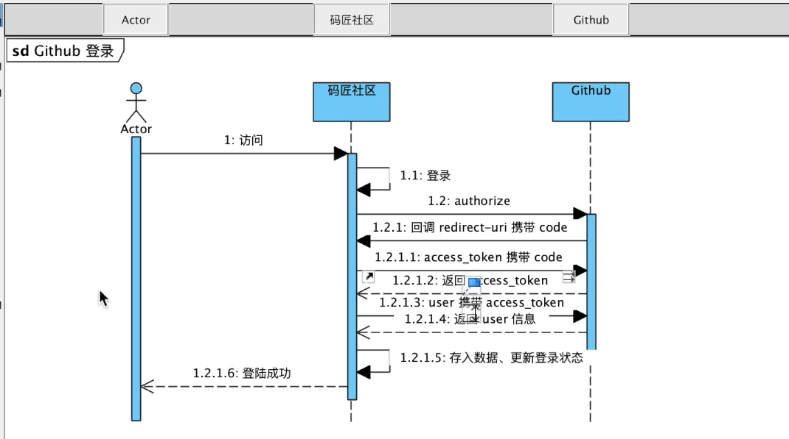
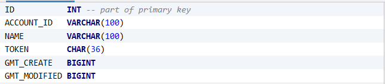
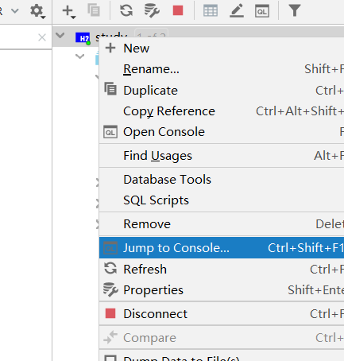
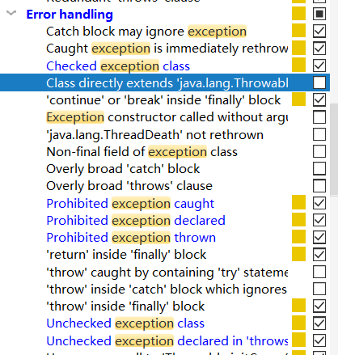

#  Day1.

## 技术栈总结

springboot + mybatis + H2

thymeleaf, flyway, lombok,

H2账号root 密码123456

# IDEA中Git的简单使用

完成项目创建后 在命令行输入

```git
git init
git add .
git commit -m "whatever"
git remote add origin https://github.com/Cola2333/lc.git
git push -u origin master
```


## 获取github授权登录

https://developer.github.com/apps/building-oauth-apps/creating-an-oauth-app/

## 登录流程图



token 记录

```
https://api.github.com/user?access_token=35508d93153740d73b45e4d8ff92e476136afeb0
```


## 快捷键：

ctl+alt+N 全局查找

alt+insert 生成getter setter

ctl+alt+v 选中new accessTokenDTO 可以快速new一个出来

shit+enter 直接换到下一行

sout + tab 生成System.out.printl()

Ctrl+Tab 切换窗口

shit+ctl+F12 最大化编辑

shift + F6 重命名 会修改所有的  

ctrl + F6  修改函数的参数

ctrl + p 查看需要写入什么参数

ctrl+ x 剪贴一整行 可以用作删除一整行

ctrl + d 拷贝光标所在行

ctrl + r 在命令行搜索之前的命令

ctrl + F5强制刷新浏览器

ctrl + shift + 方向键 换位置

ctrl + alt + m 把一段代码抽出 成为函数

ctrl + alt + p 把一个实参抽出 成为函数中的形参数

alt + F7 查看依赖


## 记录一些命令

```bash
mvn flyway:migrate
```

```
mvn -Dmybatis.generator.overwrite=true mybatis-generator:generate
```


```sql
select * from user where account_id=#{creator} limit 1
```


## 请求过程总结：

1. 在导航栏点击登录 发送get请求到"https://github.com/login/oauth/authorize?client_id=367c20aae8ce7d906d23&redirect_uri=http://localhost:8080/callback&scope=user&state=1"

2. If the user accepts your request, GitHub redirects back to your site with a temporary `code` in a code parameter as well as the state you provided in the previous step in a `state` parameter.

3. controller接受到上述get请求 拿出code和state 创建一个accessTokenDTO 并将各种参数存放进去 之后调用gitHubProvider.getAccessToken(accessTokenDTO)方法

4. 通过GitHubProvider中的getAccessToken(accessTokenDTO)方法 对accessTokenDTO进行处理 发送POST请求给github 并接受到github返回的accessToken. 

5. controller拿到getAccessToken(accessTokenDTO)方法的返回值accessToken 再调用gitHubProvider.getUser(accessToken)方法

6. 通过GitHubProvider中的getUser(accessToken)方法 对accessToken进行处理 发送POST请求给github 并接受到github返回的user信息


如果想找dependency可以只直接去mvnrepository上找


## 数据库设计



ACCOUNT_ID github返回值里带的id

NAME gihub返回值里带的name

TOKEN 用了标识用户cookie的名称

GMT_CREATE 数据创建时间

GMT_MODIFIED 数据修改时间


## 踩坑记录：database may already use

如果显示database may already use 需要先关闭后H2在运行


## 踩坑记录：连接h2显示密码错误

连接h2显示密码错误

首先要确定配置文件正确

```properties
github.client.id=367c20aae8ce7d906d23
github.client.secret=383fe1cef895580b5fbb7b543386532a062c2f77
github.redirect.uri=http://localhost:8080/callback

spring.datasource.url=jdbc:h2:~/study
spring.datasource.username=root
spring.datasource.password=123456
spring.datasource.driver-class-name=org.h2.Driver
```

解决方法：




## 疑问并解答：

1. 问：为什么要在用户登录之后将token存到数据库 然后将token用作cookie 在用户访问首页时再拿出来做校验，校验成功再设置session。为什么不可以再用户登录之后直接创建session呢？

   答：因为如果只在浏览器存session，一旦服务器重启，session就会没有了，用户还需要重新登录。

   ​		而且我们也不能直接在浏览器存带有用户全部信息的cookie，这样会很不安全。

2. session和cookies的区别

   1，session 在服务器端，cookie 在客户端（浏览器）
    2，session 默认被存在在服务器的一个文件里（不是内存）
    3，session 的运行依赖 session id，而 session id 是存在 cookie 中的，也就是说，如果浏览器禁用了 cookie ，同时 session 也会失效（但是可以通过其它方式实现，比如在 url 中传递 session_id）
    4，session 可以放在 文件、数据库、或内存中都可以。
    5，用户验证这种场合一般会用 session。

总结一下:

 H2里的数据其实就相当于session token相当于session id；当用户登录时我们手动生成这样一个token将其和user一起存入数据库 并在客户端写入一个包含这个token的cookie；当用户取访问主业时 我们从cookie里拿到这个token 然后去session(存放在数据库数据库)中查找对应的user,之后再从客户端生成session(存放在服务器内存)。这样做有个好处就是如果服务器出现问题需要重启 只要用户不关闭客户端(浏览器) 那么cookie就还在 等到服务器重启时 再用token去查找对应session也还是可以找到的；但是如果session只存在于客户端，一旦服务器出现问题重启，用户就需要重新登陆了


## 踩坑记录：idea下无法在git bash里使用mvn命令

​	idea下无法在git bash里使用mvn命令

​	解决方法：找到idea自带的maven位置 C:\WJJ\java\IDEAIU\IntelliJ IDEA 2019.2.4\plugins\maven\lib\maven3	进行环境变量配置(我的电脑)


# Day2

## 关于前端

Bootstrap官网可以找到各种布局(栅栏系统)和组件(表单等)结合到一起即可快速搭建一个前端页面踩坑记录


### 获取更多github上的user信息 

如果想获取github上的其他信息 需要修改User类 UserMaper接口 和dto包下的githubUser。之后再去AuthorizeController代码里添加user.get。


### 开发中的一些逻辑

1. 如果我们需要一些属性用来在前端展示 然而一个表(model)无法满足我们的需求 我们就可以再去dto包里写一个类 让这个类包含我们所需要的全部属性
2. 但是我们发现这样一来 mapper就无法完成满足我们的需求了 因为一个mapper只能查一个表里的属性 所以我们需要一个service层来整合 于是我们去新建一个service包

在写的过程中注意要从顶往下写 先写controll 然后service 在controler里可以直接alt + enter生成需要的方法


## 踩坑记录

### 用select*从数据库查找时 部分值为空

原因是没有开启驼峰命名法 

之所以插入的时候不会影响是因为插入的时候规定了所有字段名 insert的是数据库中定义的名字 values后面是model里写的名字

所以我们需要在application.properties中加入

```properties
mybatis.configuration.map-underscore-to-camel-case=true
```


## 分页逻辑

1. 首先需要使用limit子句. 第一个参数表示offset 第二个参数表示size

   ```sql
   select * from t_user limit 0,5;
   ```

2. 所以我们需要给indexController传入两个参数(pageNum, size);

3. 改变QuestionService.list方法并传入这两个参数

4. 在QuestionService.list中计算出limit子句真正需要的参数offset, 并修改questionMapper.getAllQuestions方法。

5. 由于我们还需要显示当前页码以及页码列表 所以QuestionDTO的list无法满足需求了 我们需要再写一个DTO

   这个DTO要包含QuestionDTO的list的所有内容 上一步查出的数据以及以下属性

   firstPage	previousPage	nextPage	lastPage	curPage	pageList 

6. 在QuestionService实例一个paginationDTO, 将QuestionDTO的list以及其他属性传入paginationDTO进行设置

7. 用逻辑限制各个属性的true或false以及列表内容的显示(详情见PaginationDTO类)

8. 在indexController里新建这个实例 传入model

   

   

## 感觉有问题的地方

1. 为什么不用构造方法去设置paginationDTO的各种属性 反而要新创建一个set方法

2. 为什么pages.add()的时候没有实例化

   确实不能实例化 因为拿不到全部属性

3. 其实分页的时候完全可以在service里把所有的属性都先算出来 得到最终赋值的属性 然后最后一起set 我的代码里就采用了这种形式


 ## template fragment

```html
<html xmlns="http://www.w3.org/1999/xhtml"
      xmlns:th="http://www.thymeleaf.org">

  <body>
  
    <div th:fragment="copy">
      &copy; 2011 The Good Thymes Virtual Grocery
    </div>
  
  </body>
  
</html>
```


```html
<body>

  ...

  <div th:replace="footer :: copy"></div>
  
</body>
```


## 疑问并解答

### @RequestParam()和@PathVariable()的区别

​	@PathVariable主要用于接收http://host:port/path/{参数值}数据。@RequestParam主要用于接收http://host:port/path?参数名=参数值数据，这里后面也可以不跟参数值


### 有时候页面样式会丢失

这是因为层级出现了问题 需要在引用的地方加/或者./之类的

```html
    <link rel="stylesheet" href="/css/bootstrap.min.css" />
    <link rel="stylesheet" href="/css/bootstrap-theme.min.css" />
    <link rel="stylesheet" href="/css/study.css" />
    <script src="/js/jquery-3.5.0.min.js" type="application/javascript"></script>
    <script src="/js/bootstrap.min.js" type="application/javascript"></script>
```


## 我的代码可能有问题的地方

1. 第二个span不知道能不能这样写

```html
<h2><span class="glyphicon glyphicon-list" aria-hidden="true"></span> <span th:text="${sectionName}"></span></h2>
```

2. 如何解决th:class替换掉了class的问题

```html
<a href="#" th:class="${section}=='question' ? 'list-group-item active' : 'list-group-item'">
                    <span class="badge">14</span>
                    我的问题
                </a>
```

3. QuestionService两个方法过于相似 如何处理

   而且PaginationDTO list(Integer pageNum, Integer size, String accountId)中似乎不再需要user信息 以后再修正

4. publish页面下没有下拉菜单

## 踩坑记录

### .section可以引入css样式 .profile.section就不行呢

因为要写成.profile .section 中间要有个空格！！！！！！！！！！！！！


## 代码中的bug

1. 当重启服务器后 只有访问index页面时才能够保持登录状态 访问其他的页面会变成未登录状态

   出现这个问题的原因是我只在indexController里验证了token 详细步骤如下

   在AuthorizeController完成后会想数据库中写入user信息 并将user信息中的token写入cookie

   在IndexController中我们先获取所有cookie 然后查找到名为token的cookie 之后按照这个token去数据库中查找是否有用户 如果有就添加一个session。

   由于服务器重启后 session消失 如果直接访问publish或profile就没有了session 前端页面自然也获取不到session中的user信息 页面自然就显示未登录状态 但是因为用户的浏览器并未关闭所以cookie还在 因此如果访问index页面 indexController会再去数据库中查 然后再创建session

2. 因为现在question中的creator是id 所以当根据question中的creator去查user时会出问题 因为同一user的id会不一样 所以应该用accountId 需要修改

   但是question回显user信息的时候其实用id是没问题的 但是profile/question中回显question一定需要用accountId

3. 重复创建user是否是必要的？如果只创建一次就不会出现id重复的问题？

   我感觉重复创建还是很有必要的 因为数据库中的user其实代表了一个session 不同的时间段登录理应就是不同的session 只需要注意要用accountId不要用id.


## 踩坑记录

### 两组不同的拼接路径方式 注意一开始的/有的不需要加'' 有的需要加

```html
th:href="@{/(pageNum=${questionList.curPage} - 1)}"
```

```html
th:href="@{'/profile/'+${section}(pageNum=${questionList.curPage} + 1)}"
```

```html
如果需要后端传过来的值做新的地址 就需要拼接
<a th:href="@{'/question/'+${question.id}}">
```

```html
如果是后端传过来的值只做参数 就可以直接写
<a th:href="@{/question/(id=${question.id})}">
```


# day3

## 不太明白的地方

@Autowired注解什么时候需要加？ 当需要用service mapper之类的时候？ 那为什么用User不用加？

## 拦截器写法记录

拦截器不一定会拦截这个请求 它只是再次对这个请求进行一些处理

```java
package life.usc.study.interceptor;

import org.springframework.beans.factory.annotation.Autowired;
import org.springframework.context.annotation.Configuration;
import org.springframework.web.servlet.config.annotation.InterceptorRegistry;
import org.springframework.web.servlet.config.annotation.WebMvcConfigurer;

@Configuration
public class WebConfig implements WebMvcConfigurer {

    @Autowired
    SessionInterceptor sessionInterceptor;

    @Override
    public void addInterceptors(InterceptorRegistry registry) {
        registry.addInterceptor(sessionInterceptor).addPathPatterns("/**");// 所有请求都会被拦截
    }
}

```


```java
package life.usc.study.interceptor;

import life.usc.study.mapper.UserMapper;
import life.usc.study.moel.User;
import org.springframework.beans.factory.annotation.Autowired;
import org.springframework.stereotype.Service;
import org.springframework.web.servlet.HandlerInterceptor;
import org.springframework.web.servlet.ModelAndView;

import javax.servlet.http.Cookie;
import javax.servlet.http.HttpServletRequest;
import javax.servlet.http.HttpServletResponse;

@Service
public class SessionInterceptor implements HandlerInterceptor {

    @Autowired
    UserMapper userMapper;

    @Override
    public boolean preHandle(HttpServletRequest request, HttpServletResponse response, Object handler) throws Exception {
        Cookie[] cookies = request.getCookies();
        if (cookies != null && cookies.length != 0) {
            for (Cookie cookie : cookies) {
                if (cookie.getName().equals("token")) {
                    String token = cookie.getValue();
                    //System.out.println(token);
                    User user = userMapper.findByToken(token);
                    //System.out.println(user);
                    if (user != null) {
                        request.getSession().setAttribute("user", user);
                    }
                    break;
                }
            }
        }
        return true;
    }

    @Override
    public void postHandle(HttpServletRequest request, HttpServletResponse response, Object handler, ModelAndView modelAndView) throws Exception {

    }

    @Override
    public void afterCompletion(HttpServletRequest request, HttpServletResponse response, Object handler, Exception ex) throws Exception {

    }
}

```


## 踩坑记录

### 添加@EnableWebMVC后CSS样式失效

显式配置 @EnableWebMvc 导致静态资源访问失败 具体原因见下方链接

https://www.jianshu.com/p/d6893c6523d0

我自己简单总结一下：

​	首先 静态资源的设置是在```WebMvcAutoConfiguration```中的```addHandlerResource```里实现的 但是```WebMvcAutoConfiguration```中有个```@ConditionalOnMissingBean(WebMvcConfigurationSupport.class```注解 限制其只有在```WebMvcConfigurationSupport.class```不存在时才会被编译

然而 当我们```@EnableWebMvc ```引用了```DelegatingWebMvcConfiguration.class)```

```java
@Import(DelegatingWebMvcConfiguration.class)
public @interface EnableWebMvc {
}
```

进一步

```java
@Configuration
public class DelegatingWebMvcConfiguration extends WebMvcConfigurationSupport {
```

如此就导致了```WebMvcAutoConfiguration```不被编译 因此也就不再设置精通资源地址


## 踩坑记录

### 前段页面使用后端传过来的参数 明明写的对但是却有红色波浪线

原因是 没加Controller!!! 记得写Controller和Service时第一件事情就是加注解!!!


## 踩坑记录

### 栅栏布局显示的不对

```html
<div class="col-lg-3 col-md-12 col-sm-12 col-xs-12 " >
    <div class="col-lg-3 col-md-12 col-sm-12 col-xs-12 " >
        <h3>发起人</h3>
    </div>
    <div class="col-lg-3 col-md-12 col-sm-12 col-xs-12 " >
        <h3>相关问题</h3>
    </div>
</div>
```

原因是子div中设置的样式是相对于父div而言的 也就是说下面这个其实只占了3/12 * 3/12的页面 因此子div并未占满父div

```html
    <div class="col-lg-3 col-md-12 col-sm-12 col-xs-12 " >
        <h3>发起人</h3>
    </div>
```

正确的写法应该是

```html
        <div class="col-lg-3 col-md-12 col-sm-12 col-xs-12 " >
            <div class="col-lg-12 col-md-12 col-sm-12 col-xs-12 " >
                <h3>发起人</h3>
            </div>
            <div class="col-lg-12 col-md-12 col-sm-12 col-xs-12 " >
                <h3>相关问题</h3>
            </div>
        </div>
```


## 代码中的bug

question.html中question.description下面的```<hr>```不起作用


# Day 4

## 踩坑记录

### th:if 中equals和&&的使用

```
gt    great than（大于）>
ge    great equal（大于等于）>=
eq    equal（等于）==
lt    less than（小于）<
le    less equal（小于等于）<=
ne    not equal（不等于）!= 
```

```
and   &&
```


## 关于登录注册

在获取github登录权限时 每次都要接受用户的信息 但是不一定每次都要创建新的用户！

如果说我们可以通过接受到的用户信息中的account_id在数据库中查到该用户 那么么我们只需要更新用户的部分信息

如果我们查不到 那就需要插入用户信息

如果仅是插入 我们通过UserMapper就可以实现 但是现在又有更新 所以我们需要一个创建一个UserService来完成这一部分工作


## 关于退出登录

注意不止要删除session 还需要删除浏览器中的cookie

删除cookie的方法

```java
request.getSession().removeAttribute("user");
```


删除cookie的方法

```java
Cookie cookie = new Cookie("token", null);//新建一个名字相同的cookie
cookie.setMaxAge(0); //存活时间为0
response.addCookie(cookie);
```


## 一些命令

```bash
mvn -Dmybatis.generator.overwrite=true mybatis-generator:generate
```


## 使用Mybatis generator

配置pom.xml

```xml
            <plugin>
                <groupId>org.mybatis.generator</groupId>
                <artifactId>mybatis-generator-maven-plugin</artifactId>
                <version>1.4.0</version>
                <dependencies>
                    <dependency>
                        <groupId>com.h2database</groupId>
                        <artifactId>h2</artifactId>
                        <version>1.4.199</version>
                    </dependency>
                </dependencies>
            </plugin>
```

在main.resources新建generatorConfig.xml

```xml
<?xml version="1.0" encoding="UTF-8"?>
<!DOCTYPE generatorConfiguration
        PUBLIC "-//mybatis.org//DTD MyBatis Generator Configuration 1.0//EN"
        "http://mybatis.org/dtd/mybatis-generator-config_1_0.dtd">

<generatorConfiguration>

    <context id="DB2Tables" targetRuntime="MyBatis3">
        
        <plugin type="org.mybatis.generator.plugins.RowBoundsPlugin"></plugin>
        <jdbcConnection driverClass="org.h2.Driver"
                        connectionURL="jdbc:h2:~/study"
                        userId="root"
                        password="123456">
        </jdbcConnection>

        <javaTypeResolver >
            <property name="forceBigDecimals" value="false" />
        </javaTypeResolver>

        <javaModelGenerator targetPackage="life.usc.study.model" targetProject="src/main/java">
            <property name="enableSubPackages" value="true" />
            <property name="trimStrings" value="true" />
        </javaModelGenerator>

        <sqlMapGenerator targetPackage="mapper"  targetProject="src/main/resources">
            <property name="enableSubPackages" value="true" />
        </sqlMapGenerator>

        <javaClientGenerator type="XMLMAPPER" targetPackage="life.usc.study.mapper"  targetProject="src/main/java">
            <property name="enableSubPackages" value="true" />
        </javaClientGenerator>

        <table tableName="user" domainObjectName="User"></table>
        <table tableName="question" domainObjectName="Question"></table>

    </context>
</generatorConfiguration>
```

配置application

```properties
github.client.id=367c20aae8ce7d906d23
github.client.secret=383fe1cef895580b5fbb7b543386532a062c2f77
github.redirect.uri=http://localhost:8080/callback

spring.datasource.url=jdbc:h2:~/study
spring.datasource.username=root
spring.datasource.password=123456
spring.datasource.driver-class-name=org.h2.Driver

spring.thymeleaf.cache=false 

mybatis.configuration.map-underscore-to-camel-case=true
mybatis.type-aliases-package=life.majiang.community.mapper
mybatis.mapper-locations=classpath:mapper/*.xml
```

命令行运行

```bash
mvn -Dmybatis.generator.overwrite=true mybatis-generator:generate
```

完成后model里的类会被overwrite 然后会生成example类

mapper里的类都会被overwrite

main.resources下会新建一个mapper包 里面有xml配置文件


## Mybatis generator用法

### select

```java
UserExample userExample = new UserExample();
userExample.createCriteria()
    .andAccountIdEqualTo(user.getAccountId());
List<User> dbUsers = userMapper.selectByExample(userExample);
```


```java
//直接查主键可以这样
Question question = questionMapper.selectByPrimaryKey(id);
```


```java
//无参分页查找
List<Question> questions = questionMapper.selectByExampleWithBLOBsWithRowbounds(new QuestionExample(), new RowBounds(offset, size));
```


```java
//有参分页查找
QuestionExample example = new QuestionExample();
example.createCriteria()
        .andCreatorEqualTo(accountId);
List<Question> questions = questionMapper.selectByExampleWithBLOBsWithRowbounds(example, new RowBounds(offset, size));
```

### insert

```java
userMapper.insert(user);
```

### update

因为我们只想更新部分属性

所以用的是updateByExampleSelective 这就要求updateUser中值包含需要更新的属性 其他属性为null

```java
User dbUser = dbUsers.get(0);
User updateUser = new User();
updateUser.setName(user.getName());
updateUser.setToken(user.getToken());
updateUser.setGmtModified(System.currentTimeMillis());
updateUser.setBio(user.getBio());
updateUser.setAvatarUrl(user.getAvatarUrl());
UserExample example = new UserExample();
example.createCriteria()
.andAccountIdEqualTo(dbUser.getAccountId());
userMapper.updateByExampleSelective(updateUser, example);
```

### count

```java
//无参
Integer totalCount = (int)questionMapper.countByExample(new QuestionExample());
```


```java
//有参
QuestionExample questionExample = new QuestionExample();
questionExample.createCriteria()
        .andCreatorEqualTo(accountId);
Integer totalCount = (int)questionMapper.countByExample(questionExample);
```


## 疑问

每次都需要new一个新的嘛 同一个方法里用一个不可以吗

```java
QuestionExample userExample = new QuestionExample();
```

## 仅记录

```java
package life.usc.study.moel;

import lombok.Data;
import org.springframework.context.annotation.Bean;

@Data
public class User {
    private Integer id;
    private String accountId;
    private String name;
    private String token;
    private Long gmtCreate;
    private Long gmtModified;
    private String bio;
    private String avatarUrl;
}

```

```java
package life.usc.study.moel;

import lombok.Data;

@Data
public class Question {
    private Integer id;
    private String title;
    private String description;
    private Long gmtCreate;
    private Long gmtModified;
    private String creator;
    private Integer commentCount;
    private Integer viewCount;
    private Integer likeCount;
    private String tag;
}

```

## 需要学习的知识

异常处理

枚举


##  线程安全问题

在更新阅读数的时候 最好是选择数据库直接操作 这样可以保证线程安全(我感觉是数据库自身的线程安全保证，因为数据库不能够同时执行两条语句)

所以我们在main/resource下的mapper包中新建一个QuestionExtMapper.xml 在study下的mapper包中新建一个QuestionExtMapper

**注意要修改 namespace="life.usc.study.mapper.QuestionExtMapper"**

```java
package life.usc.study.mapper;

import life.usc.study.model.Question;
import life.usc.study.model.QuestionExample;
import org.apache.ibatis.annotations.Param;
import org.apache.ibatis.session.RowBounds;

import java.util.List;

public interface QuestionExtMapper {
    int incViewCount(Question record);
}
```


注意 如果直接传过来对象而且不需要example时 这个地方是这个写法```parameterType="life.usc.study.model.Question```

而且下面的sql语句也不需要加```record```

```xml
  <update id="incViewCount" parameterType="life.usc.study.model.Question">
    update QUESTION
    set VIEW_COUNT = VIEW_COUNT + 1
    where ID = #{id}
  </update>
```


```xml
<?xml version="1.0" encoding="UTF-8"?>
<!DOCTYPE mapper PUBLIC "-//mybatis.org//DTD Mapper 3.0//EN" "http://mybatis.org/dtd/mybatis-3-mapper.dtd">
<mapper namespace="life.usc.study.mapper.QuestionExtMapper">
  <resultMap id="BaseResultMap" type="life.usc.study.model.Question">
    <!--
      WARNING - @mbg.generated
      This element is automatically generated by MyBatis Generator, do not modify.
      This element was generated on Fri Apr 17 17:31:16 PDT 2020.
    -->
    <id column="ID" jdbcType="INTEGER" property="id" />
    <result column="TITLE" jdbcType="VARCHAR" property="title" />
    <result column="GMT_CREATE" jdbcType="BIGINT" property="gmtCreate" />
    <result column="GMT_MODIFIED" jdbcType="BIGINT" property="gmtModified" />
    <result column="CREATOR" jdbcType="VARCHAR" property="creator" />
    <result column="COMMENT_COUNT" jdbcType="INTEGER" property="commentCount" />
    <result column="VIEW_COUNT" jdbcType="INTEGER" property="viewCount" />
    <result column="LIKE_COUNT" jdbcType="INTEGER" property="likeCount" />
    <result column="TAG" jdbcType="VARCHAR" property="tag" />
    <result column="COLUMN_11" jdbcType="INTEGER" property="column11" />
  </resultMap>
  <resultMap extends="BaseResultMap" id="ResultMapWithBLOBs" type="life.usc.study.model.Question">
    <!--
      WARNING - @mbg.generated
      This element is automatically generated by MyBatis Generator, do not modify.
      This element was generated on Fri Apr 17 17:31:16 PDT 2020.
    -->
    <result column="DESCRIPTION" jdbcType="CLOB" property="description" />
  </resultMap>

  <update id="incViewCount" parameterType="life.usc.study.model.Question">
    update QUESTION
    set VIEW_COUNT = VIEW_COUNT + 1
    where ID = #{id}
  </update>
</mapper>
```


这是不正确的写法 仅记录

```java
    public void incViewCount(Integer id) {
        Question question = questionMapper.selectByPrimaryKey(id);
        Question updateQuestion = new Question();
        updateQuestion.setViewCount(question.getViewCount() + 1);
        QuestionExample questionExample = new QuestionExample();
        questionExample.createCriteria()
                .andIdEqualTo(id);
        questionMapper.updateByExampleSelective(updateQuestion, questionExample);
    }
```


## 代码中的bug(已修复)

question的id应该是big int类型 我写的是int类型 需要修改一下 记得用flyway而且得重新生成mapper


## 容易忽略的地方

创建新的数据表时 记得用flyway 而且要在application中添加一下内容

```properties
        <table tableName="user" domainObjectName="User"></table>
        <table tableName="question" domainObjectName="Question"></table>
        <table tableName="comment" domainObjectName="Comment"></table>
```

最后再用Mybatis generator


# Day5

## Json

通过@RequestBody可以接受前端传过来的json格式的数据 然后将其转换为对象

通过@ReponseBody可以把我们后端创建的对象转换成json格式的数据 发送到前端

这也是```CommentDTO```存在的原因

```java
@ResponseBody
    @PostMapping("/comment")
    public Object post(@RequestBody CommentDTO commentDTO) {
        Comment comment = new Comment();
        comment.setParentId(commentDTO.getParentId());
        comment.setType(commentDTO.getType());
        comment.setGmtCreate(System.currentTimeMillis());
        comment.setGmtModified(System.currentTimeMillis());
        comment.setContent(commentDTO.getContent());
        comment.setCommentator(1);
        comment.setLikeCount(0L);
        commentMapper.insert(comment);
        Map<Object, Object> objectObjectHashMap = new HashMap<>();
        objectObjectHashMap.put("message", "success");

        return objectObjectHashMap;
    }
```


## 疑问

为什么要创建一个ResultDTO 直接用CommentType处理不可以吗？

为什么要再创建一个CommentService 既然只需要做基础的is null判断 直接卸载controller里不可以吗？

为什么要创建这个ResultDTO CommentController里抛出异常直接用```CustomizeException```不可以吗？(目前怀疑是用来转换成json格式)

除了```CustomizeException```之外 还有其他异常需要得到json格式吗(可能就是为了防止出现其他未知的异常？但是这样也没理由需要json格式啊)


## 第38节Exception的部分理解

总体顺序

创建阶段：```ICustomizeErrorcode```、```CustormizeErrorCode```、```CustomizeException```

使用阶段：```XXXService```抛出、```CustomizeExceptionHandler```接受并返回页面

首先县先创建一个```ICustomizeErrorcode```接口

```java
public interface ICustomizeErrorcode {
    Integer getCode();
    String getMessage();
}
```

然后在创建一个```CustormizeErrorCode```类继承这个接口

```java
public enum CustormizeErrorCode implements ICustomizeErrorcode {
    QUESTION_NOT_FOUND(2001, "您要找的问题不存在，换个问题试试吧~"),
    TARGET_PARAM_NOT_FOUND(2002, "未选中任何问题或者评论进行回复"),
    ;
    private String message;
    private  Integer code;

    CustormizeErrorCode(Integer code, String message) {
        this.code = code;
        this.message = message;
    }

    @Override
    public Integer getCode() {
        return code;
    }

    @Override
    public String getMessage() {
        return message;
    }
}
```

再创建一个```CustomizeException```用来接收errorCode然后抛出异常

```java
public class CustomizeException extends RuntimeException {
    private Integer code;
    private String message;

    public CustomizeException(ICustomizeErrorcode errorCode) {
        this.code = errorCode.getCode();
        this.message = errorCode.getMessage();
    }

    public Integer getCode() {
        return code;
    }

    @Override
    public String getMessage() {
        return message;
    }
}
```

最后在service里使用```CustomizeException```抛出异常(不太明白为什么接收的是TARGET_PARAM_NOT_FOUND)

```java
@Service
public class CommentService {

    public void insert(Comment comment) {
        if (comment.getParentId() == null || comment.getParentId() == 0)
            throw new CustomizeException(CustormizeErrorCode.TARGET_PARAM_NOT_FOUND);
    }
}
```

这样一来```CustomizeExceptionHandler```就会接受到这个exception 然后返回一个ModelView

```java
@ControllerAdvice
public class CustomizeExceptionHandler {
    @ExceptionHandler(Exception.class)
    ModelAndView handle(Throwable e, Model model) {
        if (e instanceof CustomizeException) {
            model.addAttribute("message", e.getMessage());
        }else {
            model.addAttribute("message", "服务冒烟啦~");
        }
        return new ModelAndView("error");
    }

    private HttpStatus getStatus(HttpServletRequest request) {
        Integer statusCode = (Integer) request.getAttribute("javax.servlet.error.status_code");
        if (statusCode == null) {
            return HttpStatus.INTERNAL_SERVER_ERROR;
        }
        return HttpStatus.valueOf(statusCode);
    }
}
```

我们需要对```CustomizeExceptionHandler```进行一个修改 然他可以返回json

```java
@ControllerAdvice
@Slf4j
public class CustomizeExceptionHandler {
    @ExceptionHandler(Exception.class)
    ModelAndView handle(Throwable e, Model model, HttpServletRequest request, HttpServletResponse response) {
        String contentType = request.getContentType();
        if ("application/json".equals(contentType)) { //先判断是json格式的异常
            //返回json 局部刷新
            ResultDTO resultDTO;
            if (e instanceof CustomizeException) { //是我们已知(已经定义过的)的异常
                resultDTO = ResultDTO.errorOf((CustomizeException) e); //保证是json格式
            }else { //未定义的异常
                log.error("handle error", e);
                resultDTO =  ResultDTO.errorOf(CustormizeErrorCode.SYS_ERROR);
            }
            try { //手动写到前端 之所以这样是我们需要返回一个ModelView 然而Json格式的数据不能是ModelView
                response.setContentType("application/json");
                response.setStatus(200);
                response.setCharacterEncoding("utf-8");
                PrintWriter writer = response.getWriter();
                writer.write(JSON.toJSONString(resultDTO));
                writer.close();
            } catch (IOException ioe) {
            }
            return null;
        }else //非json格式异常
            //返回错误页面 页面跳转
            if (e instanceof CustomizeException) {
                model.addAttribute("message", e.getMessage());
            }else {
                model.addAttribute("message", CustormizeErrorCode.SYS_ERROR);
            }
            return new ModelAndView("error");
    }

    private HttpStatus getStatus(HttpServletRequest request) {
        Integer statusCode = (Integer) request.getAttribute("javax.servlet.error.status_code");
        if (statusCode == null) {
            return HttpStatus.INTERNAL_SERVER_ERROR;
        }
        return HttpStatus.valueOf(statusCode);
    }
}

```

之所以不在controller里直接抛出异常是因为我们想拿到一个json格式的异常，用ResultDTO来返回json格式的异常


## 实际开发中的习惯和技巧

这里选择这样写而不选择直接+1的原因是 为了以后扩展

如果以后访问量大的话 我们可能选择数量增长10再去数据库里插入一次

```xml
<update id="incView" parameterType="life.majiang.community.model.Question">
update QUESTION
set
VIEW_COUNT = VIEW_COUNT + #{viewCount,jdbcType=INTEGER}
where id = #{id}
</update>

<update id="incCommentCount" parameterType="life.majiang.community.model.Question">
update QUESTION
set
COMMENT_COUNT = COMMENT_COUNT + #{commentCount,jdbcType=INTEGER}
where id = #{id}
</update>
```


## 代码中的bug

一开始我选择在CommentController里完成incCommentCount;

当评论被回复时 某个评论数一定会加一 但是不一定是对的

评论本身没有被回复的数量统计 所有的加一都会被加到问题上 但是这个加一是通过parentId加的 也就是说 如果id为1的评论被回复 id为1的问题会被加一 这是不合理的 

如果要解决这个问题 就需要在CommentService下的insert方法中做这件事 

如果是回复问题 那就直接根据parentID查到问题然后incCommentCount 

如果是回复评论 那就需要先根据parentId查到父级评论 在根据父级评论的parentID查到父级评论或者问题

那么问题来了 如何知道父级的父级是评论还是问题

​	

# 修改过的IDEA设置




## 关于CSS样式

```html
<div class="col-lg-12 col-md-12 col-sm-12 col-xs-12">
```

这个class在布局的同时也有padding 这就导致了如果在里面添加hr可能会出问题

而且如果在其中再去套一个该class 就会导致其他元素出问题

所以 最好不要有和<div class="col-lg-12 col-md-12 col-sm-12 col-xs-12">同级的其他元素


## 第40节ajax的理解

我们如果想从前端拿到值并完成局部刷新 就需要使用json格式的数据

所以说 我们需要在前端页面 完成下列内容 为js获取值做准备

```html
<input type="hidden" id="question_id" th:value="${question.id}">
<div class="comment">
    <textarea class="form-control" rows="3" id="comment_content"></textarea>
    <button type="button" class="btn btn-success" onclick="post()">回复</button>
</div>
```

之后我们通过js拿到前端的值, 并转换为JSON格式的字节流传给后端 

```js
function post() {
    var questionId = $("#question_id").val();// 拿到前端id为question_id的值 注意别忘了'#'
    var commentContent = $("#comment_content").val(); // 同理

    $.ajax({
       type: "POST",
        url: "/comment", //此处加'/'的原因是我们想访问根目录下的comment 而不是question/comment
        contentType: "application/json",
        data: JSON.stringify({ //转换为JSON格式的字节流 如果直接传对象 后端无法识别
            "parentId": questionId,
            "content": commentContent,
            "type": 1
        }),
        success: function (response) {
           console.log(response);
        },
        datatype: "json"
    });
}
```


## 从前端获取id的方法：th:data和隐藏input框

暂时认为这两个起到同样的作用 都是用了取出id

```html
<button type="button" class="btn btn-success" onclick="reply(this)" th:data-id="${comment.id}">评论</button>
```

```html
<input type="hidden" id="question_id" th:value="${question.id}">
```

```js
var commentId = e.getAttribute("data-id");
```

```js
var questionId = $("#question_id").val();
```

```
alter table COMMENT
   add comment_count int default 0;
```


# Day6

## 判断是否为空可以用StringUtils.isBlank(参数)


## 踩坑记录

使用markdown 之后不显示 需要rebuild一下


# 阿里云

登录用户名密码 root 3.VdLY#jkk4c38Q

远程连接密码 917077


